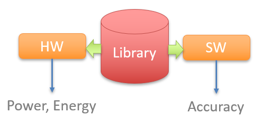

# EvoApproxLib
###### library of approximate arithmetic circuits
This is a GitHub repository of EvoApproxLib LITE version. The library consists of hardware and software models of approximate circuits that are designed to be easily used in arbitrary application. Web-based GUI and the full version of EvoApproxLib can be found on [our websites](https://ehw.fit.vutbr.cz/evoapprox)



## Reference
This library is licenced under [MIT licence](LICENCE.md). If you use the library in your research, please refer the following paper:

V. Mrazek, R. Hrbacek, Z. Vasicek and L. Sekanina, EvoApprox8b: Library of approximate adders and multipliers for circuit design and benchmarking of approximation methods. Design, Automation & Test in Europe Conference & Exhibition (DATE), 2017, Lausanne, 2017, pp. 258-261. doi: [10.23919/DATE.2017.7926993](https://dx.doi.org/10.23919/DATE.2017.7926993) 
```bibtex
@INPROCEEDINGS{evoapprox16,
    author={V. Mrazek and R. Hrbacek and Z. Vasicek and L. Sekanina}, 
    booktitle={Design, Automation Test in Europe Conference Exhibition (DATE), 2017}, 
    title={EvoApprox8b: Library of approximate adders and multipliers for circuit design and benchmarking of approximation methods}, 
    year={2017}, 
    volume={}, 
    number={}, 
    pages={258-261}, 
    doi={10.23919/DATE.2017.7926993}, 
    ISSN={1558-1101}, 
    month={March},}
```

The library is a collection of circuits published in the following papers:
  - V. Mrazek, Z. Vasicek and R. Hrbacek, "Role of circuit representation in evolutionary design of energy-efficient approximate circuits" in IET Computers & Digital Techniques, vol. 12, no. 4, pp. 139-149, 7 2018. doi: [10.1049/iet-cdt.2017.0188](https://dx.doi.org/10.1049/iet-cdt.2017.0188)
  - V. Mrazek, R. Hrbacek, Z. Vasicek and L. Sekanina, "EvoApprox8b: Library of approximate adders and multipliers for circuit design and benchmarking of approximation methods". Design, Automation & Test in Europe Conference & Exhibition (DATE), 2017, Lausanne, 2017, pp. 258-261. doi: [10.23919/DATE.2017.7926993](https://dx.doi.org/10.23919/DATE.2017.7926993)
  - V. Mrazek, S. S. Sarwar, L. Sekanina, Z. Vasicek and K. Roy, "Design of power-efficient approximate multipliers for approximate artificial neural networks," 2016 IEEE/ACM International Conference on Computer-Aided Design (ICCAD), Austin, TX, 2016, pp. 1-7. doi: [10.1145/2966986.2967021](https://dx.doi.org/10.1145/2966986.2967021)
  - V. Mrazek, Z. Vasicek, L. Sekanina, H. Jiang and J. Han, "Scalable Construction of Approximate Multipliers With Formally Guaranteed Worst Case Error" in IEEE Transactions on Very Large Scale Integration (VLSI) Systems, vol. 26, no. 11, pp. 2572-2576, Nov. 2018. doi: [10.1109/TVLSI.2018.2856362](https://dx.doi.org/10.1109/TVLSI.2018.2856362)
## Circuits
### Adders (unsigned)
 - 8-bit unsigned adders
   - [Pareto optimal subset (MAE vs power)](adders/8_unsigned/pareto_pwr_mae/README.md) - 10 circuits
   - [Pareto optimal subset (WCE vs power)](adders/8_unsigned/pareto_pwr_wce/README.md) - 10 circuits
   - [Pareto optimal subset (MRE vs power)](adders/8_unsigned/pareto_pwr_mre/README.md) - 9 circuits
   - [Pareto optimal subset (EP vs power)](adders/8_unsigned/pareto_pwr_ep/README.md) - 8 circuits
   - [Pareto optimal subset (MSE vs power)](adders/8_unsigned/pareto_pwr_mse/README.md) - 11 circuits
 - 12-bit unsigned adders
   - [Pareto optimal subset (MAE vs power)](adders/12_unsigned/pareto_pwr_mae/README.md) - 10 circuits
   - [Pareto optimal subset (WCE vs power)](adders/12_unsigned/pareto_pwr_wce/README.md) - 10 circuits
   - [Pareto optimal subset (MRE vs power)](adders/12_unsigned/pareto_pwr_mre/README.md) - 9 circuits
   - [Pareto optimal subset (EP vs power)](adders/12_unsigned/pareto_pwr_ep/README.md) - 7 circuits
   - [Pareto optimal subset (MSE vs power)](adders/12_unsigned/pareto_pwr_mse/README.md) - 10 circuits
 - 16-bit unsigned adders
   - [Pareto optimal subset (MAE vs power)](adders/16_unsigned/pareto_pwr_mae/README.md) - 9 circuits
   - [Pareto optimal subset (WCE vs power)](adders/16_unsigned/pareto_pwr_wce/README.md) - 9 circuits
   - [Pareto optimal subset (MRE vs power)](adders/16_unsigned/pareto_pwr_mre/README.md) - 10 circuits
   - [Pareto optimal subset (EP vs power)](adders/16_unsigned/pareto_pwr_ep/README.md) - 7 circuits
   - [Pareto optimal subset (MSE vs power)](adders/16_unsigned/pareto_pwr_mse/README.md) - 9 circuits
### Multipliers (unsigned)
 - 7-bit unsigned multiplier
   - [Pareto optimal subset (MAE vs power)](multiplers/7x7_unsigned/pareto_pwr_mae/README.md) - 9 circuits
   - [Pareto optimal subset (WCE vs power)](multiplers/7x7_unsigned/pareto_pwr_wce/README.md) - 10 circuits
   - [Pareto optimal subset (MRE vs power)](multiplers/7x7_unsigned/pareto_pwr_mre/README.md) - 10 circuits
   - [Pareto optimal subset (EP vs power)](multiplers/7x7_unsigned/pareto_pwr_ep/README.md) - 9 circuits
   - [Pareto optimal subset (MSE vs power)](multiplers/7x7_unsigned/pareto_pwr_mse/README.md) - 9 circuits
 - 8-bit unsigned multiplier
   - [Pareto optimal subset (MAE vs power)](multiplers/8x8_unsigned/pareto_pwr_mae/README.md) - 9 circuits
   - [Pareto optimal subset (WCE vs power)](multiplers/8x8_unsigned/pareto_pwr_wce/README.md) - 10 circuits
   - [Pareto optimal subset (MRE vs power)](multiplers/8x8_unsigned/pareto_pwr_mre/README.md) - 7 circuits
   - [Pareto optimal subset (EP vs power)](multiplers/8x8_unsigned/pareto_pwr_ep/README.md) - 10 circuits
   - [Pareto optimal subset (MSE vs power)](multiplers/8x8_unsigned/pareto_pwr_mse/README.md) - 10 circuits
 - 11-bit unsigned multiplier
   - [Pareto optimal subset (MAE vs power)](multiplers/11x11_unsigned/pareto_pwr_mae/README.md) - 7 circuits
   - [Pareto optimal subset (WCE vs power)](multiplers/11x11_unsigned/pareto_pwr_wce/README.md) - 8 circuits
   - [Pareto optimal subset (MRE vs power)](multiplers/11x11_unsigned/pareto_pwr_mre/README.md) - 9 circuits
   - [Pareto optimal subset (EP vs power)](multiplers/11x11_unsigned/pareto_pwr_ep/README.md) - 3 circuits
   - [Pareto optimal subset (MSE vs power)](multiplers/11x11_unsigned/pareto_pwr_mse/README.md) - 7 circuits
 - 12-bit unsigned multiplier
   - [Pareto optimal subset (MAE vs power)](multiplers/12x12_unsigned/pareto_pwr_mae/README.md) - 10 circuits
   - [Pareto optimal subset (WCE vs power)](multiplers/12x12_unsigned/pareto_pwr_wce/README.md) - 11 circuits
   - [Pareto optimal subset (MRE vs power)](multiplers/12x12_unsigned/pareto_pwr_mre/README.md) - 10 circuits
   - [Pareto optimal subset (EP vs power)](multiplers/12x12_unsigned/pareto_pwr_ep/README.md) - 6 circuits
   - [Pareto optimal subset (MSE vs power)](multiplers/12x12_unsigned/pareto_pwr_mse/README.md) - 10 circuits
 - 16-bit unsigned multiplier
   - [Pareto optimal subset (MAE vs power)](multiplers/16x16_unsigned/pareto_pwr_mae/README.md) - 10 circuits
   - [Pareto optimal subset (WCE vs power)](multiplers/16x16_unsigned/pareto_pwr_wce/README.md) - 10 circuits
   - [Pareto optimal subset (MRE vs power)](multiplers/16x16_unsigned/pareto_pwr_mre/README.md) - 10 circuits
   - [Pareto optimal subset (EP vs power)](multiplers/16x16_unsigned/pareto_pwr_ep/README.md) - 7 circuits
   - [Pareto optimal subset (MSE vs power)](multiplers/16x16_unsigned/pareto_pwr_mse/README.md) - 10 circuits
### Multipliers (signed)
 - 8-bit signed multiplier
   - [Pareto optimal subset (MAE vs power)](multiplers/8x8_signed/pareto_pwr_mae/README.md) - 8 circuits
   - [Pareto optimal subset (WCE vs power)](multiplers/8x8_signed/pareto_pwr_wce/README.md) - 9 circuits
   - [Pareto optimal subset (MRE vs power)](multiplers/8x8_signed/pareto_pwr_mre/README.md) - 8 circuits
   - [Pareto optimal subset (EP vs power)](multiplers/8x8_signed/pareto_pwr_ep/README.md) - 5 circuits
   - [Pareto optimal subset (MSE vs power)](multiplers/8x8_signed/pareto_pwr_mse/README.md) - 9 circuits
 - 12-bit signed multiplier
   - [Pareto optimal subset (MAE vs power)](multiplers/12x12_signed/pareto_pwr_mae/README.md) - 9 circuits
   - [Pareto optimal subset (WCE vs power)](multiplers/12x12_signed/pareto_pwr_wce/README.md) - 8 circuits
   - [Pareto optimal subset (MRE vs power)](multiplers/12x12_signed/pareto_pwr_mre/README.md) - 9 circuits
   - [Pareto optimal subset (EP vs power)](multiplers/12x12_signed/pareto_pwr_ep/README.md) - 7 circuits
   - [Pareto optimal subset (MSE vs power)](multiplers/12x12_signed/pareto_pwr_mse/README.md) - 8 circuits
 - 16-bit signed multiplier
   - [Pareto optimal subset (MAE vs power)](multiplers/16x16_signed/pareto_pwr_mae/README.md) - 4 circuits
   - [Pareto optimal subset (WCE vs power)](multiplers/16x16_signed/pareto_pwr_wce/README.md) - 4 circuits
   - [Pareto optimal subset (MRE vs power)](multiplers/16x16_signed/pareto_pwr_mre/README.md) - 4 circuits
   - [Pareto optimal subset (EP vs power)](multiplers/16x16_signed/pareto_pwr_ep/README.md) - 6 circuits
   - [Pareto optimal subset (MSE vs power)](multiplers/16x16_signed/pareto_pwr_mse/README.md) - 4 circuits
## References
The library was mentioned or used in the following research papers:
  - Issa Qiqieh, Rishad Shafik, Ghaith Tarawneh, Danil Sokolov, Shidhartha Das, Alex Yakovlev, "Energy-efficient approximate wallace-tree multiplier using significance-driven logic compression", Signal Processing Systems (SiPS) 2017 IEEE International Workshop on, pp. 1-6, 2017.
  - Michal Wiglasz, Lukas Sekanina, "Evolutionary approximation of gradient orientation module in HOG-based human detection system", Signal and Information Processing (GlobalSIP) 2017 IEEE Global Conference on, pp. 1300-1304, 2017.
  - Marcello Traiola, Arnaud Virazel, Patrick Girard, Mario Barbareschi, Alberto Bosio, "Testing approximate digital circuits: Challenges and opportunities", Test Symposium (LATS) 2018 IEEE 19th Latin-American, pp. 1-6, 2018.
  - Weiqiang Liu, Jiahua Xu, Danye Wang, Chenghua Wang, Paolo Montuschi, Fabrizio Lombardi, "Design and Evaluation of Approximate Logarithmic Multipliers for Low Power Error-Tolerant Applications", Circuits and Systems I: Regular Papers IEEE Transactions on, vol. 65, no. 9, pp. 2856-2868, 2018.
  - Marcello Traiola, Arnaud Virazel, Patrick Girard, Mario Barbareschi, Alberto Bosio, "On the Comparison of Different ATPG Approaches for Approximate Integrated Circuits", Design and Diagnostics of Electronic Circuits & Systems (DDECS) 2018 IEEE 21st International Symposium on, pp. 85-90, 2018.
  - Salim Ullah, Sanjeev Sripadraj Murthy, Akash Kumar, "SMApproxLib: Library of FPGA-based Approximate Multipliers", Design Automation Conference (DAC) 2018 55th ACM/ESDA/IEEE, pp. 1-6, 2018.
  - Vojtech Mrazek, Zdenek Vasicek, Lukas Sekanina, Honglan Jiang, Jie Han, "Scalable Construction of Approximate Multipliers With Formally Guaranteed Worst Case Error", Very Large Scale Integration (VLSI) Systems IEEE Transactions on, vol. 26, no. 11, pp. 2572-2576, 2018.
  - Sayandip De, Jos Huisken, Henk Corporaal, "Designing Energy Efficient Approximate Multipliers for Neural Acceleration", Digital System Design (DSD) 2018 21st Euromicro Conference on, pp. 288-295, 2018.
  - Aly Sultan, Ali H. Hassan, Hassan Mostafa, "A Compact Low-Power Mitchell-Based Error Tolerant Multiplier", CAS (NGCAS) 2018 New Generation of, pp. 130-133, 2018.
  - Vincent Camus, Mattia Cacciotti, Jeremy Schlachter, Christian Enz, "Design of Approximate Circuits by Fabrication of False Timing Paths: The Carry Cut-Back Adder", Emerging and Selected Topics in Circuits and Systems IEEE Journal on, vol. 8, no. 4, pp. 746-757, 2018.
  - S. Geetha, P. Amritvalli, "High Speed Error Tolerant Adder for Multimedia Applications", Journal of Electronic Testing, vol. 33, pp. 675, 2017.