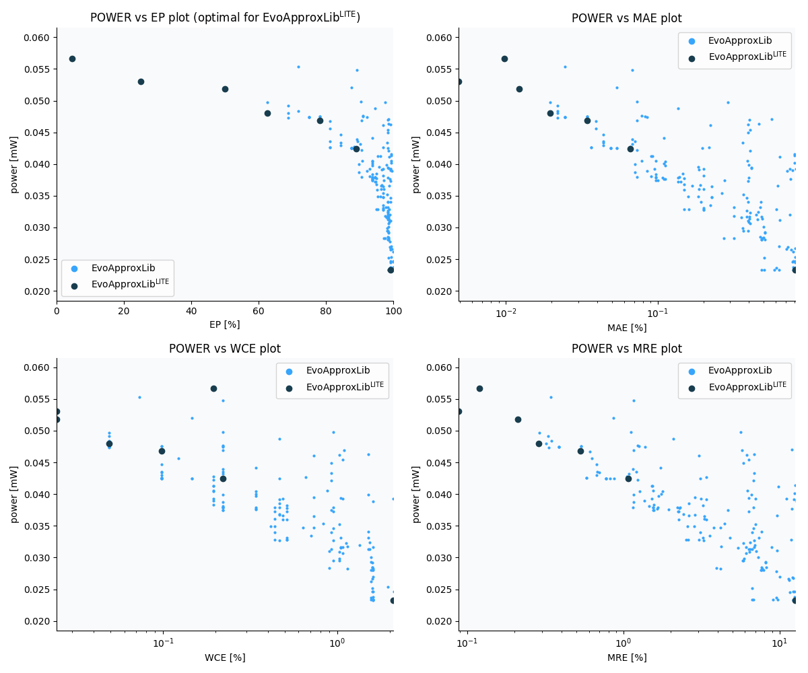

Selected circuits
===================
 - **Circuit**: 12-bit signed adders (no overflow)
 - **Selection criteria**: pareto optimal sub-set wrt. pwr and ep parameters

Parameters of selected circuits
----------------------------

| Circuit name | MAE% | WCE% | EP% | MRE% | MSE | Download |
| --- |  --- | --- | --- | --- | --- | --- | 
| add12se_5Z7 | 0.0098 | 0.20 | 4.69 | 0.12 | 3.0 |  [[Verilog](add12se_5Z7.v)]  [[C](add12se_5Z7.c)] |
| add12se_5QT | 0.0049 | 0.024 | 25.00 | 0.088 | 0.2 |  [[Verilog](add12se_5QT.v)]  [[C](add12se_5QT.c)] |
| add12se_5QC | 0.012 | 0.024 | 50.00 | 0.21 | 0.5 |  [[Verilog](add12se_5QC.v)]  [[C](add12se_5QC.c)] |
| add12se_5KB | 0.02 | 0.049 | 62.50 | 0.28 | 1.0 |  [[Verilog](add12se_5KB.v)]  [[C](add12se_5KB.c)] |
| add12se_5SV | 0.034 | 0.098 | 78.12 | 0.53 | 3.0 |  [[Verilog](add12se_5SV.v)]  [[C](add12se_5SV.c)] |
| add12se_5YE | 0.066 | 0.22 | 88.96 | 1.07 | 11 |  [[Verilog](add12se_5YE.v)]  [[C](add12se_5YE.c)] |
| add12se_5Z0 | 0.81 | 2.10 | 99.22 | 12.63 | 1513 |  [[Verilog](add12se_5Z0.v)]  [[C](add12se_5Z0.c)] |
    
Parameters
--------------

References
--------------
   - V. Mrazek, L. Sekanina, Z. Vasicek "Libraries of Approximate Circuits: Automated Design and Application in CNN Accelerators" IEEE Journal on Emerging and Selected Topics in Circuits and Systems, Vol 10, No 4, 2020

             