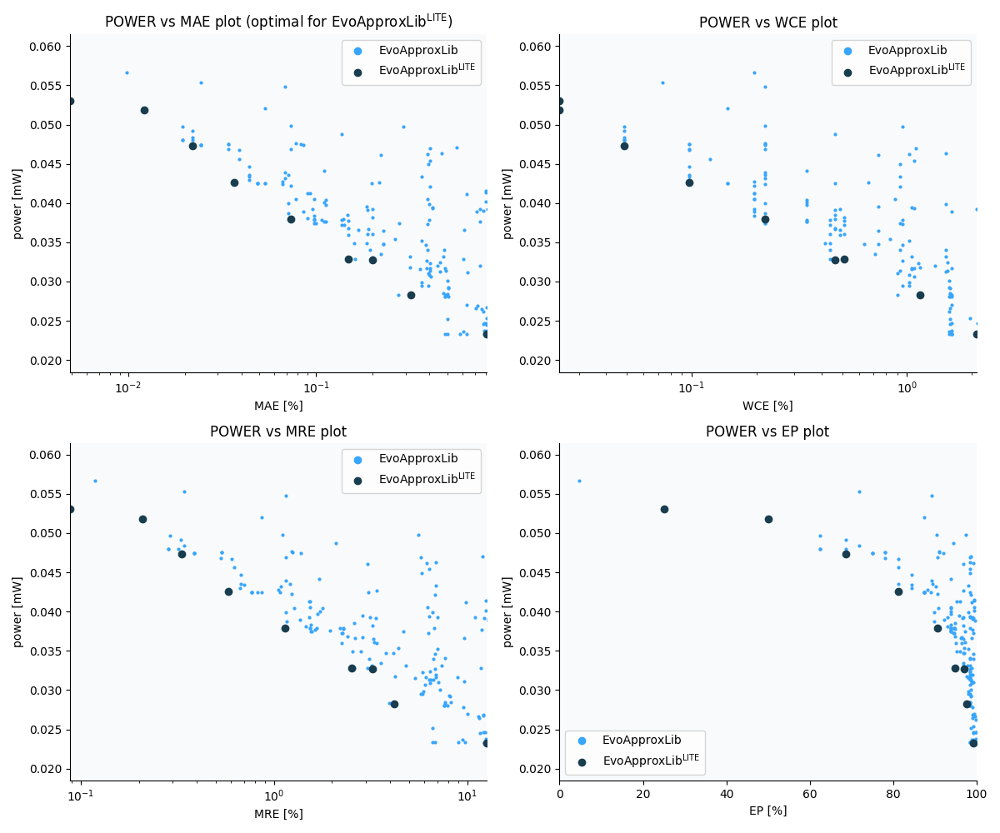

Selected circuits
===================
 - **Circuit**: 12-bit signed adders (no overflow)
 - **Selection criteria**: pareto optimal sub-set wrt. pwr and mae parameters

Parameters of selected circuits
----------------------------

| Circuit name | MAE% | WCE% | EP% | MRE% | MSE | Download |
| --- |  --- | --- | --- | --- | --- | --- | 
| add12se_5QT | 0.0049 | 0.024 | 25.00 | 0.088 | 0.2 |  [[Verilog](add12se_5QT.v)]  [[C](add12se_5QT.c)] |
| add12se_5QC | 0.012 | 0.024 | 50.00 | 0.21 | 0.5 |  [[Verilog](add12se_5QC.v)]  [[C](add12se_5QC.c)] |
| add12se_5L8 | 0.022 | 0.049 | 68.75 | 0.33 | 1.2 |  [[Verilog](add12se_5L8.v)]  [[C](add12se_5L8.c)] |
| add12se_5RP | 0.037 | 0.098 | 81.25 | 0.58 | 3.5 |  [[Verilog](add12se_5RP.v)]  [[C](add12se_5RP.c)] |
| add12se_5TE | 0.073 | 0.22 | 90.62 | 1.15 | 14 |  [[Verilog](add12se_5TE.v)]  [[C](add12se_5TE.c)] |
| add12se_5PN | 0.15 | 0.51 | 94.92 | 2.53 | 57 |  [[Verilog](add12se_5PN.v)]  [[C](add12se_5PN.c)] |
| add12se_5PD | 0.20 | 0.46 | 96.97 | 3.25 | 90 |  [[Verilog](add12se_5PD.v)]  [[C](add12se_5PD.c)] |
| add12se_5SB | 0.32 | 1.15 | 97.66 | 4.19 | 260 |  [[Verilog](add12se_5SB.v)]  [[C](add12se_5SB.c)] |
| add12se_5Z0 | 0.81 | 2.10 | 99.22 | 12.63 | 1513 |  [[Verilog](add12se_5Z0.v)]  [[C](add12se_5Z0.c)] |
    
Parameters
--------------

References
--------------
   - V. Mrazek, L. Sekanina, Z. Vasicek "Libraries of Approximate Circuits: Automated Design and Application in CNN Accelerators" IEEE Journal on Emerging and Selected Topics in Circuits and Systems, Vol 10, No 4, 2020

             