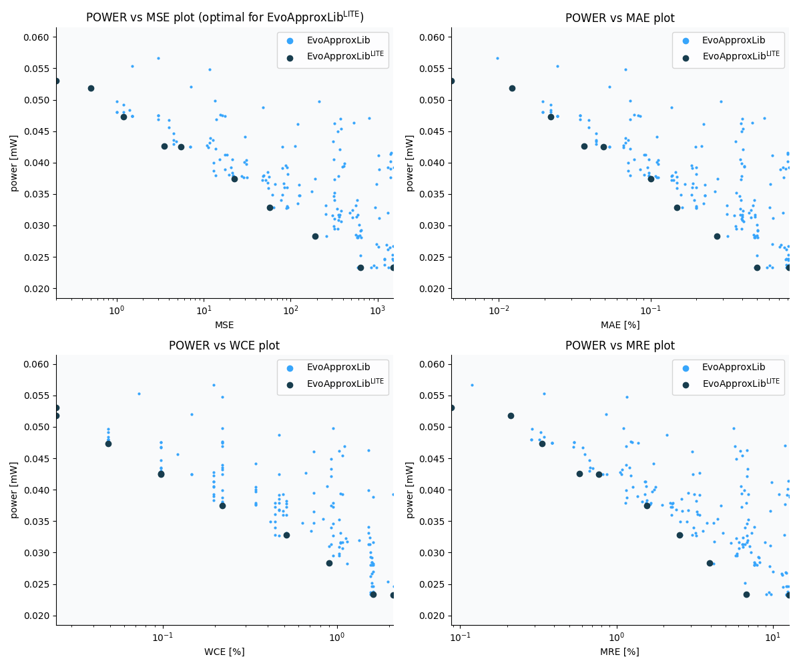

Selected circuits
===================
 - **Circuit**: 12-bit signed adders (no overflow)
 - **Selection criteria**: pareto optimal sub-set wrt. pwr and mse parameters

Parameters of selected circuits
----------------------------

| Circuit name | MAE% | WCE% | EP% | MRE% | MSE | Download |
| --- |  --- | --- | --- | --- | --- | --- | 
| add12se_54K | 0.0049 | 0.024 | 25.00 | 0.088 | 0.2 |  [[Verilog](add12se_54K.v)]  [[C](add12se_54K.c)] |
| add12se_58Y | 0.012 | 0.024 | 50.00 | 0.21 | 0.5 |  [[Verilog](add12se_58Y.v)]  [[C](add12se_58Y.c)] |
| add12se_570 | 0.022 | 0.049 | 68.75 | 0.33 | 1.2 |  [[Verilog](add12se_570.v)]  [[C](add12se_570.c)] |
| add12se_54N | 0.037 | 0.098 | 81.25 | 0.58 | 3.5 |  [[Verilog](add12se_54N.v)]  [[C](add12se_54N.c)] |
| add12se_59E | 0.049 | 0.098 | 87.50 | 0.77 | 5.5 |  [[Verilog](add12se_59E.v)]  [[C](add12se_59E.c)] |
| add12se_54H | 0.10 | 0.22 | 93.75 | 1.57 | 22 |  [[Verilog](add12se_54H.v)]  [[C](add12se_54H.c)] |
| add12se_5DG | 0.15 | 0.51 | 94.92 | 2.53 | 57 |  [[Verilog](add12se_5DG.v)]  [[C](add12se_5DG.c)] |
| add12se_54E | 0.27 | 0.90 | 97.27 | 3.95 | 190 |  [[Verilog](add12se_54E.v)]  [[C](add12se_54E.c)] |
| add12se_529 | 0.50 | 1.61 | 98.49 | 6.79 | 639 |  [[Verilog](add12se_529.v)]  [[C](add12se_529.c)] |
| add12se_5CX | 0.81 | 2.10 | 99.22 | 12.63 | 1513 |  [[Verilog](add12se_5CX.v)]  [[C](add12se_5CX.c)] |
    
Parameters
--------------

References
--------------
   - V. Mrazek, L. Sekanina, Z. Vasicek "Libraries of Approximate Circuits: Automated Design and Application in CNN Accelerators" IEEE Journal on Emerging and Selected Topics in Circuits and Systems, Vol 10, No 4, 2020

             