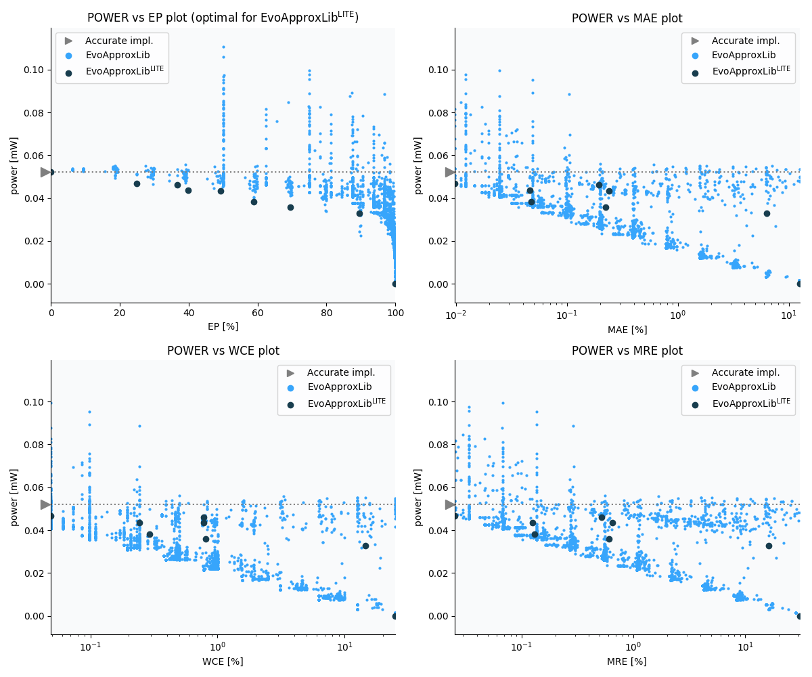

Selected circuits
===================
 - **Circuit**: 12-bit unsigned adders
 - **Selection criteria**: pareto optimal sub-set wrt. pwr and ep parameters

Parameters of selected circuits
----------------------------

| Circuit name | MAE% | WCE% | EP% | MRE% | MSE | Download |
| --- |  --- | --- | --- | --- | --- | --- | 
| add12u_2UF | 0.00 | 0.00 | 0.00 | 0.00 | 0 |  [[Verilog](add12u_2UF.v)] [[VerilogPDK45](add12u_2UF_pdk45.v)] [[C](add12u_2UF.c)] |
| add12u_0UZ | 0.0098 | 0.049 | 25.00 | 0.025 | 2.5 |  [[Verilog](add12u_0UZ.v)]  [[C](add12u_0UZ.c)] |
| add12u_0Z5 | 0.19 | 0.78 | 36.72 | 0.52 | 760 |  [[Verilog](add12u_0Z5.v)]  [[C](add12u_0Z5.c)] |
| add12u_0LN | 0.046 | 0.24 | 39.84 | 0.13 | 54 |  [[Verilog](add12u_0LN.v)]  [[C](add12u_0LN.c)] |
| add12u_187 | 0.24 | 0.78 | 49.22 | 0.65 | 876 |  [[Verilog](add12u_187.v)]  [[C](add12u_187.c)] |
| add12u_0ZP | 0.048 | 0.29 | 58.98 | 0.13 | 48 |  [[Verilog](add12u_0ZP.v)]  [[C](add12u_0ZP.c)] |
| add12u_103 | 0.22 | 0.81 | 69.53 | 0.60 | 628 |  [[Verilog](add12u_103.v)]  [[C](add12u_103.c)] |
| add12u_0AF | 6.35 | 14.55 | 89.56 | 16.19 | 524173 |  [[Verilog](add12u_0AF.v)]  [[C](add12u_0AF.c)] |
| add12u_28B | 12.50 | 25.00 | 100.00 | 30.64 | 12997.08e2 |  [[Verilog](add12u_28B.v)]  [[C](add12u_28B.c)] |
    
Parameters
--------------

References
--------------
   - V. Mrazek, Z. Vasicek and R. Hrbacek, "Role of circuit representation in evolutionary design of energy-efficient approximate circuits" in IET Computers & Digital Techniques, vol. 12, no. 4, pp. 139-149, 7 2018. doi: [10.1049/iet-cdt.2017.0188](https://dx.doi.org/10.1049/iet-cdt.2017.0188)
   - V. MRAZEK. Optimization of BDD-based Approximation Error Metrics Calculations. In: IEEE Computer Society Annual Symposium on VLSI (ISVLSI '22). Paphos: Institute of Electrical and Electronics Engineers, 2022, pp. 86-91. ISBN 978-1-6654-6605-9.

             