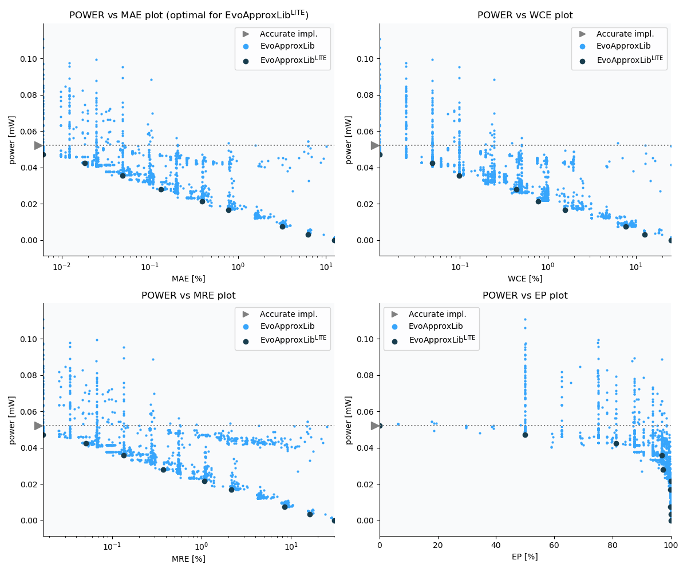

Selected circuits
===================
 - **Circuit**: 12-bit unsigned adders
 - **Selection criteria**: pareto optimal sub-set wrt. pwr and mae parameters

Parameters of selected circuits
----------------------------

| Circuit name | MAE% | WCE% | EP% | MRE% | MSE | Download |
| --- |  --- | --- | --- | --- | --- | --- | 
| add12u_2UF | 0.00 | 0.00 | 0.00 | 0.00 | 0 |  [[Verilog](add12u_2UF.v)] [[VerilogPDK45](add12u_2UF_pdk45.v)] [[C](add12u_2UF.c)] |
| add12u_39N | 0.0061 | 0.012 | 50.00 | 0.017 | 0.5 |  [[Verilog](add12u_39N.v)]  [[C](add12u_39N.c)] |
| add12u_4TF | 0.018 | 0.049 | 81.25 | 0.051 | 3.5 |  [[Verilog](add12u_4TF.v)] [[VerilogPDK45](add12u_4TF_pdk45.v)] [[C](add12u_4TF.c)] |
| add12u_2KC | 0.049 | 0.098 | 96.88 | 0.14 | 20 |  [[Verilog](add12u_2KC.v)] [[VerilogPDK45](add12u_2KC_pdk45.v)] [[C](add12u_2KC.c)] |
| add12u_3UT | 0.13 | 0.44 | 97.22 | 0.37 | 180 |  [[Verilog](add12u_3UT.v)]  [[C](add12u_3UT.c)] |
| add12u_2UH | 0.39 | 0.78 | 99.95 | 1.08 | 1242 |  [[Verilog](add12u_2UH.v)] [[VerilogPDK45](add12u_2UH_pdk45.v)] [[C](add12u_2UH.c)] |
| add12u_0PX | 0.98 | 3.78 | 99.57 | 2.64 | 10471 |  [[Verilog](add12u_0PX.v)]  [[C](add12u_0PX.c)] |
| add12u_0G8 | 3.20 | 7.71 | 99.91 | 8.54 | 92047 |  [[Verilog](add12u_0G8.v)]  [[C](add12u_0G8.c)] |
| add12u_38J | 6.25 | 12.50 | 100.00 | 16.24 | 325756 |  [[Verilog](add12u_38J.v)] [[VerilogPDK45](add12u_38J_pdk45.v)] [[C](add12u_38J.c)] |
| add12u_28B | 12.50 | 25.00 | 100.00 | 30.64 | 12997.08e2 |  [[Verilog](add12u_28B.v)]  [[C](add12u_28B.c)] |
    
Parameters
--------------

References
--------------
   - V. Mrazek, Z. Vasicek and R. Hrbacek, "Role of circuit representation in evolutionary design of energy-efficient approximate circuits" in IET Computers & Digital Techniques, vol. 12, no. 4, pp. 139-149, 7 2018. doi: [10.1049/iet-cdt.2017.0188](https://dx.doi.org/10.1049/iet-cdt.2017.0188)
   - V. MRAZEK. Optimization of BDD-based Approximation Error Metrics Calculations. In: IEEE Computer Society Annual Symposium on VLSI (ISVLSI '22). Paphos: Institute of Electrical and Electronics Engineers, 2022, pp. 86-91. ISBN 978-1-6654-6605-9.

             