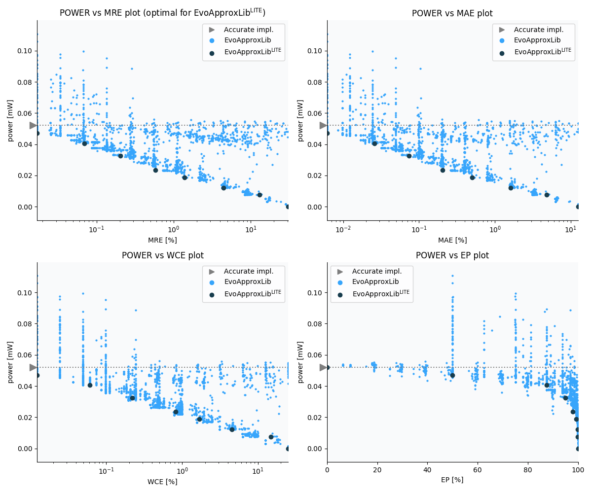

Selected circuits
===================
 - **Circuit**: 12-bit unsigned adders
 - **Selection criteria**: pareto optimal sub-set wrt. pwr and mre parameters

Parameters of selected circuits
----------------------------

| Circuit name | MAE% | WCE% | EP% | MRE% | MSE | Download |
| --- |  --- | --- | --- | --- | --- | --- | 
| add12u_2UF | 0.00 | 0.00 | 0.00 | 0.00 | 0 |  [[Verilog](add12u_2UF.v)] [[VerilogPDK45](add12u_2UF_pdk45.v)] [[C](add12u_2UF.c)] |
| add12u_39N | 0.0061 | 0.012 | 50.00 | 0.017 | 0.5 |  [[Verilog](add12u_39N.v)]  [[C](add12u_39N.c)] |
| add12u_0C9 | 0.026 | 0.061 | 87.50 | 0.07 | 6.0 |  [[Verilog](add12u_0C9.v)]  [[C](add12u_0C9.c)] |
| add12u_3L3 | 0.073 | 0.22 | 94.92 | 0.20 | 54 |  [[Verilog](add12u_3L3.v)]  [[C](add12u_3L3.c)] |
| add12u_0AZ | 0.21 | 0.82 | 97.84 | 0.58 | 474 |  [[Verilog](add12u_0AZ.v)]  [[C](add12u_0AZ.c)] |
| add12u_0B6 | 0.50 | 1.67 | 99.28 | 1.39 | 2518 |  [[Verilog](add12u_0B6.v)]  [[C](add12u_0B6.c)] |
| add12u_3R0 | 1.62 | 4.49 | 99.81 | 4.44 | 24176 |  [[Verilog](add12u_3R0.v)]  [[C](add12u_3R0.c)] |
| add12u_0G8 | 3.20 | 7.71 | 99.91 | 8.54 | 92047 |  [[Verilog](add12u_0G8.v)]  [[C](add12u_0G8.c)] |
| add12u_28B | 12.50 | 25.00 | 100.00 | 30.64 | 12997.08e2 |  [[Verilog](add12u_28B.v)]  [[C](add12u_28B.c)] |
    
Parameters
--------------

References
--------------
   - V. Mrazek, Z. Vasicek and R. Hrbacek, "Role of circuit representation in evolutionary design of energy-efficient approximate circuits" in IET Computers & Digital Techniques, vol. 12, no. 4, pp. 139-149, 7 2018. doi: [10.1049/iet-cdt.2017.0188](https://dx.doi.org/10.1049/iet-cdt.2017.0188)

             