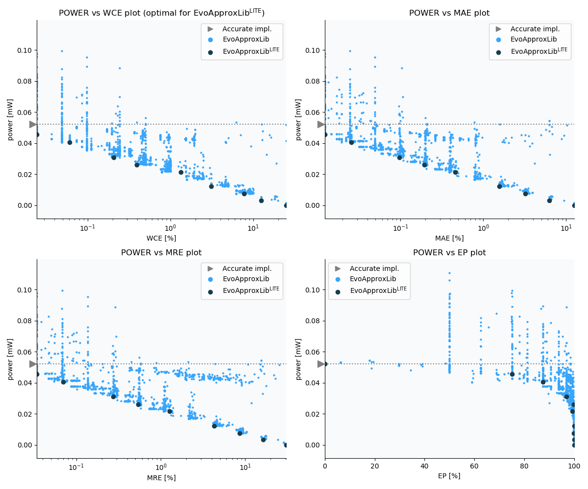

Selected circuits
===================
 - **Circuit**: 12-bit unsigned adders
 - **Selection criteria**: pareto optimal sub-set wrt. pwr and wce parameters

Parameters of selected circuits
----------------------------

| Circuit name | MAE% | WCE% | EP% | MRE% | MSE | Download |
| --- |  --- | --- | --- | --- | --- | --- | 
| add12u_2UF | 0.00 | 0.00 | 0.00 | 0.00 | 0 |  [[Verilog](add12u_2UF.v)] [[VerilogPDK45](add12u_2UF_pdk45.v)] [[C](add12u_2UF.c)] |
| add12u_4NT | 0.012 | 0.024 | 75.00 | 0.034 | 1.5 |  [[Verilog](add12u_4NT.v)] [[VerilogPDK45](add12u_4NT_pdk45.v)] [[C](add12u_4NT.c)] |
| add12u_0C9 | 0.026 | 0.061 | 87.50 | 0.07 | 6.0 |  [[Verilog](add12u_0C9.v)]  [[C](add12u_0C9.c)] |
| add12u_0JK | 0.098 | 0.21 | 96.88 | 0.27 | 86 |  [[Verilog](add12u_0JK.v)]  [[C](add12u_0JK.c)] |
| add12u_22J | 0.20 | 0.39 | 99.90 | 0.54 | 294 |  [[Verilog](add12u_22J.v)] [[VerilogPDK45](add12u_22J_pdk45.v)] [[C](add12u_22J.c)] |
| add12u_06R | 0.46 | 1.34 | 99.22 | 1.26 | 2047 |  [[Verilog](add12u_06R.v)]  [[C](add12u_06R.c)] |
| add12u_2L1 | 1.56 | 3.12 | 99.99 | 4.27 | 19387 |  [[Verilog](add12u_2L1.v)] [[VerilogPDK45](add12u_2L1_pdk45.v)] [[C](add12u_2L1.c)] |
| add12u_0G8 | 3.20 | 7.71 | 99.91 | 8.54 | 92047 |  [[Verilog](add12u_0G8.v)]  [[C](add12u_0G8.c)] |
| add12u_28B | 12.50 | 25.00 | 100.00 | 30.64 | 12997.08e2 |  [[Verilog](add12u_28B.v)]  [[C](add12u_28B.c)] |
    
Parameters
--------------

References
--------------
   - V. Mrazek, Z. Vasicek and R. Hrbacek, "Role of circuit representation in evolutionary design of energy-efficient approximate circuits" in IET Computers & Digital Techniques, vol. 12, no. 4, pp. 139-149, 7 2018. doi: [10.1049/iet-cdt.2017.0188](https://dx.doi.org/10.1049/iet-cdt.2017.0188)

             