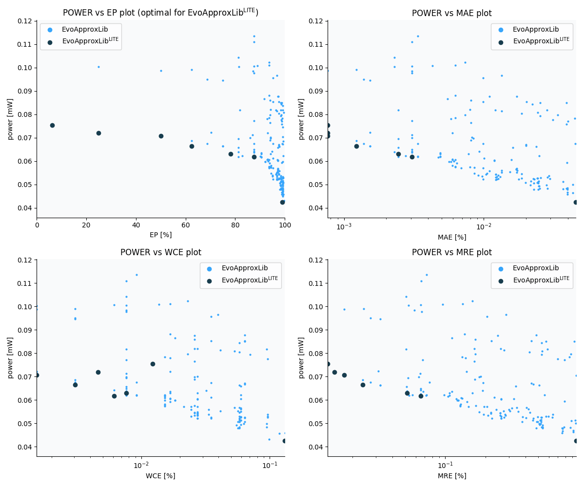

Selected circuits
===================
 - **Circuit**: 16-bit signed adders (no overflow)
 - **Selection criteria**: pareto optimal sub-set wrt. pwr and ep parameters

Parameters of selected circuits
----------------------------

| Circuit name | MAE% | WCE% | EP% | MRE% | MSE | Download |
| --- |  --- | --- | --- | --- | --- | --- | 
| add16se_35Y | 0.00076 | 0.012 | 6.25 | 0.013 | 4.0 |  [[Verilog](add16se_35Y.v)]  [[C](add16se_35Y.c)] |
| add16se_33J | 0.00076 | 0.0046 | 25.00 | 0.015 | 1.2 |  [[Verilog](add16se_33J.v)]  [[C](add16se_33J.c)] |
| add16se_2UY | 0.00076 | 0.0015 | 50.00 | 0.017 | 0.5 |  [[Verilog](add16se_2UY.v)]  [[C](add16se_2UY.c)] |
| add16se_2X2 | 0.0012 | 0.0031 | 62.50 | 0.024 | 1.0 |  [[Verilog](add16se_2X2.v)]  [[C](add16se_2X2.c)] |
| add16se_37L | 0.0024 | 0.0076 | 78.12 | 0.052 | 4.5 |  [[Verilog](add16se_37L.v)]  [[C](add16se_37L.c)] |
| add16se_349 | 0.0031 | 0.0061 | 87.50 | 0.065 | 5.5 |  [[Verilog](add16se_349.v)]  [[C](add16se_349.c)] |
| add16se_3BD | 0.046 | 0.13 | 99.02 | 0.96 | 1281 |  [[Verilog](add16se_3BD.v)]  [[C](add16se_3BD.c)] |
    
Parameters
--------------

References
--------------
   - V. Mrazek, L. Sekanina, Z. Vasicek "Libraries of Approximate Circuits: Automated Design and Application in CNN Accelerators" IEEE Journal on Emerging and Selected Topics in Circuits and Systems, Vol 10, No 4, 2020

             