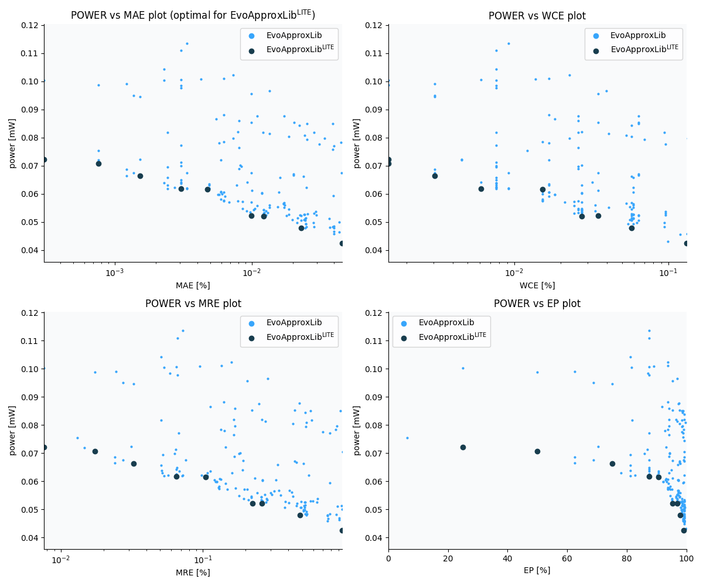

Selected circuits
===================
 - **Circuit**: 16-bit signed adders (no overflow)
 - **Selection criteria**: pareto optimal sub-set wrt. pwr and mae parameters

Parameters of selected circuits
----------------------------

| Circuit name | MAE% | WCE% | EP% | MRE% | MSE | Download |
| --- |  --- | --- | --- | --- | --- | --- | 
| add16se_2TN | 0.00031 | 0.0015 | 25.00 | 0.0076 | 0.2 |  [[Verilog](add16se_2TN.v)]  [[C](add16se_2TN.c)] |
| add16se_2UY | 0.00076 | 0.0015 | 50.00 | 0.017 | 0.5 |  [[Verilog](add16se_2UY.v)]  [[C](add16se_2UY.c)] |
| add16se_2U6 | 0.0015 | 0.0031 | 75.00 | 0.033 | 1.5 |  [[Verilog](add16se_2U6.v)]  [[C](add16se_2U6.c)] |
| add16se_349 | 0.0031 | 0.0061 | 87.50 | 0.065 | 5.5 |  [[Verilog](add16se_349.v)]  [[C](add16se_349.c)] |
| add16se_36D | 0.0047 | 0.015 | 90.62 | 0.10 | 15 |  [[Verilog](add16se_36D.v)]  [[C](add16se_36D.c)] |
| add16se_2YM | 0.0099 | 0.035 | 95.31 | 0.22 | 64 |  [[Verilog](add16se_2YM.v)]  [[C](add16se_2YM.c)] |
| add16se_2UB | 0.012 | 0.027 | 96.88 | 0.26 | 87 |  [[Verilog](add16se_2UB.v)]  [[C](add16se_2UB.c)] |
| add16se_32T | 0.023 | 0.058 | 97.95 | 0.48 | 312 |  [[Verilog](add16se_32T.v)]  [[C](add16se_32T.c)] |
| add16se_3BD | 0.046 | 0.13 | 99.02 | 0.96 | 1281 |  [[Verilog](add16se_3BD.v)]  [[C](add16se_3BD.c)] |
    
Parameters
--------------

References
--------------
   - V. Mrazek, L. Sekanina, Z. Vasicek "Libraries of Approximate Circuits: Automated Design and Application in CNN Accelerators" IEEE Journal on Emerging and Selected Topics in Circuits and Systems, Vol 10, No 4, 2020

             