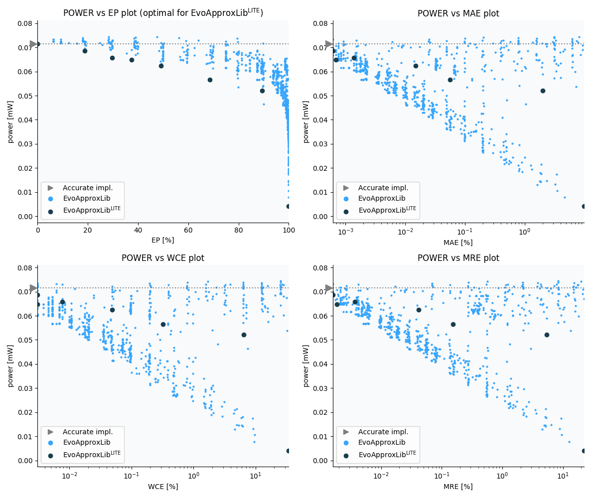

Selected circuits
===================
 - **Circuit**: 16-bit unsigned adders
 - **Selection criteria**: pareto optimal sub-set wrt. pwr and ep parameters

Parameters of selected circuits
----------------------------

| Circuit name | MAE% | WCE% | EP% | MRE% | MSE | Download |
| --- |  --- | --- | --- | --- | --- | --- | 
| add16u_1A5 | 0.00 | 0.00 | 0.00 | 0.00 | 0 |  [[Verilog](add16u_1A5.v)]  [[C](add16u_1A5.c)] |
| add16u_0TA | 0.00061 | 0.0031 | 18.75 | 0.0016 | 3.0 |  [[Verilog](add16u_0TA.v)]  [[C](add16u_0TA.c)] |
| add16u_15Q | 0.0014 | 0.0076 | 29.69 | 0.0037 | 13 |  [[Verilog](add16u_15Q.v)]  [[C](add16u_15Q.c)] |
| add16u_162 | 0.00069 | 0.0031 | 37.50 | 0.0019 | 2.2 |  [[Verilog](add16u_162.v)]  [[C](add16u_162.c)] |
| add16u_0U8 | 0.015 | 0.049 | 49.22 | 0.041 | 876 |  [[Verilog](add16u_0U8.v)]  [[C](add16u_0U8.c)] |
| add16u_0UV | 0.056 | 0.32 | 68.55 | 0.15 | 14574 |  [[Verilog](add16u_0UV.v)]  [[C](add16u_0UV.c)] |
| add16u_0VA | 2.01 | 6.46 | 89.45 | 5.41 | 16774.987e3 |  [[Verilog](add16u_0VA.v)]  [[C](add16u_0VA.c)] |
| add16u_067 | 9.90 | 34.18 | 100.00 | 22.35 | 25358.103e4 |  [[Verilog](add16u_067.v)]  [[C](add16u_067.c)] |
    
Parameters
--------------

References
--------------
   - V. MRAZEK. Optimization of BDD-based Approximation Error Metrics Calculations. In: IEEE Computer Society Annual Symposium on VLSI (ISVLSI '22). Paphos: Institute of Electrical and Electronics Engineers, 2022, pp. 86-91. ISBN 978-1-6654-6605-9.

             