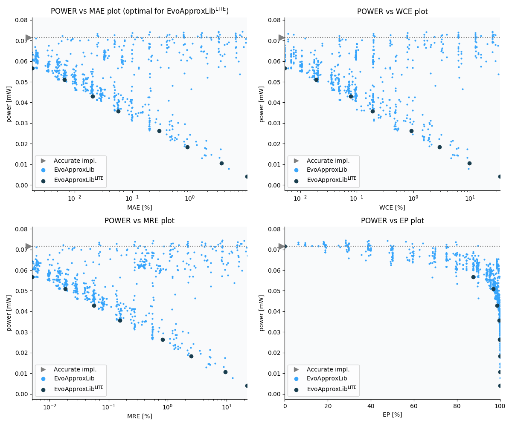

Selected circuits
===================
 - **Circuit**: 16-bit unsigned adders
 - **Selection criteria**: pareto optimal sub-set wrt. pwr and mae parameters

Parameters of selected circuits
----------------------------

| Circuit name | MAE% | WCE% | EP% | MRE% | MSE | Download |
| --- |  --- | --- | --- | --- | --- | --- | 
| add16u_1A5 | 0.00 | 0.00 | 0.00 | 0.00 | 0 |  [[Verilog](add16u_1A5.v)]  [[C](add16u_1A5.c)] |
| add16u_0GN | 0.0018 | 0.0053 | 87.50 | 0.005 | 8.5 |  [[Verilog](add16u_0GN.v)]  [[C](add16u_0GN.c)] |
| add16u_126 | 0.0066 | 0.019 | 96.88 | 0.018 | 109 |  [[Verilog](add16u_126.v)]  [[C](add16u_126.c)] |
| add16u_0P8 | 0.021 | 0.079 | 98.74 | 0.056 | 1136 |  [[Verilog](add16u_0P8.v)]  [[C](add16u_0P8.c)] |
| add16u_0HE | 0.057 | 0.19 | 99.61 | 0.16 | 8209 |  [[Verilog](add16u_0HE.v)]  [[C](add16u_0HE.c)] |
| add16u_07T | 0.29 | 0.92 | 99.92 | 0.82 | 222640 |  [[Verilog](add16u_07T.v)]  [[C](add16u_07T.c)] |
| add16u_0KU | 0.91 | 2.90 | 99.98 | 2.49 | 20515.545e2 |  [[Verilog](add16u_0KU.v)]  [[C](add16u_0KU.c)] |
| add16u_0SL | 3.52 | 9.74 | 99.99 | 9.54 | 30582.328e3 |  [[Verilog](add16u_0SL.v)]  [[C](add16u_0SL.c)] |
| add16u_067 | 9.90 | 34.18 | 100.00 | 22.35 | 25358.103e4 |  [[Verilog](add16u_067.v)]  [[C](add16u_067.c)] |
    
Parameters
--------------

References
--------------
   - V. MRAZEK. Optimization of BDD-based Approximation Error Metrics Calculations. In: IEEE Computer Society Annual Symposium on VLSI (ISVLSI '22). Paphos: Institute of Electrical and Electronics Engineers, 2022, pp. 86-91. ISBN 978-1-6654-6605-9.

             