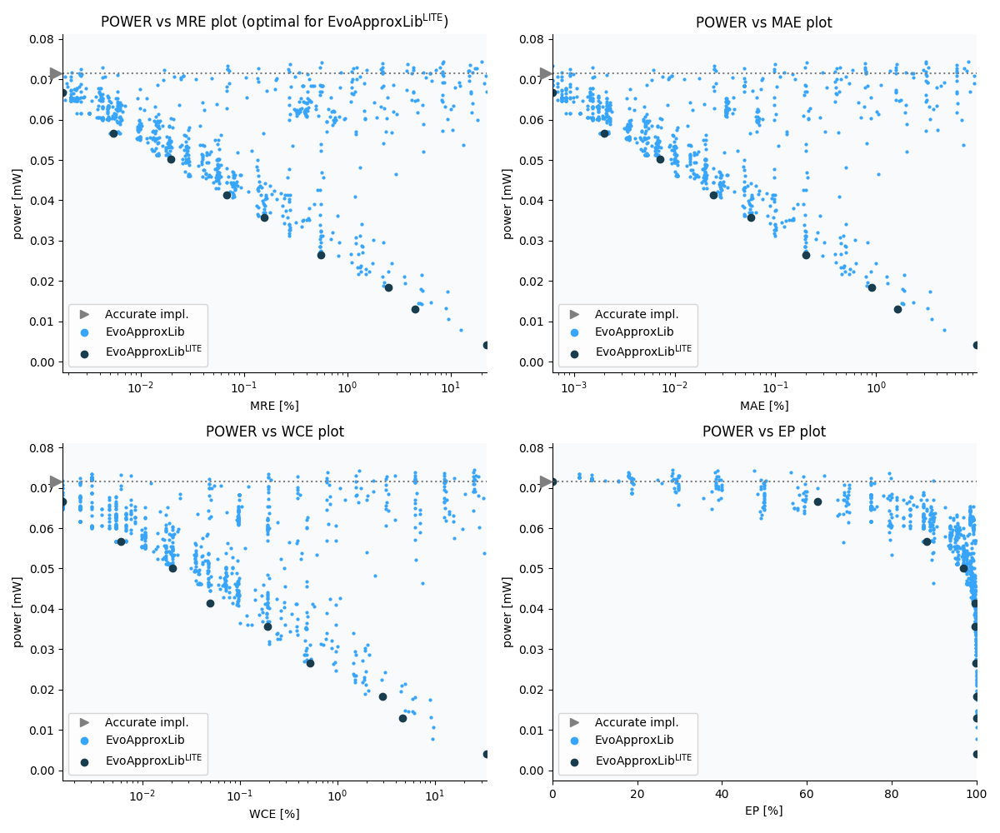

Selected circuits
===================
 - **Circuit**: 16-bit unsigned adders
 - **Selection criteria**: pareto optimal sub-set wrt. pwr and mre parameters

Parameters of selected circuits
----------------------------

| Circuit name | MAE% | WCE% | EP% | MRE% | MSE | Download |
| --- |  --- | --- | --- | --- | --- | --- | 
| add16u_1A5 | 0.00 | 0.00 | 0.00 | 0.00 | 0 |  [[Verilog](add16u_1A5.v)]  [[C](add16u_1A5.c)] |
| add16u_110 | 0.00061 | 0.0015 | 62.50 | 0.0017 | 1.0 |  [[Verilog](add16u_110.v)]  [[C](add16u_110.c)] |
| add16u_0NT | 0.002 | 0.0061 | 88.28 | 0.0054 | 10 |  [[Verilog](add16u_0NT.v)]  [[C](add16u_0NT.c)] |
| add16u_0GX | 0.0071 | 0.021 | 96.89 | 0.02 | 125 |  [[Verilog](add16u_0GX.v)]  [[C](add16u_0GX.c)] |
| add16u_0RH | 0.024 | 0.05 | 99.61 | 0.068 | 1344 |  [[Verilog](add16u_0RH.v)]  [[C](add16u_0RH.c)] |
| add16u_0HE | 0.057 | 0.19 | 99.61 | 0.16 | 8209 |  [[Verilog](add16u_0HE.v)]  [[C](add16u_0HE.c)] |
| add16u_0KG | 0.20 | 0.52 | 99.91 | 0.55 | 92039 |  [[Verilog](add16u_0KG.v)]  [[C](add16u_0KG.c)] |
| add16u_0KU | 0.91 | 2.90 | 99.98 | 2.49 | 20515.545e2 |  [[Verilog](add16u_0KU.v)]  [[C](add16u_0KU.c)] |
| add16u_0SD | 1.63 | 4.63 | 99.99 | 4.52 | 62975.827e2 |  [[Verilog](add16u_0SD.v)]  [[C](add16u_0SD.c)] |
| add16u_067 | 9.90 | 34.18 | 100.00 | 22.35 | 25358.103e4 |  [[Verilog](add16u_067.v)]  [[C](add16u_067.c)] |
    
Parameters
--------------

References
--------------
   - V. MRAZEK. Optimization of BDD-based Approximation Error Metrics Calculations. In: IEEE Computer Society Annual Symposium on VLSI (ISVLSI '22). Paphos: Institute of Electrical and Electronics Engineers, 2022, pp. 86-91. ISBN 978-1-6654-6605-9.

             