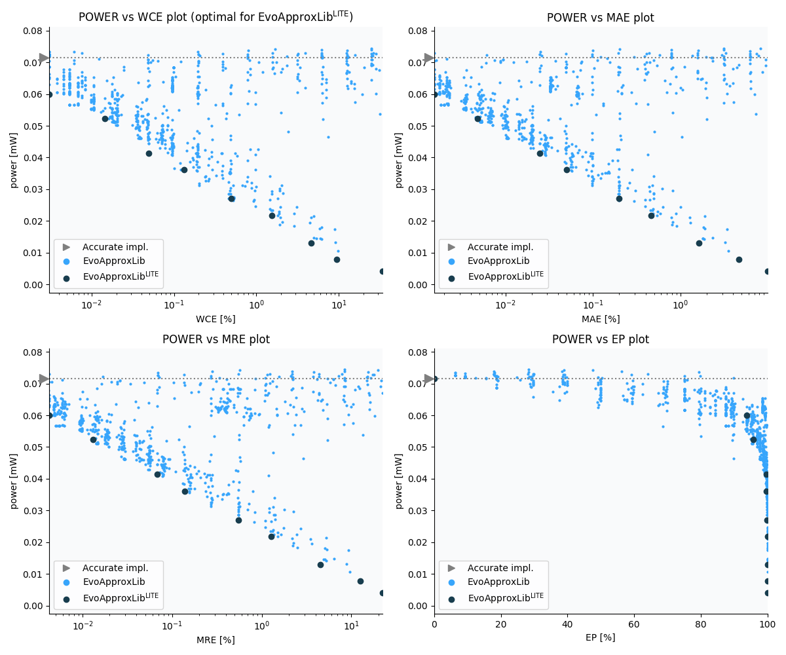

Selected circuits
===================
 - **Circuit**: 16-bit unsigned adders
 - **Selection criteria**: pareto optimal sub-set wrt. pwr and wce parameters

Parameters of selected circuits
----------------------------

| Circuit name | MAE% | WCE% | EP% | MRE% | MSE | Download |
| --- |  --- | --- | --- | --- | --- | --- | 
| add16u_1A5 | 0.00 | 0.00 | 0.00 | 0.00 | 0 |  [[Verilog](add16u_1A5.v)]  [[C](add16u_1A5.c)] |
| add16u_0NL | 0.0015 | 0.0031 | 93.75 | 0.0042 | 5.0 |  [[Verilog](add16u_0NL.v)]  [[C](add16u_0NL.c)] |
| add16u_08V | 0.0048 | 0.014 | 95.70 | 0.013 | 60 |  [[Verilog](add16u_08V.v)]  [[C](add16u_08V.c)] |
| add16u_0RJ | 0.024 | 0.049 | 99.95 | 0.068 | 1192 |  [[Verilog](add16u_0RJ.v)]  [[C](add16u_0RJ.c)] |
| add16u_0EZ | 0.05 | 0.13 | 99.71 | 0.14 | 5632 |  [[Verilog](add16u_0EZ.v)]  [[C](add16u_0EZ.c)] |
| add16u_0HK | 0.20 | 0.50 | 99.90 | 0.55 | 92768 |  [[Verilog](add16u_0HK.v)]  [[C](add16u_0HK.c)] |
| add16u_0PT | 0.46 | 1.54 | 99.95 | 1.28 | 531274 |  [[Verilog](add16u_0PT.v)]  [[C](add16u_0PT.c)] |
| add16u_0SD | 1.63 | 4.63 | 99.99 | 4.52 | 62975.827e2 |  [[Verilog](add16u_0SD.v)]  [[C](add16u_0SD.c)] |
| add16u_0J3 | 4.69 | 9.49 | 100.00 | 12.64 | 43382.861e3 |  [[Verilog](add16u_0J3.v)]  [[C](add16u_0J3.c)] |
| add16u_067 | 9.90 | 34.18 | 100.00 | 22.35 | 25358.103e4 |  [[Verilog](add16u_067.v)]  [[C](add16u_067.c)] |
    
Parameters
--------------

References
--------------
   - V. MRAZEK. Optimization of BDD-based Approximation Error Metrics Calculations. In: IEEE Computer Society Annual Symposium on VLSI (ISVLSI '22). Paphos: Institute of Electrical and Electronics Engineers, 2022, pp. 86-91. ISBN 978-1-6654-6605-9.

             