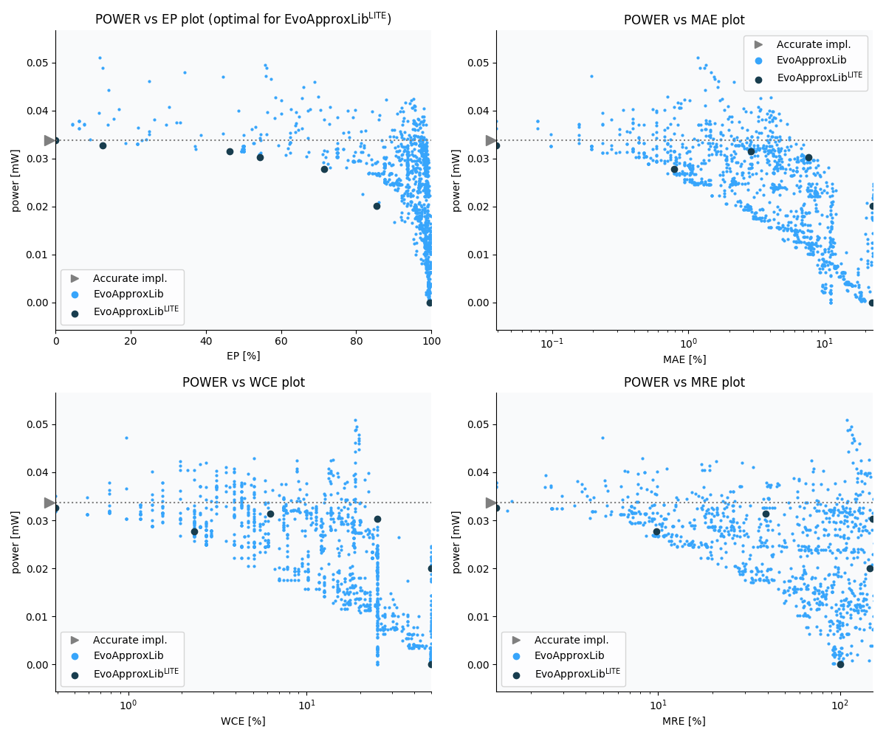

Selected circuits
===================
 - **Circuit**: 8-bit signed adders (with overflow)
 - **Selection criteria**: pareto optimal sub-set wrt. pwr and ep parameters

Parameters of selected circuits
----------------------------

| Circuit name | MAE% | WCE% | EP% | MRE% | MSE | Download |
| --- |  --- | --- | --- | --- | --- | --- | 
| add8s_9CT | 0.00 | 0.00 | 0.00 | 0.00 | 0 |  [[Verilog](add8s_9CT.v)]  [[C](add8s_9CT.c)] |
| add8s_8XJ | 0.16 | 1.56 | 12.50 | 1.29 | 0.5 |  [[Verilog](add8s_8XJ.v)]  [[C](add8s_8XJ.c)] |
| add8s_7TV | 5.78 | 12.50 | 46.35 | 39.10 | 119 |  [[Verilog](add8s_7TV.v)]  [[C](add8s_7TV.c)] |
| add8s_8ZY | 30.39 | 100.00 | 54.43 | 150.85 | 3013 |  [[Verilog](add8s_8ZY.v)]  [[C](add8s_8ZY.c)] |
| add8s_7JM | 1.56 | 4.69 | 71.48 | 9.74 | 6.5 |  [[Verilog](add8s_7JM.v)]  [[C](add8s_7JM.c)] |
| add8s_7J4 | 44.77 | 100.00 | 85.42 | 146.36 | 5003 |  [[Verilog](add8s_7J4.v)]  [[C](add8s_7J4.c)] |
| add8s_7P0 | 44.45 | 100.00 | 99.48 | 99.98 | 4551 |  [[Verilog](add8s_7P0.v)]  [[C](add8s_7P0.c)] |
    
Parameters
--------------

References
--------------
   - V. Mrazek, L. Sekanina, Z. Vasicek "Libraries of Approximate Circuits: Automated Design and Application in CNN Accelerators" IEEE Journal on Emerging and Selected Topics in Circuits and Systems, Vol 10, No 4, 2020

             