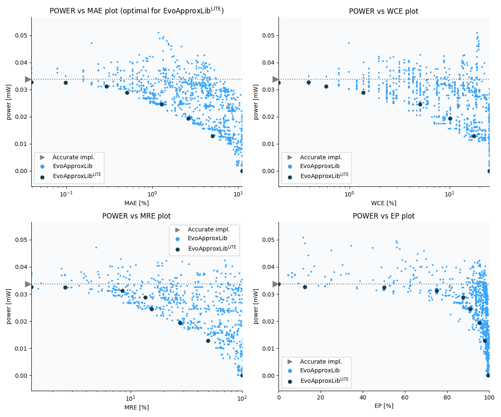

Selected circuits
===================
 - **Circuit**: 8-bit signed adders (with overflow)
 - **Selection criteria**: pareto optimal sub-set wrt. pwr and mae parameters

Parameters of selected circuits
----------------------------

| Circuit name | MAE% | WCE% | EP% | MRE% | MSE | Download |
| --- |  --- | --- | --- | --- | --- | --- | 
| add8s_9CT | 0.00 | 0.00 | 0.00 | 0.00 | 0 |  [[Verilog](add8s_9CT.v)]  [[C](add8s_9CT.c)] |
| add8s_8XJ | 0.16 | 1.56 | 12.50 | 1.29 | 0.5 |  [[Verilog](add8s_8XJ.v)]  [[C](add8s_8XJ.c)] |
| add8s_7XS | 0.39 | 1.56 | 37.30 | 1.48 | 0.7 |  [[Verilog](add8s_7XS.v)]  [[C](add8s_7XS.c)] |
| add8s_7EL | 0.86 | 3.91 | 66.85 | 4.21 | 2.4 |  [[Verilog](add8s_7EL.v)]  [[C](add8s_7EL.c)] |
| add8s_7ED | 1.88 | 5.47 | 87.50 | 11.76 | 8.4 |  [[Verilog](add8s_7ED.v)]  [[C](add8s_7ED.c)] |
| add8s_7K3 | 3.75 | 9.38 | 93.75 | 26.40 | 35 |  [[Verilog](add8s_7K3.v)]  [[C](add8s_7K3.c)] |
| add8s_7TZ | 6.88 | 25.00 | 99.27 | 40.60 | 110 |  [[Verilog](add8s_7TZ.v)]  [[C](add8s_7TZ.c)] |
| add8s_7QY | 12.27 | 33.59 | 98.52 | 75.00 | 343 |  [[Verilog](add8s_7QY.v)]  [[C](add8s_7QY.c)] |
| add8s_7GP | 25.47 | 72.66 | 99.11 | 161.98 | 1507 |  [[Verilog](add8s_7GP.v)]  [[C](add8s_7GP.c)] |
| add8s_7P0 | 44.45 | 100.00 | 99.48 | 99.98 | 4551 |  [[Verilog](add8s_7P0.v)]  [[C](add8s_7P0.c)] |
    
Parameters
--------------

References
--------------
   - V. Mrazek, L. Sekanina, Z. Vasicek "Libraries of Approximate Circuits: Automated Design and Application in CNN Accelerators" IEEE Journal on Emerging and Selected Topics in Circuits and Systems, Vol 10, No 4, 2020

             