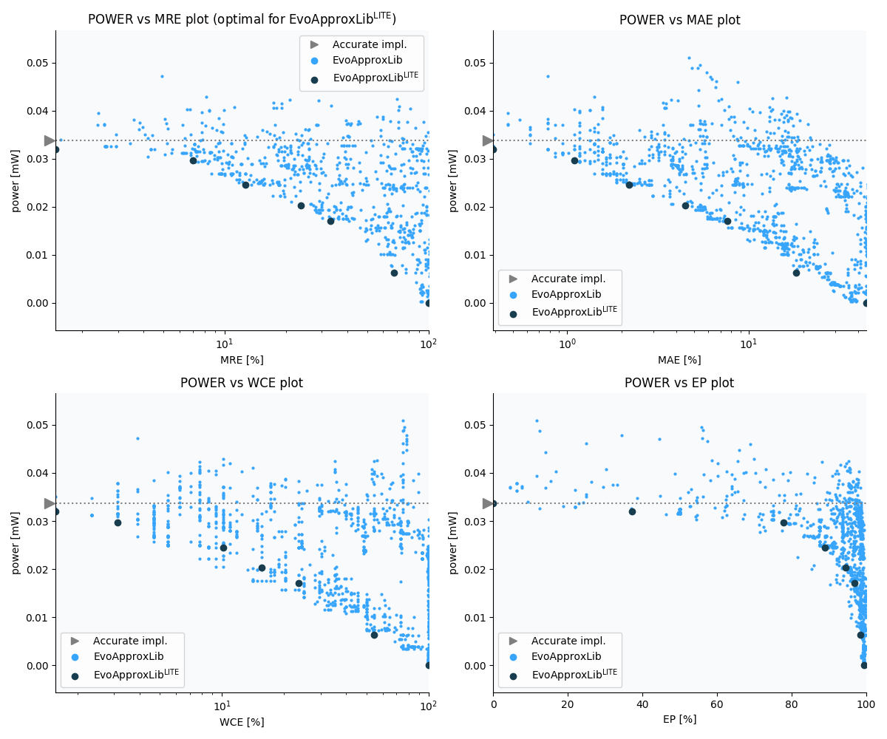

Selected circuits
===================
 - **Circuit**: 8-bit signed adders (with overflow)
 - **Selection criteria**: pareto optimal sub-set wrt. pwr and mre parameters

Parameters of selected circuits
----------------------------

| Circuit name | MAE% | WCE% | EP% | MRE% | MSE | Download |
| --- |  --- | --- | --- | --- | --- | --- | 
| add8s_9CT | 0.00 | 0.00 | 0.00 | 0.00 | 0 |  [[Verilog](add8s_9CT.v)]  [[C](add8s_9CT.c)] |
| add8s_7XS | 0.39 | 1.56 | 37.30 | 1.48 | 0.7 |  [[Verilog](add8s_7XS.v)]  [[C](add8s_7XS.c)] |
| add8s_7VF | 1.09 | 3.12 | 77.83 | 7.00 | 2.9 |  [[Verilog](add8s_7VF.v)]  [[C](add8s_7VF.c)] |
| add8s_7Q0 | 2.19 | 10.16 | 88.98 | 12.68 | 12 |  [[Verilog](add8s_7Q0.v)]  [[C](add8s_7Q0.c)] |
| add8s_7RT | 4.45 | 15.62 | 94.39 | 23.64 | 49 |  [[Verilog](add8s_7RT.v)]  [[C](add8s_7RT.c)] |
| add8s_7ML | 7.66 | 23.44 | 96.91 | 33.04 | 142 |  [[Verilog](add8s_7ML.v)]  [[C](add8s_7ML.c)] |
| add8s_7FP | 18.28 | 54.69 | 98.52 | 67.56 | 839 |  [[Verilog](add8s_7FP.v)]  [[C](add8s_7FP.c)] |
| add8s_7P0 | 44.45 | 100.00 | 99.48 | 99.98 | 4551 |  [[Verilog](add8s_7P0.v)]  [[C](add8s_7P0.c)] |
    
Parameters
--------------

References
--------------
   - V. Mrazek, L. Sekanina, Z. Vasicek "Libraries of Approximate Circuits: Automated Design and Application in CNN Accelerators" IEEE Journal on Emerging and Selected Topics in Circuits and Systems, Vol 10, No 4, 2020

             