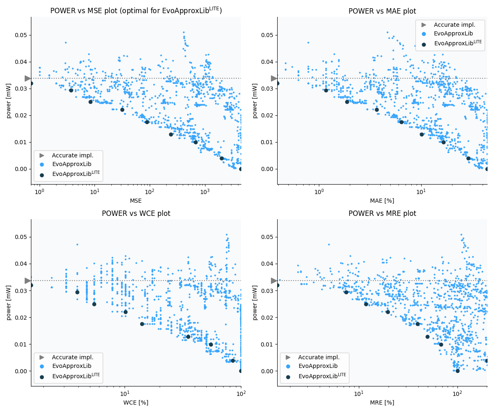

Selected circuits
===================
 - **Circuit**: 8-bit signed adders (with overflow)
 - **Selection criteria**: pareto optimal sub-set wrt. pwr and mse parameters

Parameters of selected circuits
----------------------------

| Circuit name | MAE% | WCE% | EP% | MRE% | MSE | Download |
| --- |  --- | --- | --- | --- | --- | --- | 
| add8s_9CT | 0.00 | 0.00 | 0.00 | 0.00 | 0 |  [[Verilog](add8s_9CT.v)]  [[C](add8s_9CT.c)] |
| add8s_7XS | 0.39 | 1.56 | 37.30 | 1.48 | 0.7 |  [[Verilog](add8s_7XS.v)]  [[C](add8s_7XS.c)] |
| add8s_7VB | 1.17 | 3.91 | 79.44 | 7.44 | 3.7 |  [[Verilog](add8s_7VB.v)]  [[C](add8s_7VB.c)] |
| add8s_7ED | 1.88 | 5.47 | 87.50 | 11.76 | 8.4 |  [[Verilog](add8s_7ED.v)]  [[C](add8s_7ED.c)] |
| add8s_7QQ | 3.67 | 10.16 | 94.56 | 19.71 | 31 |  [[Verilog](add8s_7QQ.v)]  [[C](add8s_7QQ.c)] |
| add8s_7QB | 6.41 | 14.06 | 97.20 | 39.40 | 89 |  [[Verilog](add8s_7QB.v)]  [[C](add8s_7QB.c)] |
| add8s_7R4 | 10.08 | 35.16 | 97.84 | 49.43 | 240 |  [[Verilog](add8s_7R4.v)]  [[C](add8s_7R4.c)] |
| add8s_7FS | 16.48 | 54.69 | 98.32 | 68.05 | 684 |  [[Verilog](add8s_7FS.v)]  [[C](add8s_7FS.c)] |
| add8s_7H2 | 28.83 | 84.38 | 99.22 | 202.19 | 1995 |  [[Verilog](add8s_7H2.v)]  [[C](add8s_7H2.c)] |
| add8s_7P0 | 44.45 | 100.00 | 99.48 | 99.98 | 4551 |  [[Verilog](add8s_7P0.v)]  [[C](add8s_7P0.c)] |
    
Parameters
--------------

References
--------------
   - V. Mrazek, L. Sekanina, Z. Vasicek "Libraries of Approximate Circuits: Automated Design and Application in CNN Accelerators" IEEE Journal on Emerging and Selected Topics in Circuits and Systems, Vol 10, No 4, 2020

             