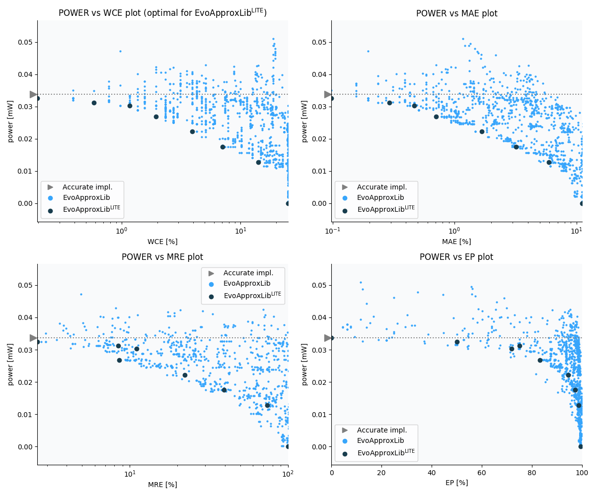

Selected circuits
===================
 - **Circuit**: 8-bit signed adders (with overflow)
 - **Selection criteria**: pareto optimal sub-set wrt. pwr and wce parameters

Parameters of selected circuits
----------------------------

| Circuit name | MAE% | WCE% | EP% | MRE% | MSE | Download |
| --- |  --- | --- | --- | --- | --- | --- | 
| add8s_9CT | 0.00 | 0.00 | 0.00 | 0.00 | 0 |  [[Verilog](add8s_9CT.v)]  [[C](add8s_9CT.c)] |
| add8s_7HJ | 0.39 | 0.78 | 50.00 | 2.62 | 0.5 |  [[Verilog](add8s_7HJ.v)]  [[C](add8s_7HJ.c)] |
| add8s_7VE | 0.78 | 1.56 | 49.74 | 4.35 | 2.0 |  [[Verilog](add8s_7VE.v)]  [[C](add8s_7VE.c)] |
| add8s_7ER | 1.41 | 3.91 | 83.20 | 8.59 | 4.6 |  [[Verilog](add8s_7ER.v)]  [[C](add8s_7ER.c)] |
| add8s_7EQ | 2.50 | 5.47 | 87.50 | 18.19 | 16 |  [[Verilog](add8s_7EQ.v)]  [[C](add8s_7EQ.c)] |
| add8s_7K3 | 3.75 | 9.38 | 93.75 | 26.40 | 35 |  [[Verilog](add8s_7K3.v)]  [[C](add8s_7K3.c)] |
| add8s_7M8 | 7.97 | 19.53 | 96.88 | 61.40 | 158 |  [[Verilog](add8s_7M8.v)]  [[C](add8s_7M8.c)] |
| add8s_7QY | 12.27 | 33.59 | 98.52 | 75.00 | 343 |  [[Verilog](add8s_7QY.v)]  [[C](add8s_7QY.c)] |
| add8s_7FP | 18.28 | 54.69 | 98.52 | 67.56 | 839 |  [[Verilog](add8s_7FP.v)]  [[C](add8s_7FP.c)] |
| add8s_7P0 | 44.45 | 100.00 | 99.48 | 99.98 | 4551 |  [[Verilog](add8s_7P0.v)]  [[C](add8s_7P0.c)] |
    
Parameters
--------------

References
--------------
   - V. Mrazek, L. Sekanina, Z. Vasicek "Libraries of Approximate Circuits: Automated Design and Application in CNN Accelerators" IEEE Journal on Emerging and Selected Topics in Circuits and Systems, Vol 10, No 4, 2020

             