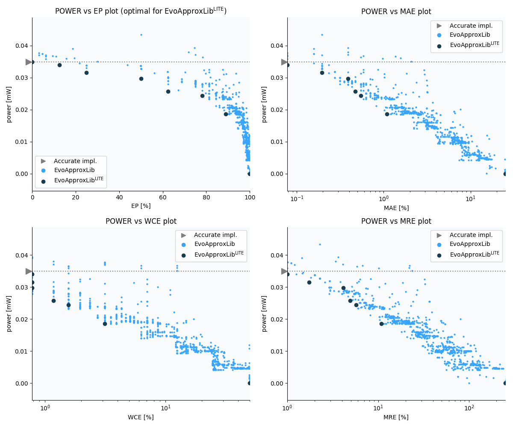

Selected circuits
===================
 - **Circuit**: 8-bit signed adders (no overflow)
 - **Selection criteria**: pareto optimal sub-set wrt. pwr and ep parameters

Parameters of selected circuits
----------------------------

| Circuit name | MAE% | WCE% | EP% | MRE% | MSE | Download |
| --- |  --- | --- | --- | --- | --- | --- | 
| add8se_8CL | 0.00 | 0.00 | 0.00 | 0.00 | 0 |  [[Verilog](add8se_8CL.v)]  [[C](add8se_8CL.c)] |
| add8se_8AM | 0.078 | 0.78 | 12.50 | 1.00 | 0.5 |  [[Verilog](add8se_8AM.v)]  [[C](add8se_8AM.c)] |
| add8se_8X1 | 0.20 | 0.78 | 25.00 | 1.74 | 1.0 |  [[Verilog](add8se_8X1.v)]  [[C](add8se_8X1.c)] |
| add8se_8J7 | 0.39 | 0.78 | 50.00 | 4.15 | 2.0 |  [[Verilog](add8se_8J7.v)]  [[C](add8se_8J7.c)] |
| add8se_8MZ | 0.47 | 1.17 | 62.50 | 4.89 | 2.8 |  [[Verilog](add8se_8MZ.v)]  [[C](add8se_8MZ.c)] |
| add8se_8PT | 0.55 | 1.56 | 78.12 | 5.69 | 3.2 |  [[Verilog](add8se_8PT.v)]  [[C](add8se_8PT.c)] |
| add8se_8T0 | 1.09 | 3.12 | 89.06 | 10.79 | 12 |  [[Verilog](add8se_8T0.v)]  [[C](add8se_8T0.c)] |
| add8se_8NH | 25.00 | 50.00 | 99.95 | 249.36 | 4798 |  [[Verilog](add8se_8NH.v)]  [[C](add8se_8NH.c)] |
    
Parameters
--------------

References
--------------
   - V. Mrazek, L. Sekanina, Z. Vasicek "Libraries of Approximate Circuits: Automated Design and Application in CNN Accelerators" IEEE Journal on Emerging and Selected Topics in Circuits and Systems, Vol 10, No 4, 2020

             