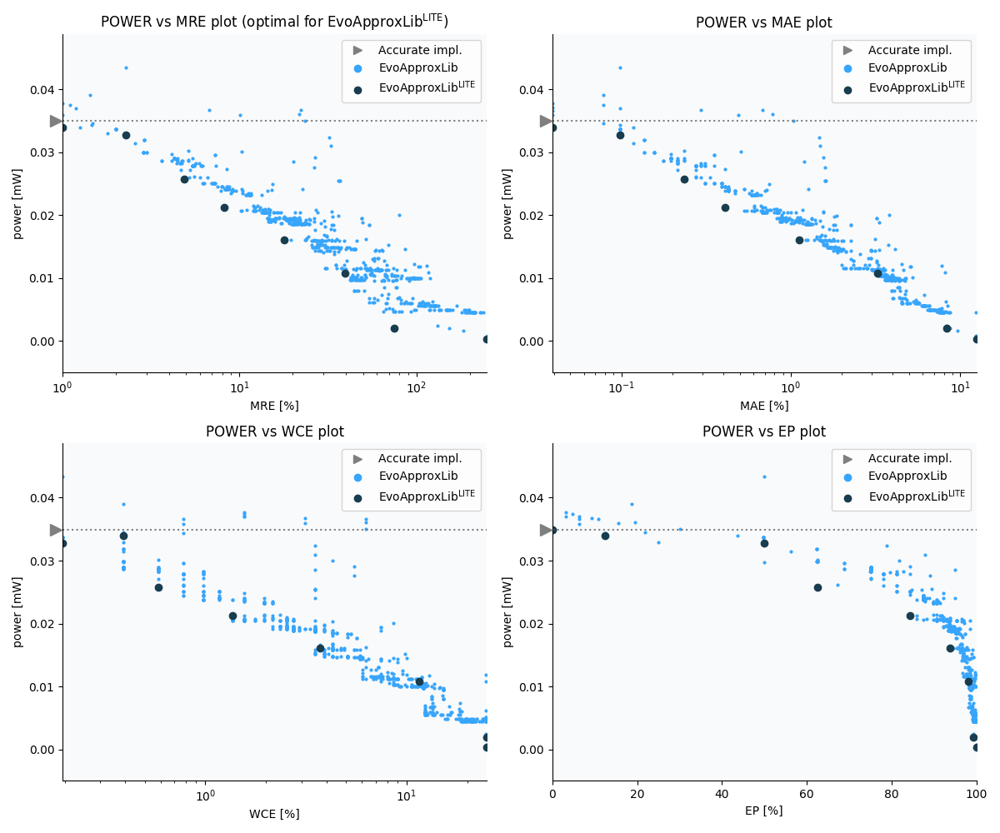

Selected circuits
===================
 - **Circuit**: 8-bit signed adders (no overflow)
 - **Selection criteria**: pareto optimal sub-set wrt. pwr and mre parameters

Parameters of selected circuits
----------------------------

| Circuit name | MAE% | WCE% | EP% | MRE% | MSE | Download |
| --- |  --- | --- | --- | --- | --- | --- | 
| add8se_8CL | 0.00 | 0.00 | 0.00 | 0.00 | 0 |  [[Verilog](add8se_8CL.v)]  [[C](add8se_8CL.c)] |
| add8se_8R9 | 0.078 | 0.39 | 25.00 | 0.87 | 0.2 |  [[Verilog](add8se_8R9.v)]  [[C](add8se_8R9.c)] |
| add8se_8X1 | 0.20 | 0.78 | 25.00 | 1.74 | 1.0 |  [[Verilog](add8se_8X1.v)]  [[C](add8se_8X1.c)] |
| add8se_8MZ | 0.47 | 1.17 | 62.50 | 4.89 | 2.8 |  [[Verilog](add8se_8MZ.v)]  [[C](add8se_8MZ.c)] |
| add8se_8CG | 0.82 | 2.73 | 84.38 | 8.19 | 7.2 |  [[Verilog](add8se_8CG.v)]  [[C](add8se_8CG.c)] |
| add8se_8L9 | 2.23 | 7.42 | 93.75 | 18.02 | 50 |  [[Verilog](add8se_8L9.v)]  [[C](add8se_8L9.c)] |
| add8se_8QH | 4.38 | 12.50 | 97.27 | 39.03 | 190 |  [[Verilog](add8se_8QH.v)]  [[C](add8se_8QH.c)] |
| add8se_8MG | 16.64 | 50.00 | 99.22 | 75.00 | 2723 |  [[Verilog](add8se_8MG.v)]  [[C](add8se_8MG.c)] |
| add8se_8ND | 15.35 | 50.00 | 99.22 | 100.10 | 2301 |  [[Verilog](add8se_8ND.v)]  [[C](add8se_8ND.c)] |
| add8se_8NH | 25.00 | 50.00 | 99.95 | 249.36 | 4798 |  [[Verilog](add8se_8NH.v)]  [[C](add8se_8NH.c)] |
    
Parameters
--------------

References
--------------
   - V. Mrazek, L. Sekanina, Z. Vasicek "Libraries of Approximate Circuits: Automated Design and Application in CNN Accelerators" IEEE Journal on Emerging and Selected Topics in Circuits and Systems, Vol 10, No 4, 2020

             