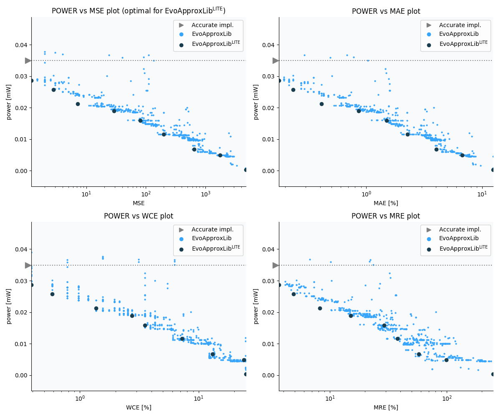

Selected circuits
===================
 - **Circuit**: 8-bit signed adders (no overflow)
 - **Selection criteria**: pareto optimal sub-set wrt. pwr and mse parameters

Parameters of selected circuits
----------------------------

| Circuit name | MAE% | WCE% | EP% | MRE% | MSE | Download |
| --- |  --- | --- | --- | --- | --- | --- | 
| add8se_8CL | 0.00 | 0.00 | 0.00 | 0.00 | 0 |  [[Verilog](add8se_8CL.v)]  [[C](add8se_8CL.c)] |
| add8se_8R9 | 0.078 | 0.39 | 25.00 | 0.87 | 0.2 |  [[Verilog](add8se_8R9.v)]  [[C](add8se_8R9.c)] |
| add8se_8PH | 0.20 | 0.39 | 50.00 | 2.28 | 0.5 |  [[Verilog](add8se_8PH.v)]  [[C](add8se_8PH.c)] |
| add8se_8NG | 0.39 | 0.78 | 75.00 | 4.02 | 1.5 |  [[Verilog](add8se_8NG.v)]  [[C](add8se_8NG.c)] |
| add8se_8PR | 0.78 | 1.56 | 87.50 | 8.05 | 5.5 |  [[Verilog](add8se_8PR.v)]  [[C](add8se_8PR.c)] |
| add8se_8UV | 1.21 | 3.91 | 90.62 | 12.28 | 15 |  [[Verilog](add8se_8UV.v)]  [[C](add8se_8UV.c)] |
| add8se_8VS | 2.42 | 6.25 | 94.53 | 24.46 | 56 |  [[Verilog](add8se_8VS.v)]  [[C](add8se_8VS.c)] |
| add8se_8QJ | 4.22 | 13.28 | 97.07 | 38.69 | 175 |  [[Verilog](add8se_8QJ.v)]  [[C](add8se_8QJ.c)] |
| add8se_8PD | 7.42 | 25.00 | 98.45 | 67.81 | 545 |  [[Verilog](add8se_8PD.v)]  [[C](add8se_8PD.c)] |
| add8se_8NH | 25.00 | 50.00 | 99.95 | 249.36 | 4798 |  [[Verilog](add8se_8NH.v)]  [[C](add8se_8NH.c)] |
    
Parameters
--------------

References
--------------
   - V. Mrazek, L. Sekanina, Z. Vasicek "Libraries of Approximate Circuits: Automated Design and Application in CNN Accelerators" IEEE Journal on Emerging and Selected Topics in Circuits and Systems, Vol 10, No 4, 2020

             