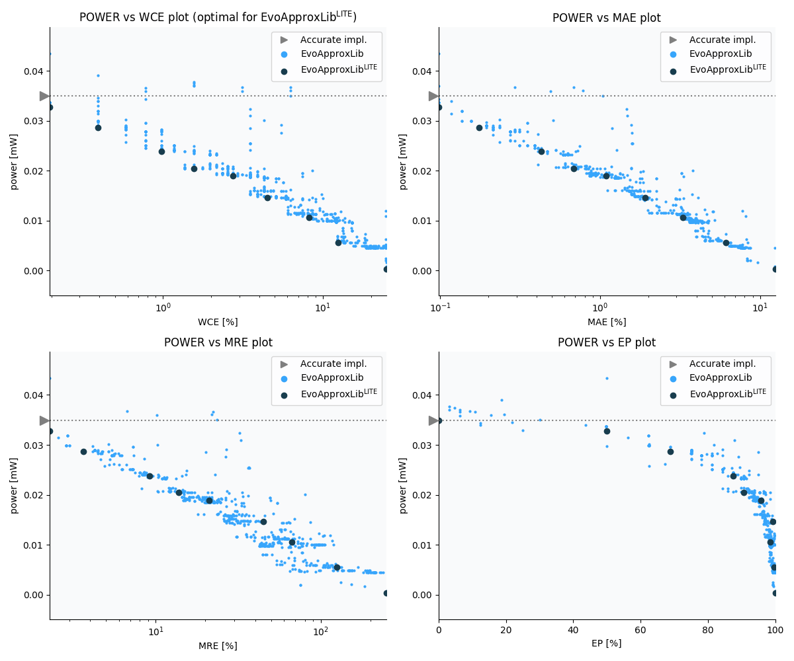

Selected circuits
===================
 - **Circuit**: 8-bit signed adders (no overflow)
 - **Selection criteria**: pareto optimal sub-set wrt. pwr and wce parameters

Parameters of selected circuits
----------------------------

| Circuit name | MAE% | WCE% | EP% | MRE% | MSE | Download |
| --- |  --- | --- | --- | --- | --- | --- | 
| add8se_8CL | 0.00 | 0.00 | 0.00 | 0.00 | 0 |  [[Verilog](add8se_8CL.v)]  [[C](add8se_8CL.c)] |
| add8se_8PH | 0.20 | 0.39 | 50.00 | 2.28 | 0.5 |  [[Verilog](add8se_8PH.v)]  [[C](add8se_8PH.c)] |
| add8se_8NG | 0.39 | 0.78 | 75.00 | 4.02 | 1.5 |  [[Verilog](add8se_8NG.v)]  [[C](add8se_8NG.c)] |
| add8se_8PR | 0.78 | 1.56 | 87.50 | 8.05 | 5.5 |  [[Verilog](add8se_8PR.v)]  [[C](add8se_8PR.c)] |
| add8se_8SZ | 1.56 | 3.12 | 93.75 | 16.11 | 22 |  [[Verilog](add8se_8SZ.v)]  [[C](add8se_8SZ.c)] |
| add8se_8VQ | 3.12 | 6.25 | 99.22 | 32.28 | 77 |  [[Verilog](add8se_8VQ.v)]  [[C](add8se_8VQ.c)] |
| add8se_8Q3 | 6.25 | 12.50 | 99.80 | 64.84 | 313 |  [[Verilog](add8se_8Q3.v)]  [[C](add8se_8Q3.c)] |
| add8se_8S7 | 8.28 | 26.17 | 98.49 | 56.09 | 672 |  [[Verilog](add8se_8S7.v)]  [[C](add8se_8S7.c)] |
| add8se_8NH | 25.00 | 50.00 | 99.95 | 249.36 | 4798 |  [[Verilog](add8se_8NH.v)]  [[C](add8se_8NH.c)] |
    
Parameters
--------------

References
--------------
   - V. Mrazek, L. Sekanina, Z. Vasicek "Libraries of Approximate Circuits: Automated Design and Application in CNN Accelerators" IEEE Journal on Emerging and Selected Topics in Circuits and Systems, Vol 10, No 4, 2020

             