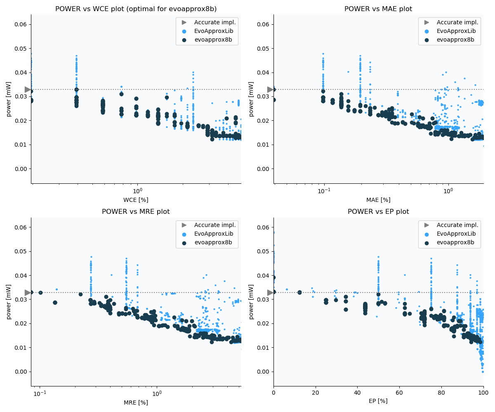

Selected circuits
===================
 - **Circuit**: 8-bit unsigned adders
 - **Selection criteria**: none, complete evoapprox8b

Parameters of selected circuits
----------------------------

| Circuit name | MAE% | WCE% | EP% | MRE% | MSE | Download |
| --- |  --- | --- | --- | --- | --- | --- | 
| add8_CarrySelectAdder | 0.00 | 0.00 | 0.00 | 0.00 | 0 |  [[Verilog](add8_CarrySelectAdder.v)] [[VerilogPDK45](add8_CarrySelectAdder_pdk45.v)] [[C](add8_CarrySelectAdder.c)] |
| add8_CarryLookaheadAdder | 0.00 | 0.00 | 0.00 | 0.00 | 0 |  [[Verilog](add8_CarryLookaheadAdder.v)] [[VerilogPDK45](add8_CarryLookaheadAdder_pdk45.v)] [[C](add8_CarryLookaheadAdder.c)] |
| add8_TreeAdder_With_KnowlesArchitecture | 0.00 | 0.00 | 0.00 | 0.00 | 0 |  [[Verilog](add8_TreeAdder_With_KnowlesArchitecture.v)] [[VerilogPDK45](add8_TreeAdder_With_KnowlesArchitecture_pdk45.v)] [[C](add8_TreeAdder_With_KnowlesArchitecture.c)] |
| add8_345 | 0.00 | 0.00 | 0.00 | 0.00 | 0 |  [[Verilog](add8_345.v)] [[VerilogPDK45](add8_345_pdk45.v)] [[C](add8_345.c)] |
| add8_HigherValencyTreeAdder_With_BrentKungArchitecture | 0.00 | 0.00 | 0.00 | 0.00 | 0 |  [[Verilog](add8_HigherValencyTreeAdder_With_BrentKungArchitecture.v)] [[VerilogPDK45](add8_HigherValencyTreeAdder_With_BrentKungArchitecture_pdk45.v)] [[C](add8_HigherValencyTreeAdder_With_BrentKungArchitecture.c)] |
| add8_387 | 0.00 | 0.00 | 0.00 | 0.00 | 0 |  [[Verilog](add8_387.v)] [[VerilogPDK45](add8_387_pdk45.v)] [[C](add8_387.c)] |
| add8_243 | 0.00 | 0.00 | 0.00 | 0.00 | 0 |  [[Verilog](add8_243.v)] [[VerilogPDK45](add8_243_pdk45.v)] [[C](add8_243.c)] |
| add8_441 | 0.00 | 0.00 | 0.00 | 0.00 | 0 |  [[Verilog](add8_441.v)] [[VerilogPDK45](add8_441_pdk45.v)] [[C](add8_441.c)] |
| add8_443 | 0.00 | 0.00 | 0.00 | 0.00 | 0 |  [[Verilog](add8_443.v)] [[VerilogPDK45](add8_443_pdk45.v)] [[C](add8_443.c)] |
| add8_HigherValencyTreeAdder_With_KoggeStoneArchitecture | 0.00 | 0.00 | 0.00 | 0.00 | 0 |  [[Verilog](add8_HigherValencyTreeAdder_With_KoggeStoneArchitecture.v)] [[VerilogPDK45](add8_HigherValencyTreeAdder_With_KoggeStoneArchitecture_pdk45.v)] [[C](add8_HigherValencyTreeAdder_With_KoggeStoneArchitecture.c)] |
| add8_146 | 0.00 | 0.00 | 0.00 | 0.00 | 0 |  [[Verilog](add8_146.v)] [[VerilogPDK45](add8_146_pdk45.v)] [[C](add8_146.c)] |
| add8_288 | 0.00 | 0.00 | 0.00 | 0.00 | 0 |  [[Verilog](add8_288.v)] [[VerilogPDK45](add8_288_pdk45.v)] [[C](add8_288.c)] |
| add8_285 | 0.00 | 0.00 | 0.00 | 0.00 | 0 |  [[Verilog](add8_285.v)] [[VerilogPDK45](add8_285_pdk45.v)] [[C](add8_285.c)] |
| add8_400 | 0.00 | 0.00 | 0.00 | 0.00 | 0 |  [[Verilog](add8_400.v)] [[VerilogPDK45](add8_400_pdk45.v)] [[C](add8_400.c)] |
| add8_TreeAdder_With_LadnerFischerArchitecture | 0.00 | 0.00 | 0.00 | 0.00 | 0 |  [[Verilog](add8_TreeAdder_With_LadnerFischerArchitecture.v)] [[VerilogPDK45](add8_TreeAdder_With_LadnerFischerArchitecture_pdk45.v)] [[C](add8_TreeAdder_With_LadnerFischerArchitecture.c)] |
| add8_244 | 0.00 | 0.00 | 0.00 | 0.00 | 0 |  [[Verilog](add8_244.v)] [[VerilogPDK45](add8_244_pdk45.v)] [[C](add8_244.c)] |
| add8_186 | 0.00 | 0.00 | 0.00 | 0.00 | 0 |  [[Verilog](add8_186.v)] [[VerilogPDK45](add8_186_pdk45.v)] [[C](add8_186.c)] |
| add8_TreeAdder_With_HanCarlsonArchitecture | 0.00 | 0.00 | 0.00 | 0.00 | 0 |  [[Verilog](add8_TreeAdder_With_HanCarlsonArchitecture.v)] [[VerilogPDK45](add8_TreeAdder_With_HanCarlsonArchitecture_pdk45.v)] [[C](add8_TreeAdder_With_HanCarlsonArchitecture.c)] |
| add8_169 | 0.00 | 0.00 | 0.00 | 0.00 | 0 |  [[Verilog](add8_169.v)] [[VerilogPDK45](add8_169_pdk45.v)] [[C](add8_169.c)] |
| add8_HigherValencyTreeAdder_With_HanCarlsonArchitecture | 0.00 | 0.00 | 0.00 | 0.00 | 0 |  [[Verilog](add8_HigherValencyTreeAdder_With_HanCarlsonArchitecture.v)] [[VerilogPDK45](add8_HigherValencyTreeAdder_With_HanCarlsonArchitecture_pdk45.v)] [[C](add8_HigherValencyTreeAdder_With_HanCarlsonArchitecture.c)] |
| add8_065 | 0.00 | 0.00 | 0.00 | 0.00 | 0 |  [[Verilog](add8_065.v)] [[VerilogPDK45](add8_065_pdk45.v)] [[C](add8_065.c)] |
| add8_TreeAdder_With_BrentKungArchitecture | 0.00 | 0.00 | 0.00 | 0.00 | 0 |  [[Verilog](add8_TreeAdder_With_BrentKungArchitecture.v)] [[VerilogPDK45](add8_TreeAdder_With_BrentKungArchitecture_pdk45.v)] [[C](add8_TreeAdder_With_BrentKungArchitecture.c)] |
| add8_319 | 0.00 | 0.00 | 0.00 | 0.00 | 0 |  [[Verilog](add8_319.v)] [[VerilogPDK45](add8_319_pdk45.v)] [[C](add8_319.c)] |
| add8_007 | 0.00 | 0.00 | 0.00 | 0.00 | 0 |  [[Verilog](add8_007.v)] [[VerilogPDK45](add8_007_pdk45.v)] [[C](add8_007.c)] |
| add8_058 | 0.00 | 0.00 | 0.00 | 0.00 | 0 |  [[Verilog](add8_058.v)] [[VerilogPDK45](add8_058_pdk45.v)] [[C](add8_058.c)] |
| add8_318 | 0.00 | 0.00 | 0.00 | 0.00 | 0 |  [[Verilog](add8_318.v)] [[VerilogPDK45](add8_318_pdk45.v)] [[C](add8_318.c)] |
| add8_073 | 0.00 | 0.00 | 0.00 | 0.00 | 0 |  [[Verilog](add8_073.v)] [[VerilogPDK45](add8_073_pdk45.v)] [[C](add8_073.c)] |
| add8_RippleCarryAdder | 0.00 | 0.00 | 0.00 | 0.00 | 0 |  [[Verilog](add8_RippleCarryAdder.v)] [[VerilogPDK45](add8_RippleCarryAdder_pdk45.v)] [[C](add8_RippleCarryAdder.c)] |
| add8_351 | 0.00 | 0.00 | 0.00 | 0.00 | 0 |  [[Verilog](add8_351.v)] [[VerilogPDK45](add8_351_pdk45.v)] [[C](add8_351.c)] |
| add8_352 | 0.00 | 0.00 | 0.00 | 0.00 | 0 |  [[Verilog](add8_352.v)] [[VerilogPDK45](add8_352_pdk45.v)] [[C](add8_352.c)] |
| add8_357 | 0.00 | 0.00 | 0.00 | 0.00 | 0 |  [[Verilog](add8_357.v)] [[VerilogPDK45](add8_357_pdk45.v)] [[C](add8_357.c)] |
| add8_379 | 0.00 | 0.00 | 0.00 | 0.00 | 0 |  [[Verilog](add8_379.v)] [[VerilogPDK45](add8_379_pdk45.v)] [[C](add8_379.c)] |
| add8_371 | 0.00 | 0.00 | 0.00 | 0.00 | 0 |  [[Verilog](add8_371.v)] [[VerilogPDK45](add8_371_pdk45.v)] [[C](add8_371.c)] |
| add8_TreeAdder_With_SklanskyArchitecture | 0.00 | 0.00 | 0.00 | 0.00 | 0 |  [[Verilog](add8_TreeAdder_With_SklanskyArchitecture.v)] [[VerilogPDK45](add8_TreeAdder_With_SklanskyArchitecture_pdk45.v)] [[C](add8_TreeAdder_With_SklanskyArchitecture.c)] |
| add8_178 | 0.00 | 0.00 | 0.00 | 0.00 | 0 |  [[Verilog](add8_178.v)] [[VerilogPDK45](add8_178_pdk45.v)] [[C](add8_178.c)] |
| add8_177 | 0.00 | 0.00 | 0.00 | 0.00 | 0 |  [[Verilog](add8_177.v)] [[VerilogPDK45](add8_177_pdk45.v)] [[C](add8_177.c)] |
| add8_452 | 0.00 | 0.00 | 0.00 | 0.00 | 0 |  [[Verilog](add8_452.v)] [[VerilogPDK45](add8_452_pdk45.v)] [[C](add8_452.c)] |
| add8_057 | 0.00 | 0.00 | 0.00 | 0.00 | 0 |  [[Verilog](add8_057.v)] [[VerilogPDK45](add8_057_pdk45.v)] [[C](add8_057.c)] |
| add8_216 | 0.00 | 0.00 | 0.00 | 0.00 | 0 |  [[Verilog](add8_216.v)] [[VerilogPDK45](add8_216_pdk45.v)] [[C](add8_216.c)] |
| add8_295 | 0.00 | 0.00 | 0.00 | 0.00 | 0 |  [[Verilog](add8_295.v)] [[VerilogPDK45](add8_295_pdk45.v)] [[C](add8_295.c)] |
| add8_415 | 0.00 | 0.00 | 0.00 | 0.00 | 0 |  [[Verilog](add8_415.v)] [[VerilogPDK45](add8_415_pdk45.v)] [[C](add8_415.c)] |
| add8_321 | 0.00 | 0.00 | 0.00 | 0.00 | 0 |  [[Verilog](add8_321.v)] [[VerilogPDK45](add8_321_pdk45.v)] [[C](add8_321.c)] |
| add8_437 | 0.00 | 0.00 | 0.00 | 0.00 | 0 |  [[Verilog](add8_437.v)] [[VerilogPDK45](add8_437_pdk45.v)] [[C](add8_437.c)] |
| add8_293 | 0.00 | 0.00 | 0.00 | 0.00 | 0 |  [[Verilog](add8_293.v)] [[VerilogPDK45](add8_293_pdk45.v)] [[C](add8_293.c)] |
| add8_213 | 0.00 | 0.00 | 0.00 | 0.00 | 0 |  [[Verilog](add8_213.v)] [[VerilogPDK45](add8_213_pdk45.v)] [[C](add8_213.c)] |
| add8_217 | 0.00 | 0.00 | 0.00 | 0.00 | 0 |  [[Verilog](add8_217.v)] [[VerilogPDK45](add8_217_pdk45.v)] [[C](add8_217.c)] |
| add8_001 | 0.00 | 0.00 | 0.00 | 0.00 | 0 |  [[Verilog](add8_001.v)] [[VerilogPDK45](add8_001_pdk45.v)] [[C](add8_001.c)] |
| add8_056 | 0.00 | 0.00 | 0.00 | 0.00 | 0 |  [[Verilog](add8_056.v)] [[VerilogPDK45](add8_056_pdk45.v)] [[C](add8_056.c)] |
| add8_HigherValencyTreeAdder_With_SklanskyArchitecture | 0.00 | 0.00 | 0.00 | 0.00 | 0 |  [[Verilog](add8_HigherValencyTreeAdder_With_SklanskyArchitecture.v)] [[VerilogPDK45](add8_HigherValencyTreeAdder_With_SklanskyArchitecture_pdk45.v)] [[C](add8_HigherValencyTreeAdder_With_SklanskyArchitecture.c)] |
| add8_029 | 0.00 | 0.00 | 0.00 | 0.00 | 0 |  [[Verilog](add8_029.v)] [[VerilogPDK45](add8_029_pdk45.v)] [[C](add8_029.c)] |
| add8_269 | 0.00 | 0.00 | 0.00 | 0.00 | 0 |  [[Verilog](add8_269.v)] [[VerilogPDK45](add8_269_pdk45.v)] [[C](add8_269.c)] |
| add8_084 | 0.00 | 0.00 | 0.00 | 0.00 | 0 |  [[Verilog](add8_084.v)] [[VerilogPDK45](add8_084_pdk45.v)] [[C](add8_084.c)] |
| add8_068 | 0.00 | 0.00 | 0.00 | 0.00 | 0 |  [[Verilog](add8_068.v)] [[VerilogPDK45](add8_068_pdk45.v)] [[C](add8_068.c)] |
| add8_307 | 0.00 | 0.00 | 0.00 | 0.00 | 0 |  [[Verilog](add8_307.v)] [[VerilogPDK45](add8_307_pdk45.v)] [[C](add8_307.c)] |
| add8_TreeAdder_With_KoggeStoneArchitecture | 0.00 | 0.00 | 0.00 | 0.00 | 0 |  [[Verilog](add8_TreeAdder_With_KoggeStoneArchitecture.v)] [[VerilogPDK45](add8_TreeAdder_With_KoggeStoneArchitecture_pdk45.v)] [[C](add8_TreeAdder_With_KoggeStoneArchitecture.c)] |
| add8_344 | 0.00 | 0.00 | 0.00 | 0.00 | 0 |  [[Verilog](add8_344.v)] [[VerilogPDK45](add8_344_pdk45.v)] [[C](add8_344.c)] |
| add8_361 | 0.039 | 0.39 | 12.50 | 0.084 | 0.5 |  [[Verilog](add8_361.v)] [[VerilogPDK45](add8_361_pdk45.v)] [[C](add8_361.c)] |
| add8_140 | 0.039 | 0.39 | 12.50 | 0.084 | 0.5 |  [[Verilog](add8_140.v)] [[VerilogPDK45](add8_140_pdk45.v)] [[C](add8_140.c)] |
| add8_159 | 0.039 | 0.39 | 12.50 | 0.084 | 0.5 |  [[Verilog](add8_159.v)] [[VerilogPDK45](add8_159_pdk45.v)] [[C](add8_159.c)] |
| add8_198 | 0.039 | 0.39 | 12.50 | 0.10 | 0.5 |  [[Verilog](add8_198.v)] [[VerilogPDK45](add8_198_pdk45.v)] [[C](add8_198.c)] |
| add8_161 | 0.098 | 0.20 | 50.00 | 0.22 | 0.5 |  [[Verilog](add8_161.v)] [[VerilogPDK45](add8_161_pdk45.v)] [[C](add8_161.c)] |
| add8_272 | 0.14 | 0.78 | 34.38 | 0.37 | 2.0 |  [[Verilog](add8_272.v)] [[VerilogPDK45](add8_272_pdk45.v)] [[C](add8_272.c)] |
| add8_028 | 0.14 | 0.78 | 34.38 | 0.37 | 2.0 |  [[Verilog](add8_028.v)] [[VerilogPDK45](add8_028_pdk45.v)] [[C](add8_028.c)] |
| add8_106 | 0.098 | 0.39 | 25.00 | 0.27 | 1.0 |  [[Verilog](add8_106.v)] [[VerilogPDK45](add8_106_pdk45.v)] [[C](add8_106.c)] |
| add8_038 | 0.098 | 0.39 | 25.00 | 0.27 | 1.0 |  [[Verilog](add8_038.v)] [[VerilogPDK45](add8_038_pdk45.v)] [[C](add8_038.c)] |
| add8_032 | 0.098 | 0.39 | 25.00 | 0.27 | 1.0 |  [[Verilog](add8_032.v)] [[VerilogPDK45](add8_032_pdk45.v)] [[C](add8_032.c)] |
| add8_064 | 0.098 | 0.39 | 25.00 | 0.27 | 1.0 |  [[Verilog](add8_064.v)] [[VerilogPDK45](add8_064_pdk45.v)] [[C](add8_064.c)] |
| add8_316 | 0.098 | 0.39 | 25.00 | 0.27 | 1.0 |  [[Verilog](add8_316.v)] [[VerilogPDK45](add8_316_pdk45.v)] [[C](add8_316.c)] |
| add8_006 | 0.098 | 0.39 | 25.00 | 0.27 | 1.0 |  [[Verilog](add8_006.v)] [[VerilogPDK45](add8_006_pdk45.v)] [[C](add8_006.c)] |
| add8_233 | 0.098 | 0.39 | 25.00 | 0.27 | 1.0 |  [[Verilog](add8_233.v)] [[VerilogPDK45](add8_233_pdk45.v)] [[C](add8_233.c)] |
| add8_112 | 0.098 | 0.39 | 25.00 | 0.27 | 1.0 |  [[Verilog](add8_112.v)] [[VerilogPDK45](add8_112_pdk45.v)] [[C](add8_112.c)] |
| add8_183 | 0.098 | 0.39 | 25.00 | 0.27 | 1.0 |  [[Verilog](add8_183.v)] [[VerilogPDK45](add8_183_pdk45.v)] [[C](add8_183.c)] |
| add8_309 | 0.098 | 0.39 | 25.00 | 0.27 | 1.0 |  [[Verilog](add8_309.v)] [[VerilogPDK45](add8_309_pdk45.v)] [[C](add8_309.c)] |
| add8_348 | 0.098 | 0.39 | 25.00 | 0.27 | 1.0 |  [[Verilog](add8_348.v)] [[VerilogPDK45](add8_348_pdk45.v)] [[C](add8_348.c)] |
| add8_346 | 0.14 | 1.56 | 29.69 | 0.40 | 4.0 |  [[Verilog](add8_346.v)] [[VerilogPDK45](add8_346_pdk45.v)] [[C](add8_346.c)] |
| add8_449 | 0.14 | 0.98 | 34.38 | 0.38 | 2.2 |  [[Verilog](add8_449.v)] [[VerilogPDK45](add8_449_pdk45.v)] [[C](add8_449.c)] |
| add8_296 | 0.14 | 0.98 | 34.38 | 0.38 | 2.2 |  [[Verilog](add8_296.v)] [[VerilogPDK45](add8_296_pdk45.v)] [[C](add8_296.c)] |
| add8_262 | 0.14 | 0.98 | 34.38 | 0.38 | 2.2 |  [[Verilog](add8_262.v)] [[VerilogPDK45](add8_262_pdk45.v)] [[C](add8_262.c)] |
| add8_390 | 0.098 | 0.39 | 51.56 | 0.29 | 0.6 |  [[Verilog](add8_390.v)] [[VerilogPDK45](add8_390_pdk45.v)] [[C](add8_390.c)] |
| add8_289 | 0.039 | 0.20 | 25.00 | 0.14 | 0.2 |  [[Verilog](add8_289.v)] [[VerilogPDK45](add8_289_pdk45.v)] [[C](add8_289.c)] |
| add8_051 | 0.039 | 0.20 | 25.00 | 0.14 | 0.2 |  [[Verilog](add8_051.v)] [[VerilogPDK45](add8_051_pdk45.v)] [[C](add8_051.c)] |
| add8_353 | 0.039 | 0.20 | 25.00 | 0.14 | 0.2 |  [[Verilog](add8_353.v)] [[VerilogPDK45](add8_353_pdk45.v)] [[C](add8_353.c)] |
| add8_115 | 0.039 | 0.20 | 25.00 | 0.14 | 0.2 |  [[Verilog](add8_115.v)] [[VerilogPDK45](add8_115_pdk45.v)] [[C](add8_115.c)] |
| add8_149 | 0.039 | 0.20 | 25.00 | 0.14 | 0.2 |  [[Verilog](add8_149.v)] [[VerilogPDK45](add8_149_pdk45.v)] [[C](add8_149.c)] |
| add8_278 | 0.039 | 0.20 | 25.00 | 0.14 | 0.2 |  [[Verilog](add8_278.v)] [[VerilogPDK45](add8_278_pdk45.v)] [[C](add8_278.c)] |
| add8_117 | 0.039 | 0.20 | 25.00 | 0.14 | 0.2 |  [[Verilog](add8_117.v)] [[VerilogPDK45](add8_117_pdk45.v)] [[C](add8_117.c)] |
| add8_304 | 0.12 | 0.39 | 50.00 | 0.32 | 0.9 |  [[Verilog](add8_304.v)] [[VerilogPDK45](add8_304_pdk45.v)] [[C](add8_304.c)] |
| add8_425 | 0.12 | 0.39 | 53.12 | 0.29 | 0.6 |  [[Verilog](add8_425.v)] [[VerilogPDK45](add8_425_pdk45.v)] [[C](add8_425.c)] |
| add8_107 | 0.12 | 0.39 | 53.12 | 0.29 | 0.6 |  [[Verilog](add8_107.v)] [[VerilogPDK45](add8_107_pdk45.v)] [[C](add8_107.c)] |
| add8_133 | 0.12 | 0.39 | 53.12 | 0.29 | 0.6 |  [[Verilog](add8_133.v)] [[VerilogPDK45](add8_133_pdk45.v)] [[C](add8_133.c)] |
| add8_113 | 0.12 | 0.39 | 53.12 | 0.29 | 0.6 |  [[Verilog](add8_113.v)] [[VerilogPDK45](add8_113_pdk45.v)] [[C](add8_113.c)] |
| add8_027 | 0.12 | 0.39 | 53.12 | 0.29 | 0.6 |  [[Verilog](add8_027.v)] [[VerilogPDK45](add8_027_pdk45.v)] [[C](add8_027.c)] |
| add8_077 | 0.14 | 0.59 | 43.75 | 0.38 | 1.4 |  [[Verilog](add8_077.v)] [[VerilogPDK45](add8_077_pdk45.v)] [[C](add8_077.c)] |
| add8_450 | 0.14 | 0.59 | 43.75 | 0.38 | 1.4 |  [[Verilog](add8_450.v)] [[VerilogPDK45](add8_450_pdk45.v)] [[C](add8_450.c)] |
| add8_199 | 0.098 | 0.20 | 50.00 | 0.27 | 0.5 |  [[Verilog](add8_199.v)] [[VerilogPDK45](add8_199_pdk45.v)] [[C](add8_199.c)] |
| add8_123 | 0.098 | 0.20 | 50.00 | 0.27 | 0.5 |  [[Verilog](add8_123.v)] [[VerilogPDK45](add8_123_pdk45.v)] [[C](add8_123.c)] |
| add8_397 | 0.098 | 0.20 | 50.00 | 0.27 | 0.5 |  [[Verilog](add8_397.v)] [[VerilogPDK45](add8_397_pdk45.v)] [[C](add8_397.c)] |
| add8_086 | 0.098 | 0.20 | 50.00 | 0.27 | 0.5 |  [[Verilog](add8_086.v)] [[VerilogPDK45](add8_086_pdk45.v)] [[C](add8_086.c)] |
| add8_137 | 0.16 | 0.39 | 62.50 | 0.43 | 1.0 |  [[Verilog](add8_137.v)] [[VerilogPDK45](add8_137_pdk45.v)] [[C](add8_137.c)] |
| add8_111 | 0.098 | 0.20 | 50.00 | 0.27 | 0.5 |  [[Verilog](add8_111.v)] [[VerilogPDK45](add8_111_pdk45.v)] [[C](add8_111.c)] |
| add8_417 | 0.14 | 0.59 | 43.75 | 0.39 | 1.4 |  [[Verilog](add8_417.v)] [[VerilogPDK45](add8_417_pdk45.v)] [[C](add8_417.c)] |
| add8_096 | 0.14 | 0.59 | 43.75 | 0.38 | 1.4 |  [[Verilog](add8_096.v)] [[VerilogPDK45](add8_096_pdk45.v)] [[C](add8_096.c)] |
| add8_180 | 0.12 | 0.39 | 43.75 | 0.34 | 1.0 |  [[Verilog](add8_180.v)] [[VerilogPDK45](add8_180_pdk45.v)] [[C](add8_180.c)] |
| add8_120 | 0.14 | 0.59 | 43.75 | 0.39 | 1.5 |  [[Verilog](add8_120.v)] [[VerilogPDK45](add8_120_pdk45.v)] [[C](add8_120.c)] |
| add8_325 | 0.14 | 0.59 | 43.75 | 0.38 | 1.5 |  [[Verilog](add8_325.v)] [[VerilogPDK45](add8_325_pdk45.v)] [[C](add8_325.c)] |
| add8_148 | 0.14 | 0.59 | 43.75 | 0.38 | 1.5 |  [[Verilog](add8_148.v)] [[VerilogPDK45](add8_148_pdk45.v)] [[C](add8_148.c)] |
| add8_162 | 0.12 | 0.39 | 43.75 | 0.34 | 1.0 |  [[Verilog](add8_162.v)] [[VerilogPDK45](add8_162_pdk45.v)] [[C](add8_162.c)] |
| add8_460 | 0.12 | 0.39 | 43.75 | 0.34 | 1.0 |  [[Verilog](add8_460.v)] [[VerilogPDK45](add8_460_pdk45.v)] [[C](add8_460.c)] |
| add8_246 | 0.12 | 0.39 | 43.75 | 0.34 | 1.0 |  [[Verilog](add8_246.v)] [[VerilogPDK45](add8_246_pdk45.v)] [[C](add8_246.c)] |
| add8_060 | 0.12 | 0.39 | 43.75 | 0.34 | 1.0 |  [[Verilog](add8_060.v)] [[VerilogPDK45](add8_060_pdk45.v)] [[C](add8_060.c)] |
| add8_275 | 0.12 | 0.39 | 43.75 | 0.34 | 1.0 |  [[Verilog](add8_275.v)] [[VerilogPDK45](add8_275_pdk45.v)] [[C](add8_275.c)] |
| add8_046 | 0.14 | 0.59 | 43.75 | 0.36 | 1.2 |  [[Verilog](add8_046.v)] [[VerilogPDK45](add8_046_pdk45.v)] [[C](add8_046.c)] |
| add8_066 | 0.14 | 0.59 | 43.75 | 0.40 | 1.5 |  [[Verilog](add8_066.v)] [[VerilogPDK45](add8_066_pdk45.v)] [[C](add8_066.c)] |
| add8_265 | 0.14 | 0.59 | 43.75 | 0.40 | 1.5 |  [[Verilog](add8_265.v)] [[VerilogPDK45](add8_265_pdk45.v)] [[C](add8_265.c)] |
| add8_339 | 0.14 | 0.59 | 43.75 | 0.39 | 1.5 |  [[Verilog](add8_339.v)] [[VerilogPDK45](add8_339_pdk45.v)] [[C](add8_339.c)] |
| add8_103 | 0.14 | 0.59 | 43.75 | 0.36 | 1.2 |  [[Verilog](add8_103.v)] [[VerilogPDK45](add8_103_pdk45.v)] [[C](add8_103.c)] |
| add8_386 | 0.14 | 0.59 | 43.75 | 0.36 | 1.2 |  [[Verilog](add8_386.v)] [[VerilogPDK45](add8_386_pdk45.v)] [[C](add8_386.c)] |
| add8_336 | 0.14 | 0.59 | 43.75 | 0.36 | 1.2 |  [[Verilog](add8_336.v)] [[VerilogPDK45](add8_336_pdk45.v)] [[C](add8_336.c)] |
| add8_341 | 0.14 | 0.59 | 43.75 | 0.36 | 1.2 |  [[Verilog](add8_341.v)] [[VerilogPDK45](add8_341_pdk45.v)] [[C](add8_341.c)] |
| add8_258 | 0.14 | 0.59 | 43.75 | 0.37 | 1.2 |  [[Verilog](add8_258.v)] [[VerilogPDK45](add8_258_pdk45.v)] [[C](add8_258.c)] |
| add8_124 | 0.14 | 0.59 | 43.75 | 0.38 | 1.4 |  [[Verilog](add8_124.v)] [[VerilogPDK45](add8_124_pdk45.v)] [[C](add8_124.c)] |
| add8_337 | 0.14 | 0.59 | 43.75 | 0.39 | 1.5 |  [[Verilog](add8_337.v)] [[VerilogPDK45](add8_337_pdk45.v)] [[C](add8_337.c)] |
| add8_044 | 0.14 | 0.59 | 43.75 | 0.39 | 1.5 |  [[Verilog](add8_044.v)] [[VerilogPDK45](add8_044_pdk45.v)] [[C](add8_044.c)] |
| add8_311 | 0.14 | 0.59 | 43.75 | 0.39 | 1.5 |  [[Verilog](add8_311.v)] [[VerilogPDK45](add8_311_pdk45.v)] [[C](add8_311.c)] |
| add8_225 | 0.14 | 0.59 | 43.75 | 0.39 | 1.5 |  [[Verilog](add8_225.v)] [[VerilogPDK45](add8_225_pdk45.v)] [[C](add8_225.c)] |
| add8_458 | 0.14 | 0.59 | 43.75 | 0.39 | 1.5 |  [[Verilog](add8_458.v)] [[VerilogPDK45](add8_458_pdk45.v)] [[C](add8_458.c)] |
| add8_119 | 0.14 | 0.59 | 43.75 | 0.37 | 1.4 |  [[Verilog](add8_119.v)] [[VerilogPDK45](add8_119_pdk45.v)] [[C](add8_119.c)] |
| add8_129 | 0.14 | 0.59 | 43.75 | 0.40 | 1.5 |  [[Verilog](add8_129.v)] [[VerilogPDK45](add8_129_pdk45.v)] [[C](add8_129.c)] |
| add8_240 | 0.14 | 0.59 | 43.75 | 0.39 | 1.5 |  [[Verilog](add8_240.v)] [[VerilogPDK45](add8_240_pdk45.v)] [[C](add8_240.c)] |
| add8_313 | 0.14 | 0.59 | 43.75 | 0.39 | 1.5 |  [[Verilog](add8_313.v)] [[VerilogPDK45](add8_313_pdk45.v)] [[C](add8_313.c)] |
| add8_434 | 0.14 | 0.59 | 43.75 | 0.39 | 1.5 |  [[Verilog](add8_434.v)] [[VerilogPDK45](add8_434_pdk45.v)] [[C](add8_434.c)] |
| add8_310 | 0.14 | 0.59 | 43.75 | 0.39 | 1.5 |  [[Verilog](add8_310.v)] [[VerilogPDK45](add8_310_pdk45.v)] [[C](add8_310.c)] |
| add8_350 | 0.14 | 0.59 | 43.75 | 0.39 | 1.5 |  [[Verilog](add8_350.v)] [[VerilogPDK45](add8_350_pdk45.v)] [[C](add8_350.c)] |
| add8_197 | 0.14 | 0.59 | 43.75 | 0.38 | 1.4 |  [[Verilog](add8_197.v)] [[VerilogPDK45](add8_197_pdk45.v)] [[C](add8_197.c)] |
| add8_396 | 0.14 | 0.59 | 43.75 | 0.38 | 1.4 |  [[Verilog](add8_396.v)] [[VerilogPDK45](add8_396_pdk45.v)] [[C](add8_396.c)] |
| add8_393 | 0.14 | 0.59 | 43.75 | 0.38 | 1.4 |  [[Verilog](add8_393.v)] [[VerilogPDK45](add8_393_pdk45.v)] [[C](add8_393.c)] |
| add8_395 | 0.14 | 0.59 | 43.75 | 0.38 | 1.4 |  [[Verilog](add8_395.v)] [[VerilogPDK45](add8_395_pdk45.v)] [[C](add8_395.c)] |
| add8_118 | 0.14 | 0.59 | 43.75 | 0.39 | 1.5 |  [[Verilog](add8_118.v)] [[VerilogPDK45](add8_118_pdk45.v)] [[C](add8_118.c)] |
| add8_092 | 0.14 | 0.59 | 43.75 | 0.37 | 1.4 |  [[Verilog](add8_092.v)] [[VerilogPDK45](add8_092_pdk45.v)] [[C](add8_092.c)] |
| add8_422 | 0.14 | 0.59 | 43.75 | 0.38 | 1.4 |  [[Verilog](add8_422.v)] [[VerilogPDK45](add8_422_pdk45.v)] [[C](add8_422.c)] |
| add8_075 | 0.14 | 0.59 | 43.75 | 0.38 | 1.4 |  [[Verilog](add8_075.v)] [[VerilogPDK45](add8_075_pdk45.v)] [[C](add8_075.c)] |
| add8_376 | 0.14 | 0.59 | 43.75 | 0.38 | 1.4 |  [[Verilog](add8_376.v)] [[VerilogPDK45](add8_376_pdk45.v)] [[C](add8_376.c)] |
| add8_080 | 0.14 | 0.59 | 43.75 | 0.38 | 1.4 |  [[Verilog](add8_080.v)] [[VerilogPDK45](add8_080_pdk45.v)] [[C](add8_080.c)] |
| add8_308 | 0.14 | 0.59 | 43.75 | 0.40 | 1.5 |  [[Verilog](add8_308.v)] [[VerilogPDK45](add8_308_pdk45.v)] [[C](add8_308.c)] |
| add8_389 | 0.20 | 0.39 | 62.50 | 0.54 | 1.8 |  [[Verilog](add8_389.v)] [[VerilogPDK45](add8_389_pdk45.v)] [[C](add8_389.c)] |
| add8_122 | 0.14 | 0.59 | 43.75 | 0.37 | 1.4 |  [[Verilog](add8_122.v)] [[VerilogPDK45](add8_122_pdk45.v)] [[C](add8_122.c)] |
| add8_126 | 0.14 | 0.59 | 43.75 | 0.37 | 1.4 |  [[Verilog](add8_126.v)] [[VerilogPDK45](add8_126_pdk45.v)] [[C](add8_126.c)] |
| add8_428 | 0.14 | 0.59 | 43.75 | 0.38 | 1.4 |  [[Verilog](add8_428.v)] [[VerilogPDK45](add8_428_pdk45.v)] [[C](add8_428.c)] |
| add8_085 | 0.14 | 0.59 | 43.75 | 0.38 | 1.4 |  [[Verilog](add8_085.v)] [[VerilogPDK45](add8_085_pdk45.v)] [[C](add8_085.c)] |
| add8_098 | 0.14 | 0.59 | 43.75 | 0.38 | 1.4 |  [[Verilog](add8_098.v)] [[VerilogPDK45](add8_098_pdk45.v)] [[C](add8_098.c)] |
| add8_424 | 0.14 | 0.59 | 43.75 | 0.39 | 1.5 |  [[Verilog](add8_424.v)] [[VerilogPDK45](add8_424_pdk45.v)] [[C](add8_424.c)] |
| add8_220 | 0.14 | 0.59 | 43.75 | 0.39 | 1.5 |  [[Verilog](add8_220.v)] [[VerilogPDK45](add8_220_pdk45.v)] [[C](add8_220.c)] |
| add8_050 | 0.14 | 0.59 | 43.75 | 0.39 | 1.5 |  [[Verilog](add8_050.v)] [[VerilogPDK45](add8_050_pdk45.v)] [[C](add8_050.c)] |
| add8_219 | 0.14 | 0.59 | 43.75 | 0.39 | 1.4 |  [[Verilog](add8_219.v)] [[VerilogPDK45](add8_219_pdk45.v)] [[C](add8_219.c)] |
| add8_166 | 0.14 | 0.59 | 43.75 | 0.39 | 1.5 |  [[Verilog](add8_166.v)] [[VerilogPDK45](add8_166_pdk45.v)] [[C](add8_166.c)] |
| add8_287 | 0.14 | 0.59 | 43.75 | 0.39 | 1.5 |  [[Verilog](add8_287.v)] [[VerilogPDK45](add8_287_pdk45.v)] [[C](add8_287.c)] |
| add8_444 | 0.14 | 0.59 | 43.75 | 0.39 | 1.5 |  [[Verilog](add8_444.v)] [[VerilogPDK45](add8_444_pdk45.v)] [[C](add8_444.c)] |
| add8_014 | 0.14 | 0.59 | 43.75 | 0.39 | 1.5 |  [[Verilog](add8_014.v)] [[VerilogPDK45](add8_014_pdk45.v)] [[C](add8_014.c)] |
| add8_130 | 0.14 | 0.59 | 43.75 | 0.40 | 1.5 |  [[Verilog](add8_130.v)] [[VerilogPDK45](add8_130_pdk45.v)] [[C](add8_130.c)] |
| add8_253 | 0.14 | 0.59 | 43.75 | 0.40 | 1.5 |  [[Verilog](add8_253.v)] [[VerilogPDK45](add8_253_pdk45.v)] [[C](add8_253.c)] |
| add8_374 | 0.14 | 0.59 | 43.75 | 0.39 | 1.5 |  [[Verilog](add8_374.v)] [[VerilogPDK45](add8_374_pdk45.v)] [[C](add8_374.c)] |
| add8_022 | 0.14 | 0.59 | 43.75 | 0.40 | 1.5 |  [[Verilog](add8_022.v)] [[VerilogPDK45](add8_022_pdk45.v)] [[C](add8_022.c)] |
| add8_053 | 0.14 | 0.59 | 43.75 | 0.39 | 1.5 |  [[Verilog](add8_053.v)] [[VerilogPDK45](add8_053_pdk45.v)] [[C](add8_053.c)] |
| add8_035 | 0.14 | 0.59 | 43.75 | 0.39 | 1.5 |  [[Verilog](add8_035.v)] [[VerilogPDK45](add8_035_pdk45.v)] [[C](add8_035.c)] |
| add8_156 | 0.14 | 0.59 | 43.75 | 0.39 | 1.5 |  [[Verilog](add8_156.v)] [[VerilogPDK45](add8_156_pdk45.v)] [[C](add8_156.c)] |
| add8_412 | 0.14 | 0.59 | 43.75 | 0.39 | 1.5 |  [[Verilog](add8_412.v)] [[VerilogPDK45](add8_412_pdk45.v)] [[C](add8_412.c)] |
| add8_432 | 0.14 | 0.59 | 43.75 | 0.39 | 1.5 |  [[Verilog](add8_432.v)] [[VerilogPDK45](add8_432_pdk45.v)] [[C](add8_432.c)] |
| add8_254 | 0.14 | 0.59 | 43.75 | 0.39 | 1.5 |  [[Verilog](add8_254.v)] [[VerilogPDK45](add8_254_pdk45.v)] [[C](add8_254.c)] |
| add8_037 | 0.21 | 0.59 | 75.00 | 0.62 | 2.0 |  [[Verilog](add8_037.v)] [[VerilogPDK45](add8_037_pdk45.v)] [[C](add8_037.c)] |
| add8_356 | 0.20 | 0.39 | 75.00 | 0.54 | 1.5 |  [[Verilog](add8_356.v)] [[VerilogPDK45](add8_356_pdk45.v)] [[C](add8_356.c)] |
| add8_228 | 0.16 | 0.98 | 34.38 | 0.40 | 2.5 |  [[Verilog](add8_228.v)] [[VerilogPDK45](add8_228_pdk45.v)] [[C](add8_228.c)] |
| add8_314 | 0.16 | 0.98 | 34.38 | 0.40 | 2.5 |  [[Verilog](add8_314.v)] [[VerilogPDK45](add8_314_pdk45.v)] [[C](add8_314.c)] |
| add8_067 | 0.16 | 0.98 | 34.38 | 0.40 | 2.5 |  [[Verilog](add8_067.v)] [[VerilogPDK45](add8_067_pdk45.v)] [[C](add8_067.c)] |
| add8_116 | 0.14 | 0.59 | 43.75 | 0.39 | 1.4 |  [[Verilog](add8_116.v)] [[VerilogPDK45](add8_116_pdk45.v)] [[C](add8_116.c)] |
| add8_433 | 0.14 | 0.59 | 43.75 | 0.39 | 1.4 |  [[Verilog](add8_433.v)] [[VerilogPDK45](add8_433_pdk45.v)] [[C](add8_433.c)] |
| add8_145 | 0.25 | 0.59 | 81.25 | 0.67 | 2.5 |  [[Verilog](add8_145.v)] [[VerilogPDK45](add8_145_pdk45.v)] [[C](add8_145.c)] |
| add8_464 | 0.23 | 0.98 | 43.75 | 0.67 | 4.8 |  [[Verilog](add8_464.v)] [[VerilogPDK45](add8_464_pdk45.v)] [[C](add8_464.c)] |
| add8_306 | 0.23 | 0.98 | 43.75 | 0.67 | 4.8 |  [[Verilog](add8_306.v)] [[VerilogPDK45](add8_306_pdk45.v)] [[C](add8_306.c)] |
| add8_121 | 0.35 | 0.98 | 81.25 | 0.94 | 6.2 |  [[Verilog](add8_121.v)] [[VerilogPDK45](add8_121_pdk45.v)] [[C](add8_121.c)] |
| add8_391 | 0.23 | 0.78 | 71.88 | 0.64 | 2.5 |  [[Verilog](add8_391.v)] [[VerilogPDK45](add8_391_pdk45.v)] [[C](add8_391.c)] |
| add8_286 | 0.33 | 1.37 | 71.68 | 0.89 | 6.2 |  [[Verilog](add8_286.v)] [[VerilogPDK45](add8_286_pdk45.v)] [[C](add8_286.c)] |
| add8_005 | 0.33 | 1.37 | 71.88 | 0.91 | 6.2 |  [[Verilog](add8_005.v)] [[VerilogPDK45](add8_005_pdk45.v)] [[C](add8_005.c)] |
| add8_138 | 0.35 | 1.37 | 71.83 | 0.93 | 6.4 |  [[Verilog](add8_138.v)] [[VerilogPDK45](add8_138_pdk45.v)] [[C](add8_138.c)] |
| add8_011 | 0.18 | 0.59 | 62.50 | 0.47 | 1.5 |  [[Verilog](add8_011.v)] [[VerilogPDK45](add8_011_pdk45.v)] [[C](add8_011.c)] |
| add8_079 | 0.18 | 0.59 | 62.50 | 0.47 | 1.5 |  [[Verilog](add8_079.v)] [[VerilogPDK45](add8_079_pdk45.v)] [[C](add8_079.c)] |
| add8_087 | 0.18 | 0.59 | 62.50 | 0.47 | 1.5 |  [[Verilog](add8_087.v)] [[VerilogPDK45](add8_087_pdk45.v)] [[C](add8_087.c)] |
| add8_164 | 0.16 | 0.59 | 43.75 | 0.40 | 1.5 |  [[Verilog](add8_164.v)] [[VerilogPDK45](add8_164_pdk45.v)] [[C](add8_164.c)] |
| add8_157 | 0.23 | 0.78 | 70.31 | 0.58 | 2.4 |  [[Verilog](add8_157.v)] [[VerilogPDK45](add8_157_pdk45.v)] [[C](add8_157.c)] |
| add8_088 | 0.23 | 0.78 | 70.31 | 0.58 | 2.4 |  [[Verilog](add8_088.v)] [[VerilogPDK45](add8_088_pdk45.v)] [[C](add8_088.c)] |
| add8_270 | 0.16 | 0.59 | 43.75 | 0.40 | 1.5 |  [[Verilog](add8_270.v)] [[VerilogPDK45](add8_270_pdk45.v)] [[C](add8_270.c)] |
| add8_210 | 0.18 | 0.59 | 62.50 | 0.51 | 1.8 |  [[Verilog](add8_210.v)] [[VerilogPDK45](add8_210_pdk45.v)] [[C](add8_210.c)] |
| add8_090 | 0.20 | 0.78 | 64.84 | 0.51 | 1.8 |  [[Verilog](add8_090.v)] [[VerilogPDK45](add8_090_pdk45.v)] [[C](add8_090.c)] |
| add8_170 | 0.23 | 0.78 | 71.88 | 0.65 | 2.5 |  [[Verilog](add8_170.v)] [[VerilogPDK45](add8_170_pdk45.v)] [[C](add8_170.c)] |
| add8_403 | 0.20 | 0.59 | 62.50 | 0.54 | 2.0 |  [[Verilog](add8_403.v)] [[VerilogPDK45](add8_403_pdk45.v)] [[C](add8_403.c)] |
| add8_189 | 0.20 | 0.59 | 62.50 | 0.54 | 2.0 |  [[Verilog](add8_189.v)] [[VerilogPDK45](add8_189_pdk45.v)] [[C](add8_189.c)] |
| add8_251 | 0.20 | 0.59 | 62.50 | 0.54 | 2.0 |  [[Verilog](add8_251.v)] [[VerilogPDK45](add8_251_pdk45.v)] [[C](add8_251.c)] |
| add8_226 | 0.18 | 0.59 | 62.50 | 0.47 | 1.5 |  [[Verilog](add8_226.v)] [[VerilogPDK45](add8_226_pdk45.v)] [[C](add8_226.c)] |
| add8_405 | 0.31 | 1.17 | 79.69 | 0.81 | 4.0 |  [[Verilog](add8_405.v)] [[VerilogPDK45](add8_405_pdk45.v)] [[C](add8_405.c)] |
| add8_039 | 0.29 | 1.17 | 79.69 | 0.79 | 3.8 |  [[Verilog](add8_039.v)] [[VerilogPDK45](add8_039_pdk45.v)] [[C](add8_039.c)] |
| add8_410 | 0.23 | 0.59 | 75.00 | 0.68 | 2.5 |  [[Verilog](add8_410.v)] [[VerilogPDK45](add8_410_pdk45.v)] [[C](add8_410.c)] |
| add8_036 | 0.35 | 1.37 | 77.34 | 0.96 | 5.6 |  [[Verilog](add8_036.v)] [[VerilogPDK45](add8_036_pdk45.v)] [[C](add8_036.c)] |
| add8_234 | 0.33 | 1.37 | 71.68 | 0.91 | 6.2 |  [[Verilog](add8_234.v)] [[VerilogPDK45](add8_234_pdk45.v)] [[C](add8_234.c)] |
| add8_421 | 0.31 | 0.98 | 76.56 | 0.84 | 4.2 |  [[Verilog](add8_421.v)] [[VerilogPDK45](add8_421_pdk45.v)] [[C](add8_421.c)] |
| add8_034 | 0.31 | 0.98 | 78.12 | 0.90 | 4.5 |  [[Verilog](add8_034.v)] [[VerilogPDK45](add8_034_pdk45.v)] [[C](add8_034.c)] |
| add8_420 | 0.29 | 1.37 | 70.70 | 0.81 | 4.9 |  [[Verilog](add8_420.v)] [[VerilogPDK45](add8_420_pdk45.v)] [[C](add8_420.c)] |
| add8_223 | 0.35 | 1.56 | 71.68 | 0.92 | 6.3 |  [[Verilog](add8_223.v)] [[VerilogPDK45](add8_223_pdk45.v)] [[C](add8_223.c)] |
| add8_195 | 0.31 | 1.17 | 81.25 | 0.87 | 4.2 |  [[Verilog](add8_195.v)] [[VerilogPDK45](add8_195_pdk45.v)] [[C](add8_195.c)] |
| add8_330 | 0.31 | 1.17 | 81.25 | 0.87 | 4.2 |  [[Verilog](add8_330.v)] [[VerilogPDK45](add8_330_pdk45.v)] [[C](add8_330.c)] |
| add8_362 | 0.51 | 1.76 | 85.94 | 1.40 | 12 |  [[Verilog](add8_362.v)] [[VerilogPDK45](add8_362_pdk45.v)] [[C](add8_362.c)] |
| add8_185 | 0.23 | 0.78 | 76.56 | 0.68 | 2.5 |  [[Verilog](add8_185.v)] [[VerilogPDK45](add8_185_pdk45.v)] [[C](add8_185.c)] |
| add8_204 | 0.23 | 0.78 | 76.56 | 0.68 | 2.5 |  [[Verilog](add8_204.v)] [[VerilogPDK45](add8_204_pdk45.v)] [[C](add8_204.c)] |
| add8_114 | 0.23 | 0.78 | 76.56 | 0.68 | 2.5 |  [[Verilog](add8_114.v)] [[VerilogPDK45](add8_114_pdk45.v)] [[C](add8_114.c)] |
| add8_370 | 0.23 | 0.78 | 76.56 | 0.68 | 2.5 |  [[Verilog](add8_370.v)] [[VerilogPDK45](add8_370_pdk45.v)] [[C](add8_370.c)] |
| add8_411 | 0.23 | 0.78 | 76.56 | 0.68 | 2.5 |  [[Verilog](add8_411.v)] [[VerilogPDK45](add8_411_pdk45.v)] [[C](add8_411.c)] |
| add8_409 | 0.31 | 1.17 | 70.31 | 0.85 | 5.2 |  [[Verilog](add8_409.v)] [[VerilogPDK45](add8_409_pdk45.v)] [[C](add8_409.c)] |
| add8_366 | 0.31 | 1.37 | 78.91 | 0.82 | 4.8 |  [[Verilog](add8_366.v)] [[VerilogPDK45](add8_366_pdk45.v)] [[C](add8_366.c)] |
| add8_298 | 0.29 | 0.98 | 71.88 | 0.81 | 4.5 |  [[Verilog](add8_298.v)] [[VerilogPDK45](add8_298_pdk45.v)] [[C](add8_298.c)] |
| add8_399 | 0.31 | 1.37 | 71.09 | 0.81 | 5.2 |  [[Verilog](add8_399.v)] [[VerilogPDK45](add8_399_pdk45.v)] [[C](add8_399.c)] |
| add8_020 | 0.31 | 1.37 | 71.09 | 0.81 | 5.2 |  [[Verilog](add8_020.v)] [[VerilogPDK45](add8_020_pdk45.v)] [[C](add8_020.c)] |
| add8_062 | 0.33 | 1.37 | 71.88 | 0.85 | 5.5 |  [[Verilog](add8_062.v)] [[VerilogPDK45](add8_062_pdk45.v)] [[C](add8_062.c)] |
| add8_031 | 0.27 | 0.98 | 76.56 | 0.74 | 3.2 |  [[Verilog](add8_031.v)] [[VerilogPDK45](add8_031_pdk45.v)] [[C](add8_031.c)] |
| add8_384 | 0.27 | 0.98 | 76.56 | 0.74 | 3.2 |  [[Verilog](add8_384.v)] [[VerilogPDK45](add8_384_pdk45.v)] [[C](add8_384.c)] |
| add8_462 | 0.31 | 0.98 | 81.25 | 0.86 | 4.0 |  [[Verilog](add8_462.v)] [[VerilogPDK45](add8_462_pdk45.v)] [[C](add8_462.c)] |
| add8_245 | 0.27 | 0.98 | 76.56 | 0.74 | 3.2 |  [[Verilog](add8_245.v)] [[VerilogPDK45](add8_245_pdk45.v)] [[C](add8_245.c)] |
| add8_430 | 0.31 | 0.98 | 81.25 | 0.86 | 4.0 |  [[Verilog](add8_430.v)] [[VerilogPDK45](add8_430_pdk45.v)] [[C](add8_430.c)] |
| add8_206 | 0.31 | 0.98 | 81.25 | 0.86 | 4.0 |  [[Verilog](add8_206.v)] [[VerilogPDK45](add8_206_pdk45.v)] [[C](add8_206.c)] |
| add8_009 | 0.29 | 1.17 | 78.12 | 0.81 | 4.0 |  [[Verilog](add8_009.v)] [[VerilogPDK45](add8_009_pdk45.v)] [[C](add8_009.c)] |
| add8_312 | 0.33 | 1.17 | 81.25 | 0.92 | 5.0 |  [[Verilog](add8_312.v)] [[VerilogPDK45](add8_312_pdk45.v)] [[C](add8_312.c)] |
| add8_134 | 0.27 | 0.98 | 76.56 | 0.74 | 3.2 |  [[Verilog](add8_134.v)] [[VerilogPDK45](add8_134_pdk45.v)] [[C](add8_134.c)] |
| add8_132 | 0.27 | 0.98 | 76.56 | 0.74 | 3.2 |  [[Verilog](add8_132.v)] [[VerilogPDK45](add8_132_pdk45.v)] [[C](add8_132.c)] |
| add8_144 | 0.31 | 0.98 | 81.25 | 0.86 | 4.0 |  [[Verilog](add8_144.v)] [[VerilogPDK45](add8_144_pdk45.v)] [[C](add8_144.c)] |
| add8_468 | 0.27 | 0.98 | 76.56 | 0.74 | 3.2 |  [[Verilog](add8_468.v)] [[VerilogPDK45](add8_468_pdk45.v)] [[C](add8_468.c)] |
| add8_004 | 0.27 | 0.98 | 76.56 | 0.74 | 3.2 |  [[Verilog](add8_004.v)] [[VerilogPDK45](add8_004_pdk45.v)] [[C](add8_004.c)] |
| add8_214 | 0.31 | 0.98 | 79.69 | 0.85 | 3.9 |  [[Verilog](add8_214.v)] [[VerilogPDK45](add8_214_pdk45.v)] [[C](add8_214.c)] |
| add8_408 | 0.27 | 0.98 | 76.56 | 0.74 | 3.2 |  [[Verilog](add8_408.v)] [[VerilogPDK45](add8_408_pdk45.v)] [[C](add8_408.c)] |
| add8_048 | 0.27 | 0.98 | 76.56 | 0.74 | 3.2 |  [[Verilog](add8_048.v)] [[VerilogPDK45](add8_048_pdk45.v)] [[C](add8_048.c)] |
| add8_128 | 0.27 | 0.98 | 76.56 | 0.74 | 3.2 |  [[Verilog](add8_128.v)] [[VerilogPDK45](add8_128_pdk45.v)] [[C](add8_128.c)] |
| add8_342 | 0.27 | 0.98 | 76.56 | 0.74 | 3.2 |  [[Verilog](add8_342.v)] [[VerilogPDK45](add8_342_pdk45.v)] [[C](add8_342.c)] |
| add8_082 | 0.33 | 1.37 | 71.88 | 0.89 | 5.5 |  [[Verilog](add8_082.v)] [[VerilogPDK45](add8_082_pdk45.v)] [[C](add8_082.c)] |
| add8_343 | 0.31 | 1.17 | 70.31 | 0.85 | 5.2 |  [[Verilog](add8_343.v)] [[VerilogPDK45](add8_343_pdk45.v)] [[C](add8_343.c)] |
| add8_187 | 0.29 | 0.98 | 70.31 | 0.78 | 4.3 |  [[Verilog](add8_187.v)] [[VerilogPDK45](add8_187_pdk45.v)] [[C](add8_187.c)] |
| add8_043 | 0.29 | 0.98 | 70.31 | 0.78 | 4.3 |  [[Verilog](add8_043.v)] [[VerilogPDK45](add8_043_pdk45.v)] [[C](add8_043.c)] |
| add8_002 | 0.33 | 1.37 | 71.48 | 0.88 | 5.9 |  [[Verilog](add8_002.v)] [[VerilogPDK45](add8_002_pdk45.v)] [[C](add8_002.c)] |
| add8_457 | 0.33 | 1.17 | 81.25 | 0.92 | 5.0 |  [[Verilog](add8_457.v)] [[VerilogPDK45](add8_457_pdk45.v)] [[C](add8_457.c)] |
| add8_368 | 0.35 | 1.37 | 81.25 | 0.92 | 5.5 |  [[Verilog](add8_368.v)] [[VerilogPDK45](add8_368_pdk45.v)] [[C](add8_368.c)] |
| add8_359 | 0.35 | 1.37 | 81.25 | 0.92 | 5.5 |  [[Verilog](add8_359.v)] [[VerilogPDK45](add8_359_pdk45.v)] [[C](add8_359.c)] |
| add8_165 | 0.35 | 1.37 | 71.78 | 0.92 | 6.4 |  [[Verilog](add8_165.v)] [[VerilogPDK45](add8_165_pdk45.v)] [[C](add8_165.c)] |
| add8_465 | 0.33 | 1.37 | 78.91 | 0.84 | 5.1 |  [[Verilog](add8_465.v)] [[VerilogPDK45](add8_465_pdk45.v)] [[C](add8_465.c)] |
| add8_091 | 0.33 | 1.37 | 78.91 | 0.84 | 5.1 |  [[Verilog](add8_091.v)] [[VerilogPDK45](add8_091_pdk45.v)] [[C](add8_091.c)] |
| add8_207 | 0.33 | 1.37 | 78.91 | 0.84 | 5.1 |  [[Verilog](add8_207.v)] [[VerilogPDK45](add8_207_pdk45.v)] [[C](add8_207.c)] |
| add8_049 | 0.33 | 1.37 | 79.69 | 0.89 | 5.5 |  [[Verilog](add8_049.v)] [[VerilogPDK45](add8_049_pdk45.v)] [[C](add8_049.c)] |
| add8_404 | 0.35 | 1.76 | 78.91 | 0.88 | 6.8 |  [[Verilog](add8_404.v)] [[VerilogPDK45](add8_404_pdk45.v)] [[C](add8_404.c)] |
| add8_024 | 0.35 | 1.76 | 78.91 | 0.88 | 6.8 |  [[Verilog](add8_024.v)] [[VerilogPDK45](add8_024_pdk45.v)] [[C](add8_024.c)] |
| add8_290 | 0.35 | 1.76 | 78.91 | 0.88 | 6.8 |  [[Verilog](add8_290.v)] [[VerilogPDK45](add8_290_pdk45.v)] [[C](add8_290.c)] |
| add8_456 | 0.35 | 1.37 | 71.78 | 0.92 | 6.4 |  [[Verilog](add8_456.v)] [[VerilogPDK45](add8_456_pdk45.v)] [[C](add8_456.c)] |
| add8_335 | 0.31 | 1.37 | 71.09 | 0.83 | 5.4 |  [[Verilog](add8_335.v)] [[VerilogPDK45](add8_335_pdk45.v)] [[C](add8_335.c)] |
| add8_026 | 0.35 | 1.37 | 71.78 | 0.93 | 6.3 |  [[Verilog](add8_026.v)] [[VerilogPDK45](add8_026_pdk45.v)] [[C](add8_026.c)] |
| add8_453 | 0.33 | 1.37 | 71.88 | 0.90 | 6.0 |  [[Verilog](add8_453.v)] [[VerilogPDK45](add8_453_pdk45.v)] [[C](add8_453.c)] |
| add8_218 | 0.33 | 1.37 | 71.88 | 0.86 | 5.5 |  [[Verilog](add8_218.v)] [[VerilogPDK45](add8_218_pdk45.v)] [[C](add8_218.c)] |
| add8_248 | 0.33 | 1.37 | 78.91 | 0.88 | 5.1 |  [[Verilog](add8_248.v)] [[VerilogPDK45](add8_248_pdk45.v)] [[C](add8_248.c)] |
| add8_324 | 0.33 | 1.37 | 78.91 | 0.88 | 5.1 |  [[Verilog](add8_324.v)] [[VerilogPDK45](add8_324_pdk45.v)] [[C](add8_324.c)] |
| add8_250 | 0.33 | 1.37 | 78.91 | 0.88 | 5.1 |  [[Verilog](add8_250.v)] [[VerilogPDK45](add8_250_pdk45.v)] [[C](add8_250.c)] |
| add8_394 | 0.33 | 1.37 | 71.68 | 0.89 | 6.2 |  [[Verilog](add8_394.v)] [[VerilogPDK45](add8_394_pdk45.v)] [[C](add8_394.c)] |
| add8_000 | 0.33 | 1.37 | 71.88 | 0.88 | 6.0 |  [[Verilog](add8_000.v)] [[VerilogPDK45](add8_000_pdk45.v)] [[C](add8_000.c)] |
| add8_196 | 0.35 | 1.37 | 81.25 | 0.96 | 6.0 |  [[Verilog](add8_196.v)] [[VerilogPDK45](add8_196_pdk45.v)] [[C](add8_196.c)] |
| add8_255 | 0.33 | 1.56 | 71.48 | 0.91 | 6.3 |  [[Verilog](add8_255.v)] [[VerilogPDK45](add8_255_pdk45.v)] [[C](add8_255.c)] |
| add8_184 | 0.33 | 1.37 | 71.68 | 0.90 | 6.2 |  [[Verilog](add8_184.v)] [[VerilogPDK45](add8_184_pdk45.v)] [[C](add8_184.c)] |
| add8_447 | 0.31 | 1.17 | 78.12 | 0.87 | 4.8 |  [[Verilog](add8_447.v)] [[VerilogPDK45](add8_447_pdk45.v)] [[C](add8_447.c)] |
| add8_238 | 0.31 | 1.17 | 78.12 | 0.87 | 4.8 |  [[Verilog](add8_238.v)] [[VerilogPDK45](add8_238_pdk45.v)] [[C](add8_238.c)] |
| add8_041 | 0.33 | 1.37 | 71.68 | 0.90 | 6.2 |  [[Verilog](add8_041.v)] [[VerilogPDK45](add8_041_pdk45.v)] [[C](add8_041.c)] |
| add8_406 | 0.35 | 1.37 | 71.88 | 0.90 | 6.2 |  [[Verilog](add8_406.v)] [[VerilogPDK45](add8_406_pdk45.v)] [[C](add8_406.c)] |
| add8_175 | 0.35 | 1.37 | 71.88 | 0.92 | 6.3 |  [[Verilog](add8_175.v)] [[VerilogPDK45](add8_175_pdk45.v)] [[C](add8_175.c)] |
| add8_317 | 0.33 | 1.37 | 71.48 | 0.87 | 6.0 |  [[Verilog](add8_317.v)] [[VerilogPDK45](add8_317_pdk45.v)] [[C](add8_317.c)] |
| add8_236 | 0.35 | 1.37 | 71.68 | 0.91 | 6.3 |  [[Verilog](add8_236.v)] [[VerilogPDK45](add8_236_pdk45.v)] [[C](add8_236.c)] |
| add8_193 | 0.35 | 1.37 | 71.88 | 0.93 | 6.5 |  [[Verilog](add8_193.v)] [[VerilogPDK45](add8_193_pdk45.v)] [[C](add8_193.c)] |
| add8_378 | 0.33 | 1.37 | 71.68 | 0.88 | 6.2 |  [[Verilog](add8_378.v)] [[VerilogPDK45](add8_378_pdk45.v)] [[C](add8_378.c)] |
| add8_301 | 0.35 | 1.37 | 71.68 | 0.92 | 6.3 |  [[Verilog](add8_301.v)] [[VerilogPDK45](add8_301_pdk45.v)] [[C](add8_301.c)] |
| add8_188 | 0.33 | 1.37 | 71.68 | 0.89 | 6.2 |  [[Verilog](add8_188.v)] [[VerilogPDK45](add8_188_pdk45.v)] [[C](add8_188.c)] |
| add8_340 | 0.37 | 1.37 | 81.25 | 0.98 | 6.2 |  [[Verilog](add8_340.v)] [[VerilogPDK45](add8_340_pdk45.v)] [[C](add8_340.c)] |
| add8_401 | 0.59 | 4.49 | 85.35 | 1.64 | 25 |  [[Verilog](add8_401.v)] [[VerilogPDK45](add8_401_pdk45.v)] [[C](add8_401.c)] |
| add8_252 | 0.74 | 3.91 | 89.06 | 1.98 | 34 |  [[Verilog](add8_252.v)] [[VerilogPDK45](add8_252_pdk45.v)] [[C](add8_252.c)] |
| add8_423 | 0.74 | 3.91 | 89.06 | 1.98 | 34 |  [[Verilog](add8_423.v)] [[VerilogPDK45](add8_423_pdk45.v)] [[C](add8_423.c)] |
| add8_329 | 0.62 | 4.49 | 88.28 | 1.77 | 27 |  [[Verilog](add8_329.v)] [[VerilogPDK45](add8_329_pdk45.v)] [[C](add8_329.c)] |
| add8_418 | 0.62 | 4.49 | 88.28 | 1.77 | 27 |  [[Verilog](add8_418.v)] [[VerilogPDK45](add8_418_pdk45.v)] [[C](add8_418.c)] |
| add8_332 | 0.33 | 1.37 | 71.68 | 0.91 | 6.2 |  [[Verilog](add8_332.v)] [[VerilogPDK45](add8_332_pdk45.v)] [[C](add8_332.c)] |
| add8_382 | 0.33 | 1.37 | 71.88 | 0.91 | 6.0 |  [[Verilog](add8_382.v)] [[VerilogPDK45](add8_382_pdk45.v)] [[C](add8_382.c)] |
| add8_021 | 0.43 | 1.76 | 82.03 | 1.13 | 9.2 |  [[Verilog](add8_021.v)] [[VerilogPDK45](add8_021_pdk45.v)] [[C](add8_021.c)] |
| add8_017 | 0.43 | 1.76 | 81.25 | 1.18 | 10 |  [[Verilog](add8_017.v)] [[VerilogPDK45](add8_017_pdk45.v)] [[C](add8_017.c)] |
| add8_136 | 0.35 | 1.37 | 71.88 | 0.94 | 6.5 |  [[Verilog](add8_136.v)] [[VerilogPDK45](add8_136_pdk45.v)] [[C](add8_136.c)] |
| add8_102 | 0.78 | 4.49 | 89.06 | 2.07 | 40 |  [[Verilog](add8_102.v)] [[VerilogPDK45](add8_102_pdk45.v)] [[C](add8_102.c)] |
| add8_413 | 0.78 | 4.49 | 89.06 | 2.07 | 40 |  [[Verilog](add8_413.v)] [[VerilogPDK45](add8_413_pdk45.v)] [[C](add8_413.c)] |
| add8_142 | 0.51 | 1.37 | 87.50 | 1.41 | 10 |  [[Verilog](add8_142.v)] [[VerilogPDK45](add8_142_pdk45.v)] [[C](add8_142.c)] |
| add8_232 | 0.43 | 1.76 | 83.01 | 1.10 | 8.2 |  [[Verilog](add8_232.v)] [[VerilogPDK45](add8_232_pdk45.v)] [[C](add8_232.c)] |
| add8_369 | 0.39 | 1.37 | 81.25 | 1.05 | 7.0 |  [[Verilog](add8_369.v)] [[VerilogPDK45](add8_369_pdk45.v)] [[C](add8_369.c)] |
| add8_163 | 0.37 | 1.37 | 81.25 | 1.04 | 6.5 |  [[Verilog](add8_163.v)] [[VerilogPDK45](add8_163_pdk45.v)] [[C](add8_163.c)] |
| add8_147 | 0.37 | 1.37 | 81.25 | 1.04 | 6.5 |  [[Verilog](add8_147.v)] [[VerilogPDK45](add8_147_pdk45.v)] [[C](add8_147.c)] |
| add8_099 | 0.37 | 1.37 | 81.25 | 1.04 | 6.5 |  [[Verilog](add8_099.v)] [[VerilogPDK45](add8_099_pdk45.v)] [[C](add8_099.c)] |
| add8_299 | 0.37 | 1.37 | 81.25 | 1.04 | 6.5 |  [[Verilog](add8_299.v)] [[VerilogPDK45](add8_299_pdk45.v)] [[C](add8_299.c)] |
| add8_431 | 0.53 | 1.37 | 90.62 | 1.43 | 10 |  [[Verilog](add8_431.v)] [[VerilogPDK45](add8_431_pdk45.v)] [[C](add8_431.c)] |
| add8_018 | 0.37 | 1.37 | 81.25 | 1.04 | 6.5 |  [[Verilog](add8_018.v)] [[VerilogPDK45](add8_018_pdk45.v)] [[C](add8_018.c)] |
| add8_101 | 0.57 | 2.15 | 87.50 | 1.49 | 14 |  [[Verilog](add8_101.v)] [[VerilogPDK45](add8_101_pdk45.v)] [[C](add8_101.c)] |
| add8_202 | 0.70 | 1.95 | 91.41 | 1.89 | 19 |  [[Verilog](add8_202.v)] [[VerilogPDK45](add8_202_pdk45.v)] [[C](add8_202.c)] |
| add8_010 | 0.76 | 4.49 | 86.33 | 2.10 | 43 |  [[Verilog](add8_010.v)] [[VerilogPDK45](add8_010_pdk45.v)] [[C](add8_010.c)] |
| add8_154 | 0.45 | 1.37 | 87.50 | 1.23 | 8.0 |  [[Verilog](add8_154.v)] [[VerilogPDK45](add8_154_pdk45.v)] [[C](add8_154.c)] |
| add8_179 | 0.45 | 1.37 | 87.50 | 1.23 | 8.0 |  [[Verilog](add8_179.v)] [[VerilogPDK45](add8_179_pdk45.v)] [[C](add8_179.c)] |
| add8_367 | 0.61 | 1.76 | 85.94 | 1.65 | 16 |  [[Verilog](add8_367.v)] [[VerilogPDK45](add8_367_pdk45.v)] [[C](add8_367.c)] |
| add8_191 | 0.62 | 2.15 | 85.94 | 1.68 | 18 |  [[Verilog](add8_191.v)] [[VerilogPDK45](add8_191_pdk45.v)] [[C](add8_191.c)] |
| add8_302 | 0.62 | 2.15 | 85.94 | 1.68 | 18 |  [[Verilog](add8_302.v)] [[VerilogPDK45](add8_302_pdk45.v)] [[C](add8_302.c)] |
| add8_461 | 0.62 | 2.54 | 85.94 | 1.67 | 18 |  [[Verilog](add8_461.v)] [[VerilogPDK45](add8_461_pdk45.v)] [[C](add8_461.c)] |
| add8_221 | 0.57 | 2.54 | 85.16 | 1.50 | 15 |  [[Verilog](add8_221.v)] [[VerilogPDK45](add8_221_pdk45.v)] [[C](add8_221.c)] |
| add8_069 | 0.62 | 2.54 | 85.94 | 1.67 | 18 |  [[Verilog](add8_069.v)] [[VerilogPDK45](add8_069_pdk45.v)] [[C](add8_069.c)] |
| add8_354 | 0.57 | 2.54 | 85.16 | 1.50 | 15 |  [[Verilog](add8_354.v)] [[VerilogPDK45](add8_354_pdk45.v)] [[C](add8_354.c)] |
| add8_338 | 0.62 | 2.54 | 85.94 | 1.67 | 18 |  [[Verilog](add8_338.v)] [[VerilogPDK45](add8_338_pdk45.v)] [[C](add8_338.c)] |
| add8_463 | 0.62 | 2.54 | 85.94 | 1.67 | 18 |  [[Verilog](add8_463.v)] [[VerilogPDK45](add8_463_pdk45.v)] [[C](add8_463.c)] |
| add8_194 | 0.61 | 2.15 | 85.35 | 1.64 | 18 |  [[Verilog](add8_194.v)] [[VerilogPDK45](add8_194_pdk45.v)] [[C](add8_194.c)] |
| add8_305 | 0.61 | 2.15 | 85.35 | 1.64 | 18 |  [[Verilog](add8_305.v)] [[VerilogPDK45](add8_305_pdk45.v)] [[C](add8_305.c)] |
| add8_283 | 0.57 | 2.15 | 84.77 | 1.51 | 15 |  [[Verilog](add8_283.v)] [[VerilogPDK45](add8_283_pdk45.v)] [[C](add8_283.c)] |
| add8_205 | 0.62 | 2.15 | 85.94 | 1.67 | 18 |  [[Verilog](add8_205.v)] [[VerilogPDK45](add8_205_pdk45.v)] [[C](add8_205.c)] |
| add8_375 | 0.62 | 2.15 | 85.94 | 1.67 | 18 |  [[Verilog](add8_375.v)] [[VerilogPDK45](add8_375_pdk45.v)] [[C](add8_375.c)] |
| add8_095 | 0.62 | 2.15 | 85.94 | 1.67 | 18 |  [[Verilog](add8_095.v)] [[VerilogPDK45](add8_095_pdk45.v)] [[C](add8_095.c)] |
| add8_168 | 0.70 | 2.73 | 85.94 | 1.87 | 25 |  [[Verilog](add8_168.v)] [[VerilogPDK45](add8_168_pdk45.v)] [[C](add8_168.c)] |
| add8_076 | 0.66 | 2.54 | 85.94 | 1.77 | 22 |  [[Verilog](add8_076.v)] [[VerilogPDK45](add8_076_pdk45.v)] [[C](add8_076.c)] |
| add8_448 | 0.70 | 2.93 | 85.79 | 1.79 | 24 |  [[Verilog](add8_448.v)] [[VerilogPDK45](add8_448_pdk45.v)] [[C](add8_448.c)] |
| add8_023 | 0.68 | 2.93 | 85.94 | 1.75 | 22 |  [[Verilog](add8_023.v)] [[VerilogPDK45](add8_023_pdk45.v)] [[C](add8_023.c)] |
| add8_097 | 0.68 | 2.93 | 85.94 | 1.75 | 22 |  [[Verilog](add8_097.v)] [[VerilogPDK45](add8_097_pdk45.v)] [[C](add8_097.c)] |
| add8_377 | 0.68 | 2.93 | 85.94 | 1.75 | 22 |  [[Verilog](add8_377.v)] [[VerilogPDK45](add8_377_pdk45.v)] [[C](add8_377.c)] |
| add8_030 | 0.68 | 2.15 | 90.62 | 1.85 | 18 |  [[Verilog](add8_030.v)] [[VerilogPDK45](add8_030_pdk45.v)] [[C](add8_030.c)] |
| add8_454 | 0.68 | 2.15 | 90.62 | 1.87 | 18 |  [[Verilog](add8_454.v)] [[VerilogPDK45](add8_454_pdk45.v)] [[C](add8_454.c)] |
| add8_471 | 0.68 | 2.93 | 85.94 | 1.82 | 24 |  [[Verilog](add8_471.v)] [[VerilogPDK45](add8_471_pdk45.v)] [[C](add8_471.c)] |
| add8_249 | 0.68 | 2.93 | 85.94 | 1.82 | 24 |  [[Verilog](add8_249.v)] [[VerilogPDK45](add8_249_pdk45.v)] [[C](add8_249.c)] |
| add8_100 | 0.66 | 2.93 | 85.64 | 1.73 | 22 |  [[Verilog](add8_100.v)] [[VerilogPDK45](add8_100_pdk45.v)] [[C](add8_100.c)] |
| add8_055 | 0.59 | 2.15 | 84.77 | 1.60 | 18 |  [[Verilog](add8_055.v)] [[VerilogPDK45](add8_055_pdk45.v)] [[C](add8_055.c)] |
| add8_328 | 0.61 | 2.15 | 85.55 | 1.64 | 18 |  [[Verilog](add8_328.v)] [[VerilogPDK45](add8_328_pdk45.v)] [[C](add8_328.c)] |
| add8_072 | 0.59 | 2.15 | 84.77 | 1.60 | 18 |  [[Verilog](add8_072.v)] [[VerilogPDK45](add8_072_pdk45.v)] [[C](add8_072.c)] |
| add8_158 | 0.59 | 2.15 | 84.77 | 1.60 | 18 |  [[Verilog](add8_158.v)] [[VerilogPDK45](add8_158_pdk45.v)] [[C](add8_158.c)] |
| add8_373 | 0.70 | 2.73 | 85.55 | 1.87 | 25 |  [[Verilog](add8_373.v)] [[VerilogPDK45](add8_373_pdk45.v)] [[C](add8_373.c)] |
| add8_383 | 0.64 | 2.93 | 85.35 | 1.67 | 21 |  [[Verilog](add8_383.v)] [[VerilogPDK45](add8_383_pdk45.v)] [[C](add8_383.c)] |
| add8_380 | 0.70 | 2.93 | 85.94 | 1.86 | 25 |  [[Verilog](add8_380.v)] [[VerilogPDK45](add8_380_pdk45.v)] [[C](add8_380.c)] |
| add8_398 | 0.70 | 2.93 | 85.94 | 1.86 | 25 |  [[Verilog](add8_398.v)] [[VerilogPDK45](add8_398_pdk45.v)] [[C](add8_398.c)] |
| add8_385 | 0.66 | 2.93 | 85.35 | 1.74 | 22 |  [[Verilog](add8_385.v)] [[VerilogPDK45](add8_385_pdk45.v)] [[C](add8_385.c)] |
| add8_274 | 0.68 | 2.73 | 85.94 | 1.83 | 24 |  [[Verilog](add8_274.v)] [[VerilogPDK45](add8_274_pdk45.v)] [[C](add8_274.c)] |
| add8_331 | 0.70 | 2.93 | 85.94 | 1.87 | 24 |  [[Verilog](add8_331.v)] [[VerilogPDK45](add8_331_pdk45.v)] [[C](add8_331.c)] |
| add8_284 | 0.70 | 2.93 | 85.94 | 1.88 | 26 |  [[Verilog](add8_284.v)] [[VerilogPDK45](add8_284_pdk45.v)] [[C](add8_284.c)] |
| add8_446 | 0.66 | 2.93 | 85.35 | 1.71 | 22 |  [[Verilog](add8_446.v)] [[VerilogPDK45](add8_446_pdk45.v)] [[C](add8_446.c)] |
| add8_013 | 0.66 | 2.93 | 85.35 | 1.71 | 22 |  [[Verilog](add8_013.v)] [[VerilogPDK45](add8_013_pdk45.v)] [[C](add8_013.c)] |
| add8_291 | 0.66 | 2.93 | 85.74 | 1.74 | 22 |  [[Verilog](add8_291.v)] [[VerilogPDK45](add8_291_pdk45.v)] [[C](add8_291.c)] |
| add8_440 | 0.68 | 2.93 | 85.94 | 1.76 | 22 |  [[Verilog](add8_440.v)] [[VerilogPDK45](add8_440_pdk45.v)] [[C](add8_440.c)] |
| add8_261 | 0.68 | 2.93 | 85.94 | 1.76 | 22 |  [[Verilog](add8_261.v)] [[VerilogPDK45](add8_261_pdk45.v)] [[C](add8_261.c)] |
| add8_402 | 0.68 | 2.93 | 85.94 | 1.76 | 22 |  [[Verilog](add8_402.v)] [[VerilogPDK45](add8_402_pdk45.v)] [[C](add8_402.c)] |
| add8_078 | 0.68 | 2.93 | 85.94 | 1.76 | 22 |  [[Verilog](add8_078.v)] [[VerilogPDK45](add8_078_pdk45.v)] [[C](add8_078.c)] |
| add8_438 | 0.72 | 2.93 | 85.94 | 1.87 | 26 |  [[Verilog](add8_438.v)] [[VerilogPDK45](add8_438_pdk45.v)] [[C](add8_438.c)] |
| add8_237 | 0.70 | 2.93 | 85.94 | 1.86 | 26 |  [[Verilog](add8_237.v)] [[VerilogPDK45](add8_237_pdk45.v)] [[C](add8_237.c)] |
| add8_268 | 0.68 | 2.93 | 85.64 | 1.77 | 24 |  [[Verilog](add8_268.v)] [[VerilogPDK45](add8_268_pdk45.v)] [[C](add8_268.c)] |
| add8_263 | 0.68 | 2.93 | 85.64 | 1.77 | 24 |  [[Verilog](add8_263.v)] [[VerilogPDK45](add8_263_pdk45.v)] [[C](add8_263.c)] |
| add8_239 | 0.68 | 2.93 | 85.64 | 1.77 | 24 |  [[Verilog](add8_239.v)] [[VerilogPDK45](add8_239_pdk45.v)] [[C](add8_239.c)] |
| add8_300 | 0.70 | 2.93 | 85.94 | 1.87 | 25 |  [[Verilog](add8_300.v)] [[VerilogPDK45](add8_300_pdk45.v)] [[C](add8_300.c)] |
| add8_365 | 0.68 | 2.93 | 85.74 | 1.80 | 24 |  [[Verilog](add8_365.v)] [[VerilogPDK45](add8_365_pdk45.v)] [[C](add8_365.c)] |
| add8_414 | 0.70 | 2.93 | 85.94 | 1.86 | 25 |  [[Verilog](add8_414.v)] [[VerilogPDK45](add8_414_pdk45.v)] [[C](add8_414.c)] |
| add8_264 | 0.70 | 2.93 | 85.94 | 1.85 | 25 |  [[Verilog](add8_264.v)] [[VerilogPDK45](add8_264_pdk45.v)] [[C](add8_264.c)] |
| add8_247 | 0.70 | 2.93 | 85.94 | 1.80 | 24 |  [[Verilog](add8_247.v)] [[VerilogPDK45](add8_247_pdk45.v)] [[C](add8_247.c)] |
| add8_211 | 0.70 | 2.93 | 85.94 | 1.80 | 24 |  [[Verilog](add8_211.v)] [[VerilogPDK45](add8_211_pdk45.v)] [[C](add8_211.c)] |
| add8_273 | 0.70 | 2.93 | 85.94 | 1.80 | 24 |  [[Verilog](add8_273.v)] [[VerilogPDK45](add8_273_pdk45.v)] [[C](add8_273.c)] |
| add8_171 | 0.70 | 2.93 | 85.94 | 1.82 | 24 |  [[Verilog](add8_171.v)] [[VerilogPDK45](add8_171_pdk45.v)] [[C](add8_171.c)] |
| add8_203 | 0.70 | 2.93 | 85.94 | 1.87 | 25 |  [[Verilog](add8_203.v)] [[VerilogPDK45](add8_203_pdk45.v)] [[C](add8_203.c)] |
| add8_040 | 0.70 | 2.93 | 85.94 | 1.84 | 24 |  [[Verilog](add8_040.v)] [[VerilogPDK45](add8_040_pdk45.v)] [[C](add8_040.c)] |
| add8_260 | 0.94 | 3.12 | 92.77 | 2.53 | 37 |  [[Verilog](add8_260.v)] [[VerilogPDK45](add8_260_pdk45.v)] [[C](add8_260.c)] |
| add8_257 | 0.94 | 3.12 | 92.77 | 2.53 | 37 |  [[Verilog](add8_257.v)] [[VerilogPDK45](add8_257_pdk45.v)] [[C](add8_257.c)] |
| add8_426 | 0.98 | 3.12 | 92.97 | 2.61 | 40 |  [[Verilog](add8_426.v)] [[VerilogPDK45](add8_426_pdk45.v)] [[C](add8_426.c)] |
| add8_320 | 0.94 | 3.12 | 92.77 | 2.53 | 37 |  [[Verilog](add8_320.v)] [[VerilogPDK45](add8_320_pdk45.v)] [[C](add8_320.c)] |
| add8_094 | 0.94 | 3.12 | 92.77 | 2.53 | 37 |  [[Verilog](add8_094.v)] [[VerilogPDK45](add8_094_pdk45.v)] [[C](add8_094.c)] |
| add8_242 | 0.88 | 2.93 | 92.38 | 2.35 | 32 |  [[Verilog](add8_242.v)] [[VerilogPDK45](add8_242_pdk45.v)] [[C](add8_242.c)] |
| add8_435 | 0.94 | 2.93 | 92.38 | 2.48 | 36 |  [[Verilog](add8_435.v)] [[VerilogPDK45](add8_435_pdk45.v)] [[C](add8_435.c)] |
| add8_135 | 0.88 | 2.93 | 92.38 | 2.35 | 32 |  [[Verilog](add8_135.v)] [[VerilogPDK45](add8_135_pdk45.v)] [[C](add8_135.c)] |
| add8_012 | 0.94 | 2.93 | 92.38 | 2.48 | 36 |  [[Verilog](add8_012.v)] [[VerilogPDK45](add8_012_pdk45.v)] [[C](add8_012.c)] |
| add8_201 | 0.90 | 2.93 | 92.38 | 2.41 | 34 |  [[Verilog](add8_201.v)] [[VerilogPDK45](add8_201_pdk45.v)] [[C](add8_201.c)] |
| add8_416 | 0.90 | 2.93 | 92.38 | 2.41 | 34 |  [[Verilog](add8_416.v)] [[VerilogPDK45](add8_416_pdk45.v)] [[C](add8_416.c)] |
| add8_358 | 0.90 | 2.93 | 92.38 | 2.41 | 34 |  [[Verilog](add8_358.v)] [[VerilogPDK45](add8_358_pdk45.v)] [[C](add8_358.c)] |
| add8_231 | 0.78 | 2.93 | 90.62 | 2.11 | 26 |  [[Verilog](add8_231.v)] [[VerilogPDK45](add8_231_pdk45.v)] [[C](add8_231.c)] |
| add8_281 | 0.78 | 2.93 | 90.62 | 2.11 | 26 |  [[Verilog](add8_281.v)] [[VerilogPDK45](add8_281_pdk45.v)] [[C](add8_281.c)] |
| add8_276 | 1.09 | 3.32 | 94.04 | 2.95 | 47 |  [[Verilog](add8_276.v)] [[VerilogPDK45](add8_276_pdk45.v)] [[C](add8_276.c)] |
| add8_297 | 0.80 | 3.12 | 91.46 | 2.20 | 28 |  [[Verilog](add8_297.v)] [[VerilogPDK45](add8_297_pdk45.v)] [[C](add8_297.c)] |
| add8_192 | 1.13 | 3.32 | 94.24 | 3.05 | 50 |  [[Verilog](add8_192.v)] [[VerilogPDK45](add8_192_pdk45.v)] [[C](add8_192.c)] |
| add8_360 | 0.96 | 3.12 | 92.97 | 2.55 | 38 |  [[Verilog](add8_360.v)] [[VerilogPDK45](add8_360_pdk45.v)] [[C](add8_360.c)] |
| add8_093 | 0.96 | 3.12 | 92.97 | 2.55 | 38 |  [[Verilog](add8_093.v)] [[VerilogPDK45](add8_093_pdk45.v)] [[C](add8_093.c)] |
| add8_160 | 0.78 | 2.93 | 91.02 | 2.14 | 28 |  [[Verilog](add8_160.v)] [[VerilogPDK45](add8_160_pdk45.v)] [[C](add8_160.c)] |
| add8_209 | 0.84 | 2.93 | 91.02 | 2.28 | 32 |  [[Verilog](add8_209.v)] [[VerilogPDK45](add8_209_pdk45.v)] [[C](add8_209.c)] |
| add8_472 | 0.78 | 2.93 | 91.02 | 2.14 | 28 |  [[Verilog](add8_472.v)] [[VerilogPDK45](add8_472_pdk45.v)] [[C](add8_472.c)] |
| add8_303 | 0.82 | 2.93 | 91.02 | 2.23 | 31 |  [[Verilog](add8_303.v)] [[VerilogPDK45](add8_303_pdk45.v)] [[C](add8_303.c)] |
| add8_108 | 1.07 | 3.12 | 93.95 | 2.90 | 45 |  [[Verilog](add8_108.v)] [[VerilogPDK45](add8_108_pdk45.v)] [[C](add8_108.c)] |
| add8_071 | 1.27 | 3.71 | 95.41 | 3.42 | 62 |  [[Verilog](add8_071.v)] [[VerilogPDK45](add8_071_pdk45.v)] [[C](add8_071.c)] |
| add8_388 | 1.07 | 3.12 | 93.95 | 2.95 | 46 |  [[Verilog](add8_388.v)] [[VerilogPDK45](add8_388_pdk45.v)] [[C](add8_388.c)] |
| add8_224 | 1.13 | 3.32 | 94.24 | 3.07 | 50 |  [[Verilog](add8_224.v)] [[VerilogPDK45](add8_224_pdk45.v)] [[C](add8_224.c)] |
| add8_442 | 1.07 | 3.12 | 93.95 | 2.90 | 45 |  [[Verilog](add8_442.v)] [[VerilogPDK45](add8_442_pdk45.v)] [[C](add8_442.c)] |
| add8_469 | 1.05 | 3.12 | 93.95 | 2.90 | 44 |  [[Verilog](add8_469.v)] [[VerilogPDK45](add8_469_pdk45.v)] [[C](add8_469.c)] |
| add8_042 | 1.11 | 3.12 | 93.95 | 3.03 | 49 |  [[Verilog](add8_042.v)] [[VerilogPDK45](add8_042_pdk45.v)] [[C](add8_042.c)] |
| add8_151 | 1.07 | 3.12 | 93.95 | 2.90 | 45 |  [[Verilog](add8_151.v)] [[VerilogPDK45](add8_151_pdk45.v)] [[C](add8_151.c)] |
| add8_259 | 1.13 | 3.32 | 94.24 | 3.08 | 50 |  [[Verilog](add8_259.v)] [[VerilogPDK45](add8_259_pdk45.v)] [[C](add8_259.c)] |
| add8_215 | 1.07 | 3.12 | 93.95 | 2.95 | 46 |  [[Verilog](add8_215.v)] [[VerilogPDK45](add8_215_pdk45.v)] [[C](add8_215.c)] |
| add8_131 | 1.07 | 3.12 | 93.95 | 2.90 | 45 |  [[Verilog](add8_131.v)] [[VerilogPDK45](add8_131_pdk45.v)] [[C](add8_131.c)] |
| add8_363 | 1.13 | 3.12 | 94.14 | 3.03 | 50 |  [[Verilog](add8_363.v)] [[VerilogPDK45](add8_363_pdk45.v)] [[C](add8_363.c)] |
| add8_322 | 0.72 | 2.93 | 85.94 | 1.91 | 26 |  [[Verilog](add8_322.v)] [[VerilogPDK45](add8_322_pdk45.v)] [[C](add8_322.c)] |
| add8_381 | 0.94 | 3.12 | 92.58 | 2.53 | 37 |  [[Verilog](add8_381.v)] [[VerilogPDK45](add8_381_pdk45.v)] [[C](add8_381.c)] |
| add8_282 | 1.04 | 3.12 | 92.58 | 2.72 | 44 |  [[Verilog](add8_282.v)] [[VerilogPDK45](add8_282_pdk45.v)] [[C](add8_282.c)] |
| add8_267 | 0.94 | 3.12 | 92.58 | 2.53 | 37 |  [[Verilog](add8_267.v)] [[VerilogPDK45](add8_267_pdk45.v)] [[C](add8_267.c)] |
| add8_407 | 0.98 | 3.12 | 92.97 | 2.63 | 40 |  [[Verilog](add8_407.v)] [[VerilogPDK45](add8_407_pdk45.v)] [[C](add8_407.c)] |
| add8_256 | 0.98 | 3.32 | 93.16 | 2.64 | 40 |  [[Verilog](add8_256.v)] [[VerilogPDK45](add8_256_pdk45.v)] [[C](add8_256.c)] |
| add8_172 | 1.04 | 3.12 | 92.58 | 2.72 | 44 |  [[Verilog](add8_172.v)] [[VerilogPDK45](add8_172_pdk45.v)] [[C](add8_172.c)] |
| add8_052 | 0.94 | 3.12 | 92.58 | 2.53 | 37 |  [[Verilog](add8_052.v)] [[VerilogPDK45](add8_052_pdk45.v)] [[C](add8_052.c)] |
| add8_451 | 0.98 | 3.12 | 92.97 | 2.63 | 40 |  [[Verilog](add8_451.v)] [[VerilogPDK45](add8_451_pdk45.v)] [[C](add8_451.c)] |
| add8_033 | 0.96 | 3.12 | 92.58 | 2.56 | 39 |  [[Verilog](add8_033.v)] [[VerilogPDK45](add8_033_pdk45.v)] [[C](add8_033.c)] |
| add8_173 | 0.98 | 3.12 | 92.97 | 2.63 | 40 |  [[Verilog](add8_173.v)] [[VerilogPDK45](add8_173_pdk45.v)] [[C](add8_173.c)] |
| add8_455 | 1.04 | 3.12 | 92.58 | 2.72 | 44 |  [[Verilog](add8_455.v)] [[VerilogPDK45](add8_455_pdk45.v)] [[C](add8_455.c)] |
| add8_294 | 1.00 | 3.12 | 92.58 | 2.64 | 42 |  [[Verilog](add8_294.v)] [[VerilogPDK45](add8_294_pdk45.v)] [[C](add8_294.c)] |
| add8_327 | 1.00 | 3.12 | 92.58 | 2.64 | 42 |  [[Verilog](add8_327.v)] [[VerilogPDK45](add8_327_pdk45.v)] [[C](add8_327.c)] |
| add8_326 | 1.76 | 4.49 | 96.88 | 4.84 | 119 |  [[Verilog](add8_326.v)] [[VerilogPDK45](add8_326_pdk45.v)] [[C](add8_326.c)] |
| add8_467 | 1.00 | 3.32 | 92.97 | 2.77 | 40 |  [[Verilog](add8_467.v)] [[VerilogPDK45](add8_467_pdk45.v)] [[C](add8_467.c)] |
| add8_429 | 1.00 | 3.71 | 92.97 | 2.71 | 42 |  [[Verilog](add8_429.v)] [[VerilogPDK45](add8_429_pdk45.v)] [[C](add8_429.c)] |
| add8_427 | 0.78 | 2.93 | 90.62 | 2.11 | 26 |  [[Verilog](add8_427.v)] [[VerilogPDK45](add8_427_pdk45.v)] [[C](add8_427.c)] |
| add8_054 | 0.82 | 2.93 | 90.62 | 2.19 | 31 |  [[Verilog](add8_054.v)] [[VerilogPDK45](add8_054_pdk45.v)] [[C](add8_054.c)] |
| add8_063 | 0.78 | 2.93 | 90.62 | 2.11 | 28 |  [[Verilog](add8_063.v)] [[VerilogPDK45](add8_063_pdk45.v)] [[C](add8_063.c)] |
| add8_323 | 0.78 | 2.93 | 90.62 | 2.08 | 27 |  [[Verilog](add8_323.v)] [[VerilogPDK45](add8_323_pdk45.v)] [[C](add8_323.c)] |
| add8_227 | 0.90 | 2.93 | 93.75 | 2.47 | 32 |  [[Verilog](add8_227.v)] [[VerilogPDK45](add8_227_pdk45.v)] [[C](add8_227.c)] |
| add8_200 | 1.64 | 4.69 | 96.88 | 4.43 | 103 |  [[Verilog](add8_200.v)] [[VerilogPDK45](add8_200_pdk45.v)] [[C](add8_200.c)] |
| add8_315 | 1.48 | 3.32 | 96.09 | 3.99 | 79 |  [[Verilog](add8_315.v)] [[VerilogPDK45](add8_315_pdk45.v)] [[C](add8_315.c)] |
| add8_016 | 1.04 | 2.93 | 93.75 | 2.82 | 42 |  [[Verilog](add8_016.v)] [[VerilogPDK45](add8_016_pdk45.v)] [[C](add8_016.c)] |
| add8_083 | 1.50 | 3.71 | 96.48 | 4.08 | 83 |  [[Verilog](add8_083.v)] [[VerilogPDK45](add8_083_pdk45.v)] [[C](add8_083.c)] |
| add8_025 | 0.90 | 2.93 | 93.75 | 2.47 | 32 |  [[Verilog](add8_025.v)] [[VerilogPDK45](add8_025_pdk45.v)] [[C](add8_025.c)] |
| add8_372 | 1.35 | 3.71 | 95.80 | 3.63 | 69 |  [[Verilog](add8_372.v)] [[VerilogPDK45](add8_372_pdk45.v)] [[C](add8_372.c)] |
| add8_181 | 1.35 | 3.71 | 95.80 | 3.63 | 69 |  [[Verilog](add8_181.v)] [[VerilogPDK45](add8_181_pdk45.v)] [[C](add8_181.c)] |
| add8_110 | 1.43 | 4.10 | 96.29 | 3.89 | 77 |  [[Verilog](add8_110.v)] [[VerilogPDK45](add8_110_pdk45.v)] [[C](add8_110.c)] |
| add8_279 | 1.31 | 3.91 | 94.63 | 3.45 | 70 |  [[Verilog](add8_279.v)] [[VerilogPDK45](add8_279_pdk45.v)] [[C](add8_279.c)] |
| add8_152 | 1.31 | 3.91 | 94.63 | 3.46 | 70 |  [[Verilog](add8_152.v)] [[VerilogPDK45](add8_152_pdk45.v)] [[C](add8_152.c)] |
| add8_104 | 1.37 | 3.71 | 96.00 | 3.65 | 71 |  [[Verilog](add8_104.v)] [[VerilogPDK45](add8_104_pdk45.v)] [[C](add8_104.c)] |
| add8_364 | 1.31 | 3.71 | 93.95 | 3.44 | 71 |  [[Verilog](add8_364.v)] [[VerilogPDK45](add8_364_pdk45.v)] [[C](add8_364.c)] |
| add8_182 | 1.31 | 3.71 | 93.95 | 3.44 | 71 |  [[Verilog](add8_182.v)] [[VerilogPDK45](add8_182_pdk45.v)] [[C](add8_182.c)] |
| add8_241 | 1.13 | 3.32 | 94.24 | 3.08 | 51 |  [[Verilog](add8_241.v)] [[VerilogPDK45](add8_241_pdk45.v)] [[C](add8_241.c)] |
| add8_222 | 1.07 | 3.12 | 93.95 | 2.93 | 46 |  [[Verilog](add8_222.v)] [[VerilogPDK45](add8_222_pdk45.v)] [[C](add8_222.c)] |
| add8_436 | 1.09 | 3.12 | 93.95 | 2.97 | 47 |  [[Verilog](add8_436.v)] [[VerilogPDK45](add8_436_pdk45.v)] [[C](add8_436.c)] |
| add8_347 | 1.29 | 3.52 | 95.31 | 3.47 | 64 |  [[Verilog](add8_347.v)] [[VerilogPDK45](add8_347_pdk45.v)] [[C](add8_347.c)] |
| add8_230 | 1.80 | 4.49 | 96.09 | 4.89 | 128 |  [[Verilog](add8_230.v)] [[VerilogPDK45](add8_230_pdk45.v)] [[C](add8_230.c)] |
| add8_445 | 1.21 | 4.10 | 94.53 | 3.25 | 58 |  [[Verilog](add8_445.v)] [[VerilogPDK45](add8_445_pdk45.v)] [[C](add8_445.c)] |
| add8_061 | 1.21 | 4.10 | 94.53 | 3.25 | 59 |  [[Verilog](add8_061.v)] [[VerilogPDK45](add8_061_pdk45.v)] [[C](add8_061.c)] |
| add8_176 | 1.29 | 3.71 | 95.31 | 3.43 | 63 |  [[Verilog](add8_176.v)] [[VerilogPDK45](add8_176_pdk45.v)] [[C](add8_176.c)] |
| add8_070 | 1.23 | 3.91 | 94.53 | 3.27 | 59 |  [[Verilog](add8_070.v)] [[VerilogPDK45](add8_070_pdk45.v)] [[C](add8_070.c)] |
| add8_141 | 1.35 | 3.52 | 96.88 | 3.61 | 68 |  [[Verilog](add8_141.v)] [[VerilogPDK45](add8_141_pdk45.v)] [[C](add8_141.c)] |
| add8_143 | 1.33 | 4.10 | 95.31 | 3.51 | 68 |  [[Verilog](add8_143.v)] [[VerilogPDK45](add8_143_pdk45.v)] [[C](add8_143.c)] |
| add8_355 | 1.35 | 3.52 | 96.88 | 3.62 | 68 |  [[Verilog](add8_355.v)] [[VerilogPDK45](add8_355_pdk45.v)] [[C](add8_355.c)] |
| add8_174 | 1.35 | 3.52 | 96.88 | 3.61 | 68 |  [[Verilog](add8_174.v)] [[VerilogPDK45](add8_174_pdk45.v)] [[C](add8_174.c)] |
| add8_008 | 1.35 | 3.52 | 96.88 | 3.61 | 68 |  [[Verilog](add8_008.v)] [[VerilogPDK45](add8_008_pdk45.v)] [[C](add8_008.c)] |
| add8_047 | 1.35 | 3.32 | 97.85 | 3.59 | 66 |  [[Verilog](add8_047.v)] [[VerilogPDK45](add8_047_pdk45.v)] [[C](add8_047.c)] |
| add8_349 | 1.45 | 4.30 | 96.48 | 3.92 | 78 |  [[Verilog](add8_349.v)] [[VerilogPDK45](add8_349_pdk45.v)] [[C](add8_349.c)] |
| add8_419 | 1.88 | 4.88 | 97.66 | 5.16 | 134 |  [[Verilog](add8_419.v)] [[VerilogPDK45](add8_419_pdk45.v)] [[C](add8_419.c)] |
| add8_292 | 1.88 | 4.69 | 96.88 | 5.19 | 138 |  [[Verilog](add8_292.v)] [[VerilogPDK45](add8_292_pdk45.v)] [[C](add8_292.c)] |
| add8_003 | 1.88 | 4.69 | 96.88 | 5.21 | 138 |  [[Verilog](add8_003.v)] [[VerilogPDK45](add8_003_pdk45.v)] [[C](add8_003.c)] |
| add8_153 | 1.66 | 4.49 | 96.09 | 4.58 | 110 |  [[Verilog](add8_153.v)] [[VerilogPDK45](add8_153_pdk45.v)] [[C](add8_153.c)] |
| add8_235 | 1.70 | 4.49 | 96.09 | 4.67 | 115 |  [[Verilog](add8_235.v)] [[VerilogPDK45](add8_235_pdk45.v)] [[C](add8_235.c)] |
| add8_125 | 1.88 | 4.88 | 96.88 | 5.12 | 136 |  [[Verilog](add8_125.v)] [[VerilogPDK45](add8_125_pdk45.v)] [[C](add8_125.c)] |
| add8_229 | 1.82 | 4.49 | 96.88 | 4.98 | 128 |  [[Verilog](add8_229.v)] [[VerilogPDK45](add8_229_pdk45.v)] [[C](add8_229.c)] |
| add8_280 | 1.62 | 4.88 | 96.58 | 4.47 | 100 |  [[Verilog](add8_280.v)] [[VerilogPDK45](add8_280_pdk45.v)] [[C](add8_280.c)] |
| add8_271 | 1.62 | 4.88 | 96.58 | 4.47 | 100 |  [[Verilog](add8_271.v)] [[VerilogPDK45](add8_271_pdk45.v)] [[C](add8_271.c)] |
| add8_139 | 1.82 | 4.49 | 96.88 | 4.98 | 128 |  [[Verilog](add8_139.v)] [[VerilogPDK45](add8_139_pdk45.v)] [[C](add8_139.c)] |
| add8_277 | 1.88 | 4.69 | 96.88 | 5.12 | 136 |  [[Verilog](add8_277.v)] [[VerilogPDK45](add8_277_pdk45.v)] [[C](add8_277.c)] |
| add8_109 | 1.91 | 4.49 | 96.88 | 5.22 | 142 |  [[Verilog](add8_109.v)] [[VerilogPDK45](add8_109_pdk45.v)] [[C](add8_109.c)] |
| add8_105 | 1.91 | 4.49 | 96.88 | 5.22 | 142 |  [[Verilog](add8_105.v)] [[VerilogPDK45](add8_105_pdk45.v)] [[C](add8_105.c)] |
| add8_167 | 1.91 | 4.49 | 96.88 | 5.22 | 142 |  [[Verilog](add8_167.v)] [[VerilogPDK45](add8_167_pdk45.v)] [[C](add8_167.c)] |
| add8_466 | 1.91 | 4.49 | 96.88 | 5.22 | 142 |  [[Verilog](add8_466.v)] [[VerilogPDK45](add8_466_pdk45.v)] [[C](add8_466.c)] |
| add8_266 | 1.66 | 4.49 | 96.88 | 4.58 | 100 |  [[Verilog](add8_266.v)] [[VerilogPDK45](add8_266_pdk45.v)] [[C](add8_266.c)] |
| add8_439 | 1.91 | 4.49 | 96.88 | 5.22 | 142 |  [[Verilog](add8_439.v)] [[VerilogPDK45](add8_439_pdk45.v)] [[C](add8_439.c)] |
| add8_208 | 1.68 | 4.69 | 96.88 | 4.64 | 104 |  [[Verilog](add8_208.v)] [[VerilogPDK45](add8_208_pdk45.v)] [[C](add8_208.c)] |
| add8_019 | 1.91 | 4.49 | 96.88 | 5.22 | 142 |  [[Verilog](add8_019.v)] [[VerilogPDK45](add8_019_pdk45.v)] [[C](add8_019.c)] |
| add8_190 | 1.91 | 4.49 | 96.88 | 5.22 | 142 |  [[Verilog](add8_190.v)] [[VerilogPDK45](add8_190_pdk45.v)] [[C](add8_190.c)] |
| add8_059 | 1.91 | 4.49 | 96.88 | 5.22 | 142 |  [[Verilog](add8_059.v)] [[VerilogPDK45](add8_059_pdk45.v)] [[C](add8_059.c)] |
| add8_074 | 1.91 | 4.49 | 96.88 | 5.22 | 142 |  [[Verilog](add8_074.v)] [[VerilogPDK45](add8_074_pdk45.v)] [[C](add8_074.c)] |
| add8_333 | 1.76 | 4.49 | 96.88 | 4.82 | 118 |  [[Verilog](add8_333.v)] [[VerilogPDK45](add8_333_pdk45.v)] [[C](add8_333.c)] |
| add8_089 | 1.91 | 4.49 | 96.88 | 5.22 | 142 |  [[Verilog](add8_089.v)] [[VerilogPDK45](add8_089_pdk45.v)] [[C](add8_089.c)] |
| add8_392 | 1.91 | 4.49 | 96.88 | 5.22 | 142 |  [[Verilog](add8_392.v)] [[VerilogPDK45](add8_392_pdk45.v)] [[C](add8_392.c)] |
| add8_155 | 1.91 | 4.49 | 96.88 | 5.22 | 142 |  [[Verilog](add8_155.v)] [[VerilogPDK45](add8_155_pdk45.v)] [[C](add8_155.c)] |
| add8_150 | 1.91 | 4.49 | 96.88 | 5.22 | 142 |  [[Verilog](add8_150.v)] [[VerilogPDK45](add8_150_pdk45.v)] [[C](add8_150.c)] |
| add8_459 | 1.70 | 4.49 | 96.88 | 4.66 | 106 |  [[Verilog](add8_459.v)] [[VerilogPDK45](add8_459_pdk45.v)] [[C](add8_459.c)] |
| add8_081 | 1.91 | 4.49 | 96.88 | 5.22 | 142 |  [[Verilog](add8_081.v)] [[VerilogPDK45](add8_081_pdk45.v)] [[C](add8_081.c)] |
| add8_470 | 1.74 | 4.49 | 96.88 | 4.78 | 114 |  [[Verilog](add8_470.v)] [[VerilogPDK45](add8_470_pdk45.v)] [[C](add8_470.c)] |
| add8_015 | 1.91 | 4.49 | 96.88 | 5.22 | 142 |  [[Verilog](add8_015.v)] [[VerilogPDK45](add8_015_pdk45.v)] [[C](add8_015.c)] |
| add8_045 | 1.91 | 4.49 | 96.88 | 5.22 | 142 |  [[Verilog](add8_045.v)] [[VerilogPDK45](add8_045_pdk45.v)] [[C](add8_045.c)] |
| add8_127 | 1.91 | 4.49 | 96.88 | 5.22 | 142 |  [[Verilog](add8_127.v)] [[VerilogPDK45](add8_127_pdk45.v)] [[C](add8_127.c)] |
| add8_334 | 1.05 | 3.12 | 94.14 | 2.93 | 44 |  [[Verilog](add8_334.v)] [[VerilogPDK45](add8_334_pdk45.v)] [[C](add8_334.c)] |
| add8_212 | 1.56 | 3.12 | 98.44 | 4.28 | 84 |  [[Verilog](add8_212.v)] [[VerilogPDK45](add8_212_pdk45.v)] [[C](add8_212.c)] |
    
Parameters
--------------

References
--------------
   - V. Mrazek, R. Hrbacek, Z. Vasicek and L. Sekanina, "EvoApprox8b: Library of approximate adders and multipliers for circuit design and benchmarking of approximation methods". Design, Automation & Test in Europe Conference & Exhibition (DATE), 2017, Lausanne, 2017, pp. 258-261. doi: [10.23919/DATE.2017.7926993](https://dx.doi.org/10.23919/DATE.2017.7926993)

             