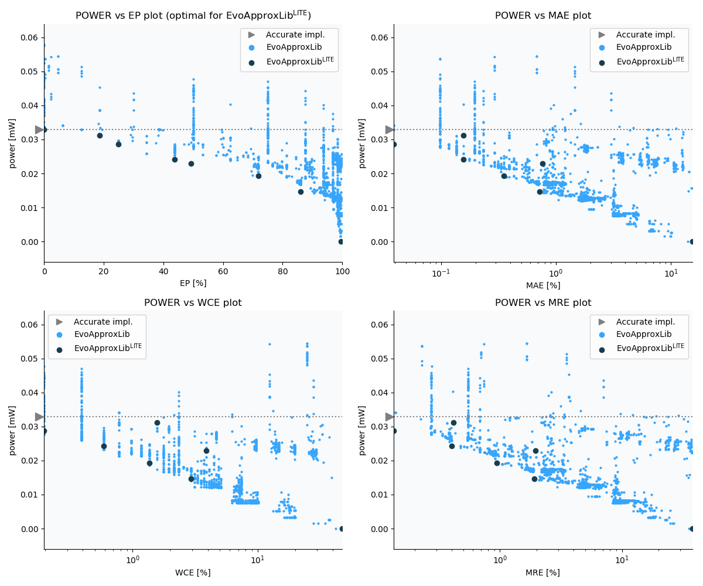

Selected circuits
===================
 - **Circuit**: 8-bit unsigned adders
 - **Selection criteria**: pareto optimal sub-set wrt. pwr and ep parameters

Parameters of selected circuits
----------------------------

| Circuit name | MAE% | WCE% | EP% | MRE% | MSE | Download |
| --- |  --- | --- | --- | --- | --- | --- | 
| add8u_1HG | 0.00 | 0.00 | 0.00 | 0.00 | 0 |  [[Verilog](add8u_1HG.v)]  [[C](add8u_1HG.c)] |
| add8u_6PT | 0.039 | 0.20 | 25.00 | 0.14 | 0.2 |  [[Verilog](add8u_6PT.v)] [[VerilogPDK45](add8u_6PT_pdk45.v)] [[C](add8u_6PT.c)] |
| add8u_6MZ | 0.16 | 0.98 | 34.38 | 0.40 | 2.5 |  [[Verilog](add8u_6MZ.v)] [[VerilogPDK45](add8u_6MZ_pdk45.v)] [[C](add8u_6MZ.c)] |
| add8u_0NH | 0.39 | 1.56 | 46.88 | 1.04 | 10 |  [[Verilog](add8u_0NH.v)]  [[C](add8u_0NH.c)] |
| add8u_0NS | 0.74 | 3.71 | 57.81 | 1.89 | 46 |  [[Verilog](add8u_0NS.v)]  [[C](add8u_0NS.c)] |
| add8u_0NQ | 1.54 | 8.59 | 59.96 | 3.76 | 190 |  [[Verilog](add8u_0NQ.v)]  [[C](add8u_0NQ.c)] |
| add8u_0PA | 1.56 | 6.25 | 78.91 | 3.97 | 124 |  [[Verilog](add8u_0PA.v)]  [[C](add8u_0PA.c)] |
| add8u_0PL | 3.20 | 19.34 | 89.23 | 7.47 | 745 |  [[Verilog](add8u_0PL.v)]  [[C](add8u_0PL.c)] |
| add8u_0UK | 19.67 | 50.39 | 99.77 | 49.16 | 14074 |  [[Verilog](add8u_0UK.v)]  [[C](add8u_0UK.c)] |
    
Parameters
--------------

References
--------------
   - V. Mrazek, Z. Vasicek and R. Hrbacek, "Role of circuit representation in evolutionary design of energy-efficient approximate circuits" in IET Computers & Digital Techniques, vol. 12, no. 4, pp. 139-149, 7 2018. doi: [10.1049/iet-cdt.2017.0188](https://dx.doi.org/10.1049/iet-cdt.2017.0188)
   - V. Mrazek, R. Hrbacek, Z. Vasicek and L. Sekanina, "EvoApprox8b: Library of approximate adders and multipliers for circuit design and benchmarking of approximation methods". Design, Automation & Test in Europe Conference & Exhibition (DATE), 2017, Lausanne, 2017, pp. 258-261. doi: [10.23919/DATE.2017.7926993](https://dx.doi.org/10.23919/DATE.2017.7926993)
   - V. MRAZEK. Optimization of BDD-based Approximation Error Metrics Calculations. In: IEEE Computer Society Annual Symposium on VLSI (ISVLSI '22). Paphos: Institute of Electrical and Electronics Engineers, 2022, pp. 86-91. ISBN 978-1-6654-6605-9.

             