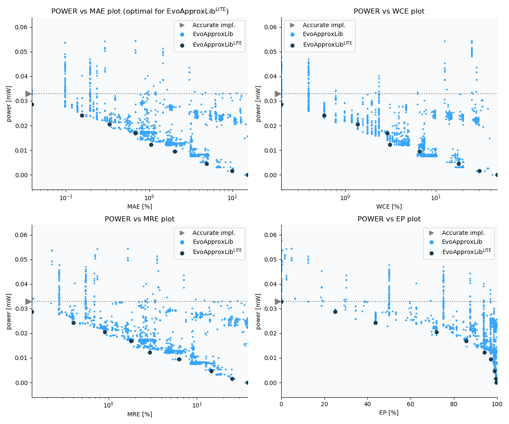

Selected circuits
===================
 - **Circuit**: 8-bit unsigned adders
 - **Selection criteria**: pareto optimal sub-set wrt. pwr and mae parameters

Parameters of selected circuits
----------------------------

| Circuit name | MAE% | WCE% | EP% | MRE% | MSE | Download |
| --- |  --- | --- | --- | --- | --- | --- | 
| add8u_1HG | 0.00 | 0.00 | 0.00 | 0.00 | 0 |  [[Verilog](add8u_1HG.v)]  [[C](add8u_1HG.c)] |
| add8u_6PT | 0.039 | 0.20 | 25.00 | 0.14 | 0.2 |  [[Verilog](add8u_6PT.v)] [[VerilogPDK45](add8u_6PT_pdk45.v)] [[C](add8u_6PT.c)] |
| add8u_6P8 | 0.16 | 0.59 | 43.75 | 0.40 | 1.5 |  [[Verilog](add8u_6P8.v)] [[VerilogPDK45](add8u_6P8_pdk45.v)] [[C](add8u_6P8.c)] |
| add8u_6SM | 0.33 | 1.37 | 71.88 | 0.91 | 6.0 |  [[Verilog](add8u_6SM.v)] [[VerilogPDK45](add8u_6SM_pdk45.v)] [[C](add8u_6SM.c)] |
| add8u_6S4 | 0.68 | 2.93 | 85.74 | 1.80 | 24 |  [[Verilog](add8u_6S4.v)] [[VerilogPDK45](add8u_6S4_pdk45.v)] [[C](add8u_6S4.c)] |
| add8u_6R6 | 1.05 | 3.12 | 94.14 | 2.93 | 44 |  [[Verilog](add8u_6R6.v)] [[VerilogPDK45](add8u_6R6_pdk45.v)] [[C](add8u_6R6.c)] |
| add8u_0TP | 1.97 | 6.25 | 96.97 | 6.16 | 154 |  [[Verilog](add8u_0TP.v)]  [[C](add8u_0TP.c)] |
| add8u_00M | 4.92 | 17.97 | 98.77 | 14.58 | 960 |  [[Verilog](add8u_00M.v)]  [[C](add8u_00M.c)] |
| add8u_02Y | 9.88 | 30.47 | 99.45 | 24.87 | 3803 |  [[Verilog](add8u_02Y.v)]  [[C](add8u_02Y.c)] |
| add8u_0UK | 19.67 | 50.39 | 99.77 | 49.16 | 14074 |  [[Verilog](add8u_0UK.v)]  [[C](add8u_0UK.c)] |
    
Parameters
--------------

References
--------------
   - V. Mrazek, Z. Vasicek and R. Hrbacek, "Role of circuit representation in evolutionary design of energy-efficient approximate circuits" in IET Computers & Digital Techniques, vol. 12, no. 4, pp. 139-149, 7 2018. doi: [10.1049/iet-cdt.2017.0188](https://dx.doi.org/10.1049/iet-cdt.2017.0188)
   - V. Mrazek, R. Hrbacek, Z. Vasicek and L. Sekanina, "EvoApprox8b: Library of approximate adders and multipliers for circuit design and benchmarking of approximation methods". Design, Automation & Test in Europe Conference & Exhibition (DATE), 2017, Lausanne, 2017, pp. 258-261. doi: [10.23919/DATE.2017.7926993](https://dx.doi.org/10.23919/DATE.2017.7926993)
   - V. MRAZEK. Optimization of BDD-based Approximation Error Metrics Calculations. In: IEEE Computer Society Annual Symposium on VLSI (ISVLSI '22). Paphos: Institute of Electrical and Electronics Engineers, 2022, pp. 86-91. ISBN 978-1-6654-6605-9.

             