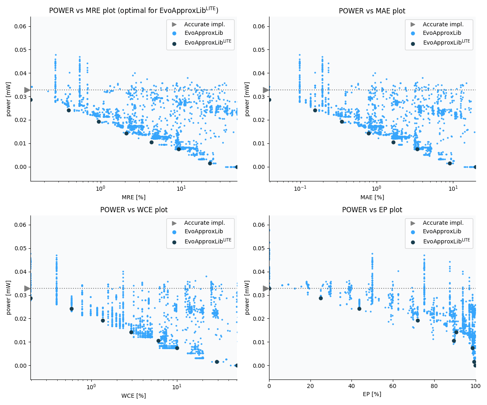

Selected circuits
===================
 - **Circuit**: 8-bit unsigned adders
 - **Selection criteria**: pareto optimal sub-set wrt. pwr and mre parameters

Parameters of selected circuits
----------------------------

| Circuit name | MAE% | WCE% | EP% | MRE% | MSE | Download |
| --- |  --- | --- | --- | --- | --- | --- | 
| add8u_1HG | 0.00 | 0.00 | 0.00 | 0.00 | 0 |  [[Verilog](add8u_1HG.v)]  [[C](add8u_1HG.c)] |
| add8u_6PT | 0.039 | 0.20 | 25.00 | 0.14 | 0.2 |  [[Verilog](add8u_6PT.v)] [[VerilogPDK45](add8u_6PT_pdk45.v)] [[C](add8u_6PT.c)] |
| add8u_6P8 | 0.16 | 0.59 | 43.75 | 0.40 | 1.5 |  [[Verilog](add8u_6P8.v)] [[VerilogPDK45](add8u_6P8_pdk45.v)] [[C](add8u_6P8.c)] |
| add8u_6K6 | 0.35 | 1.37 | 71.88 | 0.94 | 6.5 |  [[Verilog](add8u_6K6.v)] [[VerilogPDK45](add8u_6K6_pdk45.v)] [[C](add8u_6K6.c)] |
| add8u_6QU | 0.78 | 2.93 | 90.62 | 2.08 | 27 |  [[Verilog](add8u_6QU.v)] [[VerilogPDK45](add8u_6QU_pdk45.v)] [[C](add8u_6QU.c)] |
| add8u_108 | 1.64 | 6.05 | 89.45 | 4.28 | 123 |  [[Verilog](add8u_108.v)]  [[C](add8u_108.c)] |
| add8u_3RE | 3.40 | 9.96 | 98.44 | 9.24 | 432 |  [[Verilog](add8u_3RE.v)]  [[C](add8u_3RE.c)] |
| add8u_0JM | 9.00 | 29.10 | 99.33 | 22.62 | 3188 |  [[Verilog](add8u_0JM.v)]  [[C](add8u_0JM.c)] |
| add8u_0UK | 19.67 | 50.39 | 99.77 | 49.16 | 14074 |  [[Verilog](add8u_0UK.v)]  [[C](add8u_0UK.c)] |
    
Parameters
--------------

References
--------------
   - V. Mrazek, Z. Vasicek and R. Hrbacek, "Role of circuit representation in evolutionary design of energy-efficient approximate circuits" in IET Computers & Digital Techniques, vol. 12, no. 4, pp. 139-149, 7 2018. doi: [10.1049/iet-cdt.2017.0188](https://dx.doi.org/10.1049/iet-cdt.2017.0188)
   - V. Mrazek, R. Hrbacek, Z. Vasicek and L. Sekanina, "EvoApprox8b: Library of approximate adders and multipliers for circuit design and benchmarking of approximation methods". Design, Automation & Test in Europe Conference & Exhibition (DATE), 2017, Lausanne, 2017, pp. 258-261. doi: [10.23919/DATE.2017.7926993](https://dx.doi.org/10.23919/DATE.2017.7926993)
   - V. MRAZEK. Optimization of BDD-based Approximation Error Metrics Calculations. In: IEEE Computer Society Annual Symposium on VLSI (ISVLSI '22). Paphos: Institute of Electrical and Electronics Engineers, 2022, pp. 86-91. ISBN 978-1-6654-6605-9.

             