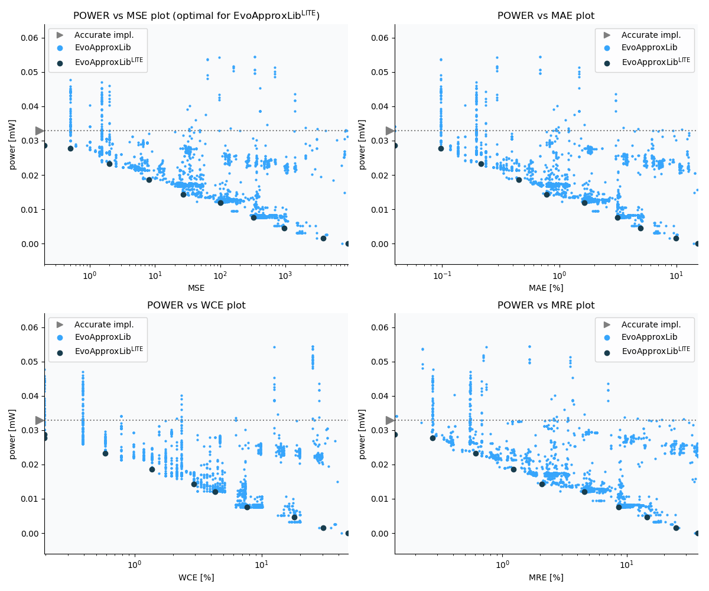

Selected circuits
===================
 - **Circuit**: 8-bit unsigned adders
 - **Selection criteria**: pareto optimal sub-set wrt. pwr and mse parameters

Parameters of selected circuits
----------------------------

| Circuit name | MAE% | WCE% | EP% | MRE% | MSE | Download |
| --- |  --- | --- | --- | --- | --- | --- | 
| add8u_1HG | 0.00 | 0.00 | 0.00 | 0.00 | 0 |  [[Verilog](add8u_1HG.v)]  [[C](add8u_1HG.c)] |
| add8u_6PT | 0.039 | 0.20 | 25.00 | 0.14 | 0.2 |  [[Verilog](add8u_6PT.v)] [[VerilogPDK45](add8u_6PT_pdk45.v)] [[C](add8u_6PT.c)] |
| add8u_2AM | 0.098 | 0.20 | 50.00 | 0.27 | 0.5 |  [[Verilog](add8u_2AM.v)]  [[C](add8u_2AM.c)] |
| add8u_6TH | 0.23 | 0.78 | 76.56 | 0.68 | 2.5 |  [[Verilog](add8u_6TH.v)] [[VerilogPDK45](add8u_6TH_pdk45.v)] [[C](add8u_6TH.c)] |
| add8u_6LG | 0.45 | 1.37 | 87.50 | 1.23 | 8.0 |  [[Verilog](add8u_6LG.v)] [[VerilogPDK45](add8u_6LG_pdk45.v)] [[C](add8u_6LG.c)] |
| add8u_6FT | 0.90 | 2.93 | 93.75 | 2.47 | 32 |  [[Verilog](add8u_6FT.v)] [[VerilogPDK45](add8u_6FT_pdk45.v)] [[C](add8u_6FT.c)] |
| add8u_2LL | 1.64 | 4.30 | 96.88 | 4.57 | 100 |  [[Verilog](add8u_2LL.v)]  [[C](add8u_2LL.c)] |
| add8u_3RE | 3.40 | 9.96 | 98.44 | 9.24 | 432 |  [[Verilog](add8u_3RE.v)]  [[C](add8u_3RE.c)] |
| add8u_0E2 | 6.45 | 16.60 | 99.22 | 16.82 | 1488 |  [[Verilog](add8u_0E2.v)]  [[C](add8u_0E2.c)] |
| add8u_02Y | 9.88 | 30.47 | 99.45 | 24.87 | 3803 |  [[Verilog](add8u_02Y.v)]  [[C](add8u_02Y.c)] |
| add8u_0UK | 19.67 | 50.39 | 99.77 | 49.16 | 14074 |  [[Verilog](add8u_0UK.v)]  [[C](add8u_0UK.c)] |
    
Parameters
--------------

References
--------------
   - V. Mrazek, Z. Vasicek and R. Hrbacek, "Role of circuit representation in evolutionary design of energy-efficient approximate circuits" in IET Computers & Digital Techniques, vol. 12, no. 4, pp. 139-149, 7 2018. doi: [10.1049/iet-cdt.2017.0188](https://dx.doi.org/10.1049/iet-cdt.2017.0188)
   - V. Mrazek, R. Hrbacek, Z. Vasicek and L. Sekanina, "EvoApprox8b: Library of approximate adders and multipliers for circuit design and benchmarking of approximation methods". Design, Automation & Test in Europe Conference & Exhibition (DATE), 2017, Lausanne, 2017, pp. 258-261. doi: [10.23919/DATE.2017.7926993](https://dx.doi.org/10.23919/DATE.2017.7926993)
   - V. MRAZEK. Optimization of BDD-based Approximation Error Metrics Calculations. In: IEEE Computer Society Annual Symposium on VLSI (ISVLSI '22). Paphos: Institute of Electrical and Electronics Engineers, 2022, pp. 86-91. ISBN 978-1-6654-6605-9.

             