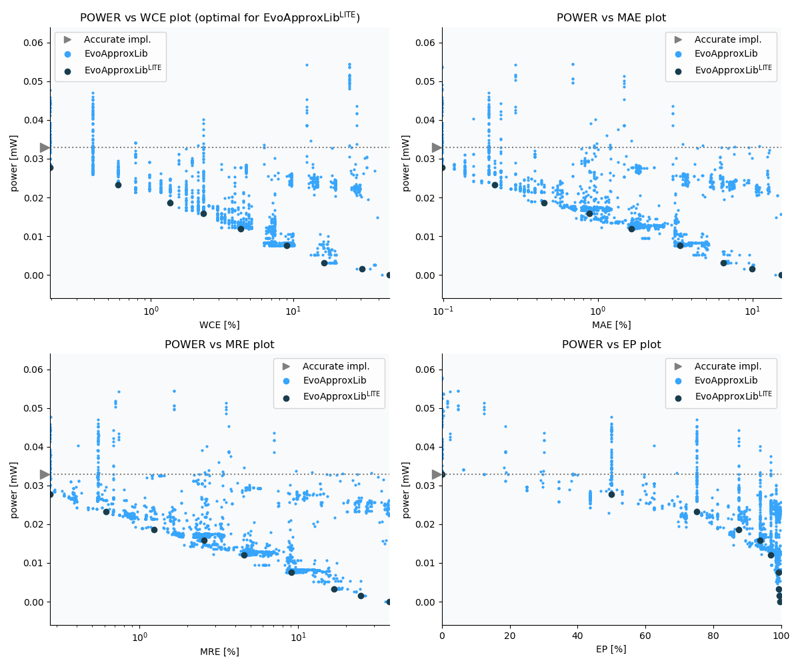

Selected circuits
===================
 - **Circuit**: 8-bit unsigned adders
 - **Selection criteria**: pareto optimal sub-set wrt. pwr and wce parameters

Parameters of selected circuits
----------------------------

| Circuit name | MAE% | WCE% | EP% | MRE% | MSE | Download |
| --- |  --- | --- | --- | --- | --- | --- | 
| add8u_1HG | 0.00 | 0.00 | 0.00 | 0.00 | 0 |  [[Verilog](add8u_1HG.v)]  [[C](add8u_1HG.c)] |
| add8u_2AM | 0.098 | 0.20 | 50.00 | 0.27 | 0.5 |  [[Verilog](add8u_2AM.v)]  [[C](add8u_2AM.c)] |
| add8u_05G | 0.21 | 0.59 | 75.00 | 0.61 | 2.0 |  [[Verilog](add8u_05G.v)]  [[C](add8u_05G.c)] |
| add8u_6LG | 0.45 | 1.37 | 87.50 | 1.23 | 8.0 |  [[Verilog](add8u_6LG.v)] [[VerilogPDK45](add8u_6LG_pdk45.v)] [[C](add8u_6LG.c)] |
| add8u_4M7 | 0.88 | 2.34 | 93.75 | 2.54 | 30 |  [[Verilog](add8u_4M7.v)] [[VerilogPDK45](add8u_4M7_pdk45.v)] [[C](add8u_4M7.c)] |
| add8u_2J3 | 2.44 | 4.88 | 99.61 | 6.73 | 186 |  [[Verilog](add8u_2J3.v)]  [[C](add8u_2J3.c)] |
| add8u_3RE | 3.40 | 9.96 | 98.44 | 9.24 | 432 |  [[Verilog](add8u_3RE.v)]  [[C](add8u_3RE.c)] |
| add8u_0E2 | 6.45 | 16.60 | 99.22 | 16.82 | 1488 |  [[Verilog](add8u_0E2.v)]  [[C](add8u_0E2.c)] |
| add8u_0D0 | 14.06 | 42.38 | 99.61 | 35.29 | 7477 |  [[Verilog](add8u_0D0.v)]  [[C](add8u_0D0.c)] |
    
Parameters
--------------

References
--------------
   - V. Mrazek, Z. Vasicek and R. Hrbacek, "Role of circuit representation in evolutionary design of energy-efficient approximate circuits" in IET Computers & Digital Techniques, vol. 12, no. 4, pp. 139-149, 7 2018. doi: [10.1049/iet-cdt.2017.0188](https://dx.doi.org/10.1049/iet-cdt.2017.0188)
   - V. Mrazek, R. Hrbacek, Z. Vasicek and L. Sekanina, "EvoApprox8b: Library of approximate adders and multipliers for circuit design and benchmarking of approximation methods". Design, Automation & Test in Europe Conference & Exhibition (DATE), 2017, Lausanne, 2017, pp. 258-261. doi: [10.23919/DATE.2017.7926993](https://dx.doi.org/10.23919/DATE.2017.7926993)

             