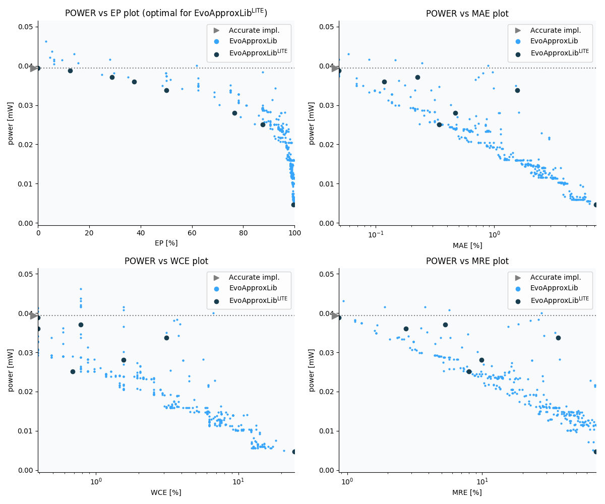

Selected circuits
===================
 - **Circuit**: 9-bit signed adders (no overflow)
 - **Selection criteria**: pareto optimal sub-set wrt. pwr and ep parameters

Parameters of selected circuits
----------------------------

| Circuit name | MAE% | WCE% | EP% | MRE% | MSE | Download |
| --- |  --- | --- | --- | --- | --- | --- | 
| add9se_0AG | 0.00 | 0.00 | 0.00 | 0.00 | 0 |  [[Verilog](add9se_0AG.v)]  [[C](add9se_0AG.c)] |
| add9se_0AS | 0.098 | 0.78 | 12.50 | 0.87 | 2.0 |  [[Verilog](add9se_0AS.v)]  [[C](add9se_0AS.c)] |
| add9se_0AT | 0.45 | 1.56 | 28.91 | 5.32 | 18 |  [[Verilog](add9se_0AT.v)]  [[C](add9se_0AT.c)] |
| add9se_02T | 0.23 | 0.78 | 37.50 | 2.71 | 4.5 |  [[Verilog](add9se_02T.v)]  [[C](add9se_02T.c)] |
| add9se_0BF | 3.12 | 6.25 | 50.00 | 36.60 | 512 |  [[Verilog](add9se_0BF.v)]  [[C](add9se_0BF.c)] |
| add9se_0AZ | 0.94 | 3.12 | 76.56 | 9.87 | 40 |  [[Verilog](add9se_0AZ.v)]  [[C](add9se_0AZ.c)] |
| add9se_08D | 0.68 | 1.37 | 87.50 | 7.97 | 18 |  [[Verilog](add9se_08D.v)]  [[C](add9se_08D.c)] |
| add9se_04E | 14.37 | 49.61 | 99.53 | 69.54 | 8574 |  [[Verilog](add9se_04E.v)]  [[C](add9se_04E.c)] |
    
Parameters
--------------

References
--------------
   - V. Mrazek, L. Sekanina, Z. Vasicek "Libraries of Approximate Circuits: Automated Design and Application in CNN Accelerators" IEEE Journal on Emerging and Selected Topics in Circuits and Systems, Vol 10, No 4, 2020

             