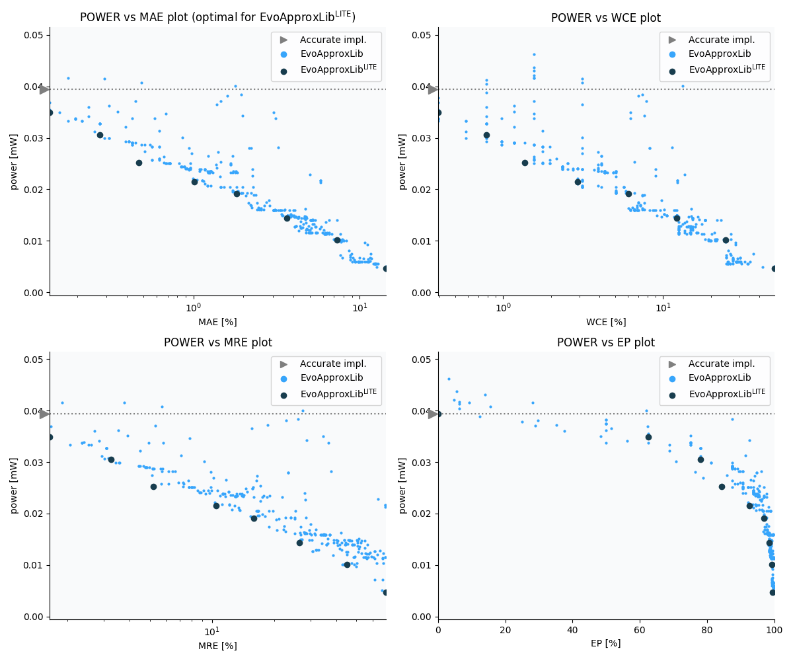

Selected circuits
===================
 - **Circuit**: 9-bit signed adders (no overflow)
 - **Selection criteria**: pareto optimal sub-set wrt. pwr and mae parameters

Parameters of selected circuits
----------------------------

| Circuit name | MAE% | WCE% | EP% | MRE% | MSE | Download |
| --- |  --- | --- | --- | --- | --- | --- | 
| add9se_0AG | 0.00 | 0.00 | 0.00 | 0.00 | 0 |  [[Verilog](add9se_0AG.v)]  [[C](add9se_0AG.c)] |
| add9se_0D4 | 0.14 | 0.39 | 62.45 | 1.64 | 1.0 |  [[Verilog](add9se_0D4.v)]  [[C](add9se_0D4.c)] |
| add9se_06U | 0.27 | 0.78 | 78.12 | 3.25 | 3.0 |  [[Verilog](add9se_06U.v)]  [[C](add9se_06U.c)] |
| add9se_08H | 0.47 | 1.37 | 84.38 | 5.20 | 9.0 |  [[Verilog](add9se_08H.v)]  [[C](add9se_08H.c)] |
| add9se_0B3 | 1.02 | 2.93 | 92.58 | 10.51 | 41 |  [[Verilog](add9se_0B3.v)]  [[C](add9se_0B3.c)] |
| add9se_05X | 1.82 | 6.05 | 96.88 | 15.90 | 128 |  [[Verilog](add9se_05X.v)]  [[C](add9se_05X.c)] |
| add9se_07M | 3.63 | 12.11 | 98.39 | 26.55 | 514 |  [[Verilog](add9se_07M.v)]  [[C](add9se_07M.c)] |
| add9se_0A5 | 7.32 | 24.61 | 99.21 | 44.90 | 2070 |  [[Verilog](add9se_0A5.v)]  [[C](add9se_0A5.c)] |
| add9se_04E | 14.37 | 49.61 | 99.53 | 69.54 | 8574 |  [[Verilog](add9se_04E.v)]  [[C](add9se_04E.c)] |
    
Parameters
--------------

References
--------------
   - V. Mrazek, L. Sekanina, Z. Vasicek "Libraries of Approximate Circuits: Automated Design and Application in CNN Accelerators" IEEE Journal on Emerging and Selected Topics in Circuits and Systems, Vol 10, No 4, 2020

             