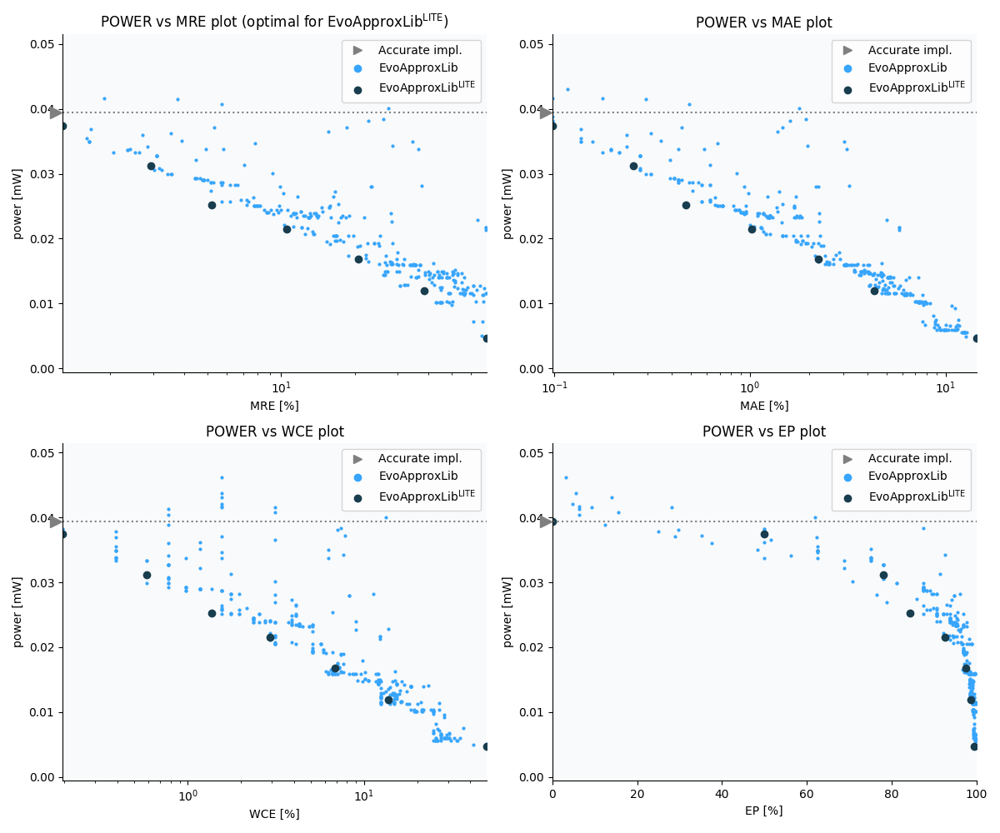

Selected circuits
===================
 - **Circuit**: 9-bit signed adders (no overflow)
 - **Selection criteria**: pareto optimal sub-set wrt. pwr and mre parameters

Parameters of selected circuits
----------------------------

| Circuit name | MAE% | WCE% | EP% | MRE% | MSE | Download |
| --- |  --- | --- | --- | --- | --- | --- | 
| add9se_0AG | 0.00 | 0.00 | 0.00 | 0.00 | 0 |  [[Verilog](add9se_0AG.v)]  [[C](add9se_0AG.c)] |
| add9se_094 | 0.098 | 0.20 | 50.00 | 1.27 | 0.5 |  [[Verilog](add9se_094.v)]  [[C](add9se_094.c)] |
| add9se_06T | 0.25 | 0.59 | 78.12 | 2.92 | 2.6 |  [[Verilog](add9se_06T.v)]  [[C](add9se_06T.c)] |
| add9se_08H | 0.47 | 1.37 | 84.38 | 5.20 | 9.0 |  [[Verilog](add9se_08H.v)]  [[C](add9se_08H.c)] |
| add9se_0B3 | 1.02 | 2.93 | 92.58 | 10.51 | 41 |  [[Verilog](add9se_0B3.v)]  [[C](add9se_0B3.c)] |
| add9se_063 | 2.23 | 6.84 | 97.44 | 20.67 | 186 |  [[Verilog](add9se_063.v)]  [[C](add9se_063.c)] |
| add9se_08R | 4.30 | 13.67 | 98.61 | 38.51 | 729 |  [[Verilog](add9se_08R.v)]  [[C](add9se_08R.c)] |
| add9se_04E | 14.37 | 49.61 | 99.53 | 69.54 | 8574 |  [[Verilog](add9se_04E.v)]  [[C](add9se_04E.c)] |
    
Parameters
--------------

References
--------------
   - V. Mrazek, L. Sekanina, Z. Vasicek "Libraries of Approximate Circuits: Automated Design and Application in CNN Accelerators" IEEE Journal on Emerging and Selected Topics in Circuits and Systems, Vol 10, No 4, 2020

             