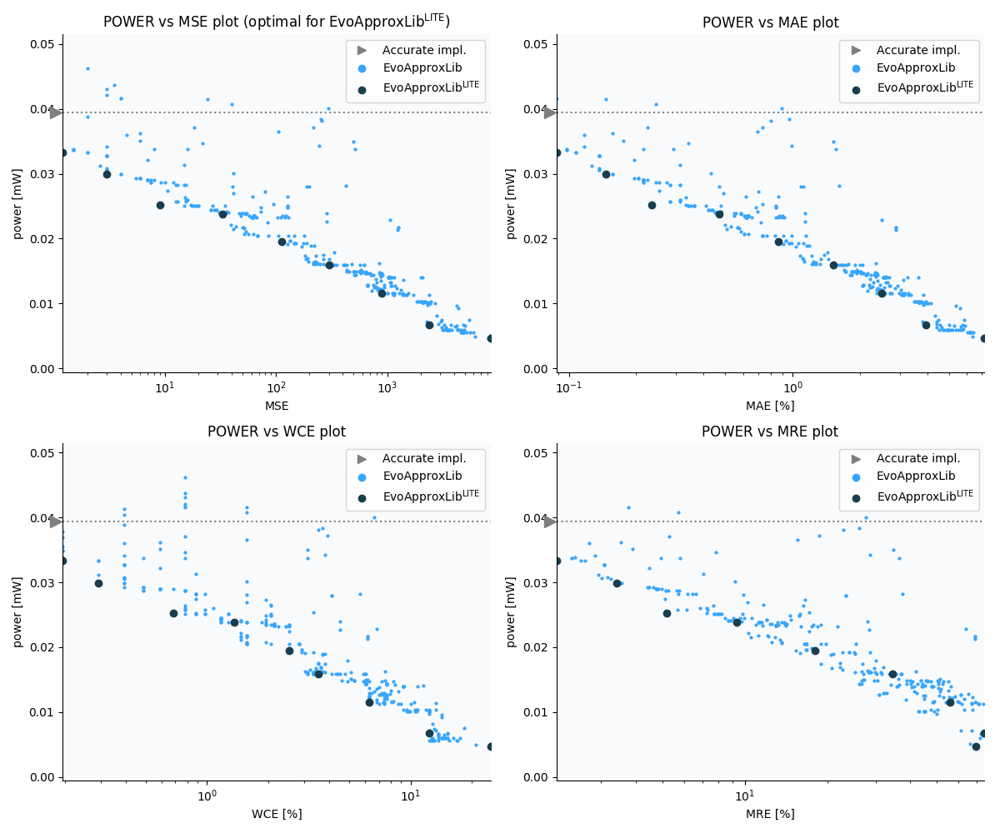

Selected circuits
===================
 - **Circuit**: 9-bit signed adders (no overflow)
 - **Selection criteria**: pareto optimal sub-set wrt. pwr and mse parameters

Parameters of selected circuits
----------------------------

| Circuit name | MAE% | WCE% | EP% | MRE% | MSE | Download |
| --- |  --- | --- | --- | --- | --- | --- | 
| add9se_0AG | 0.00 | 0.00 | 0.00 | 0.00 | 0 |  [[Verilog](add9se_0AG.v)]  [[C](add9se_0AG.c)] |
| add9se_00T | 0.18 | 0.39 | 68.75 | 2.06 | 1.2 |  [[Verilog](add9se_00T.v)]  [[C](add9se_00T.c)] |
| add9se_06Q | 0.29 | 0.59 | 87.50 | 3.42 | 3.0 |  [[Verilog](add9se_06Q.v)]  [[C](add9se_06Q.c)] |
| add9se_08H | 0.47 | 1.37 | 84.38 | 5.20 | 9.0 |  [[Verilog](add9se_08H.v)]  [[C](add9se_08H.c)] |
| add9se_0CJ | 0.94 | 2.73 | 94.14 | 9.31 | 33 |  [[Verilog](add9se_0CJ.v)]  [[C](add9se_0CJ.c)] |
| add9se_01H | 1.72 | 5.08 | 96.88 | 18.00 | 112 |  [[Verilog](add9se_01H.v)]  [[C](add9se_01H.c)] |
| add9se_01V | 3.05 | 7.03 | 99.12 | 34.40 | 300 |  [[Verilog](add9se_01V.v)]  [[C](add9se_01V.c)] |
| add9se_03N | 4.98 | 12.50 | 98.97 | 55.73 | 896 |  [[Verilog](add9se_03N.v)]  [[C](add9se_03N.c)] |
| add9se_0BN | 7.83 | 24.80 | 99.24 | 74.66 | 2406 |  [[Verilog](add9se_0BN.v)]  [[C](add9se_0BN.c)] |
| add9se_04E | 14.37 | 49.61 | 99.53 | 69.54 | 8574 |  [[Verilog](add9se_04E.v)]  [[C](add9se_04E.c)] |
    
Parameters
--------------

References
--------------
   - V. Mrazek, L. Sekanina, Z. Vasicek "Libraries of Approximate Circuits: Automated Design and Application in CNN Accelerators" IEEE Journal on Emerging and Selected Topics in Circuits and Systems, Vol 10, No 4, 2020

             