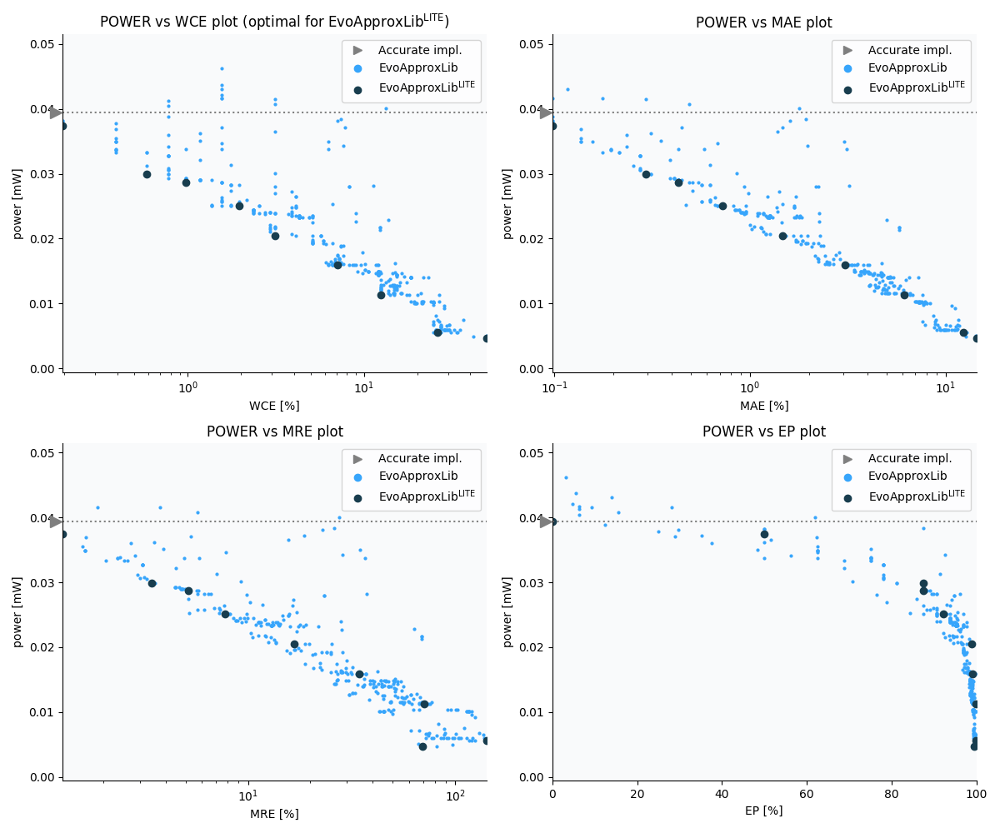

Selected circuits
===================
 - **Circuit**: 9-bit signed adders (no overflow)
 - **Selection criteria**: pareto optimal sub-set wrt. pwr and wce parameters

Parameters of selected circuits
----------------------------

| Circuit name | MAE% | WCE% | EP% | MRE% | MSE | Download |
| --- |  --- | --- | --- | --- | --- | --- | 
| add9se_0AG | 0.00 | 0.00 | 0.00 | 0.00 | 0 |  [[Verilog](add9se_0AG.v)]  [[C](add9se_0AG.c)] |
| add9se_094 | 0.098 | 0.20 | 50.00 | 1.27 | 0.5 |  [[Verilog](add9se_094.v)]  [[C](add9se_094.c)] |
| add9se_06Q | 0.29 | 0.59 | 87.50 | 3.42 | 3.0 |  [[Verilog](add9se_06Q.v)]  [[C](add9se_06Q.c)] |
| add9se_078 | 0.43 | 0.98 | 87.50 | 5.17 | 7.5 |  [[Verilog](add9se_078.v)]  [[C](add9se_078.c)] |
| add9se_074 | 0.72 | 1.95 | 92.19 | 7.73 | 20 |  [[Verilog](add9se_074.v)]  [[C](add9se_074.c)] |
| add9se_0CH | 1.46 | 3.12 | 98.83 | 16.69 | 68 |  [[Verilog](add9se_0CH.v)]  [[C](add9se_0CH.c)] |
| add9se_01V | 3.05 | 7.03 | 99.12 | 34.40 | 300 |  [[Verilog](add9se_01V.v)]  [[C](add9se_01V.c)] |
| add9se_03D | 6.13 | 12.50 | 99.92 | 71.05 | 1160 |  [[Verilog](add9se_03D.v)]  [[C](add9se_03D.c)] |
| add9se_09F | 12.32 | 26.17 | 99.92 | 142.15 | 4705 |  [[Verilog](add9se_09F.v)]  [[C](add9se_09F.c)] |
| add9se_04E | 14.37 | 49.61 | 99.53 | 69.54 | 8574 |  [[Verilog](add9se_04E.v)]  [[C](add9se_04E.c)] |
    
Parameters
--------------

References
--------------
   - V. Mrazek, L. Sekanina, Z. Vasicek "Libraries of Approximate Circuits: Automated Design and Application in CNN Accelerators" IEEE Journal on Emerging and Selected Topics in Circuits and Systems, Vol 10, No 4, 2020

             