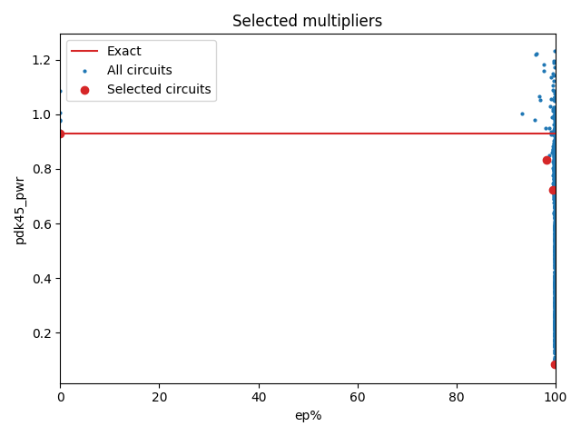

Selected circuits
===================
**Desired bitwidth**: XX
**Optimized for**: XX - YY

Parameters of circuits
----------------------------

| Circuit name | MAE | WCE | EP | Download |
| ----- |  ---- | ---- | --- | ---- | 
| cgp-nn-iccad16.11.cgpnn_mul11_e00_0_00008_csamrca | 0.0 | 0 | 0.0 |  [Verilog](cgp-nn-iccad16.11.cgpnn_mul11_e00_0_00008_csamrca.v) [C](cgp-nn-iccad16.11.cgpnn_mul11_e00_0_00008_csamrca.c) |
| cgp-nn-iccad16.11.cgpnn_mul11_e00_2_00019_csamrca | 4294.3 | 8369 | 98.2769012451 |  [Verilog](cgp-nn-iccad16.11.cgpnn_mul11_e00_2_00019_csamrca.v) [C](cgp-nn-iccad16.11.cgpnn_mul11_e00_2_00019_csamrca.c) |
| cgp-nn-iccad16.11.cgpnn_mul11_e00_1_00036_rcam | 748.1 | 4126 | 99.5432853699 |  [Verilog](cgp-nn-iccad16.11.cgpnn_mul11_e00_1_00036_rcam.v) [C](cgp-nn-iccad16.11.cgpnn_mul11_e00_1_00036_rcam.c) |
| cgp-nn-iccad16.11.cgpnn_mul11_e15_0_00376_wtmrca | 140134.8 | 588559 | 99.9018669128 |  [Verilog](cgp-nn-iccad16.11.cgpnn_mul11_e15_0_00376_wtmrca.v) [C](cgp-nn-iccad16.11.cgpnn_mul11_e15_0_00376_wtmrca.c) |

Parameters
--------------

         