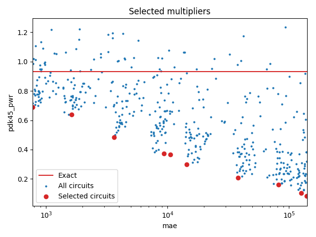

Selected circuits
===================
**Desired bitwidth**: XX
**Optimized for**: XX - YY

Parameters of circuits
----------------------------

| Circuit name | MAE | WCE | EP | Download |
| ----- |  ---- | ---- | --- | ---- | 
| cgp-nn-iccad16.11.cgpnn_mul11_e00_0_00008_csamrca | 0.0 | 0 | 0.0 |  [Verilog](cgp-nn-iccad16.11.cgpnn_mul11_e00_0_00008_csamrca.v) [C](cgp-nn-iccad16.11.cgpnn_mul11_e00_0_00008_csamrca.c) |
| cgp-nn-iccad16.11.cgpnn_mul11_e00_1_00126_csamrca | 778.5 | 4455 | 99.6997594833 |  [Verilog](cgp-nn-iccad16.11.cgpnn_mul11_e00_1_00126_csamrca.v) [C](cgp-nn-iccad16.11.cgpnn_mul11_e00_1_00126_csamrca.c) |
| cgp-nn-iccad16.11.cgpnn_mul11_e00_2_00289_csamrca | 1629.4 | 8342 | 99.7320652008 |  [Verilog](cgp-nn-iccad16.11.cgpnn_mul11_e00_2_00289_csamrca.v) [C](cgp-nn-iccad16.11.cgpnn_mul11_e00_2_00289_csamrca.c) |
| cgp-nn-iccad16.11.cgpnn_mul11_e00_5_00416_rcam | 3635.3 | 20860 | 99.8380184174 |  [Verilog](cgp-nn-iccad16.11.cgpnn_mul11_e00_5_00416_rcam.v) [C](cgp-nn-iccad16.11.cgpnn_mul11_e00_5_00416_rcam.c) |
| cgp-nn-iccad16.11.cgpnn_mul11_e01_0_00534_wtmrca | 9308.4 | 41768 | 99.8874664307 |  [Verilog](cgp-nn-iccad16.11.cgpnn_mul11_e01_0_00534_wtmrca.v) [C](cgp-nn-iccad16.11.cgpnn_mul11_e01_0_00534_wtmrca.c) |
| cgp-nn-iccad16.11.cgpnn_mul11_e01_0_00093_rcam | 10517.2 | 41058 | 99.8795032501 |  [Verilog](cgp-nn-iccad16.11.cgpnn_mul11_e01_0_00093_rcam.v) [C](cgp-nn-iccad16.11.cgpnn_mul11_e01_0_00093_rcam.c) |
| cgp-nn-iccad16.11.cgpnn_mul11_e02_0_00166_csamcsa | 14306.1 | 83411 | 99.8944282532 |  [Verilog](cgp-nn-iccad16.11.cgpnn_mul11_e02_0_00166_csamcsa.v) [C](cgp-nn-iccad16.11.cgpnn_mul11_e02_0_00166_csamcsa.c) |
| cgp-nn-iccad16.11.cgpnn_mul11_e05_0_00077_csamrca | 38145.9 | 204649 | 99.8986244202 |  [Verilog](cgp-nn-iccad16.11.cgpnn_mul11_e05_0_00077_csamrca.v) [C](cgp-nn-iccad16.11.cgpnn_mul11_e05_0_00077_csamrca.c) |
| cgp-nn-iccad16.11.cgpnn_mul11_e10_0_00042_rcam | 81738.5 | 412975 | 99.9011039734 |  [Verilog](cgp-nn-iccad16.11.cgpnn_mul11_e10_0_00042_rcam.v) [C](cgp-nn-iccad16.11.cgpnn_mul11_e10_0_00042_rcam.c) |
| cgp-nn-iccad16.11.cgpnn_mul11_e15_0_00295_csamrca | 126165.3 | 608220 | 99.9008893967 |  [Verilog](cgp-nn-iccad16.11.cgpnn_mul11_e15_0_00295_csamrca.v) [C](cgp-nn-iccad16.11.cgpnn_mul11_e15_0_00295_csamrca.c) |
| cgp-nn-iccad16.11.cgpnn_mul11_e15_0_00376_wtmrca | 140134.8 | 588559 | 99.9018669128 |  [Verilog](cgp-nn-iccad16.11.cgpnn_mul11_e15_0_00376_wtmrca.v) [C](cgp-nn-iccad16.11.cgpnn_mul11_e15_0_00376_wtmrca.c) |

Parameters
--------------

         