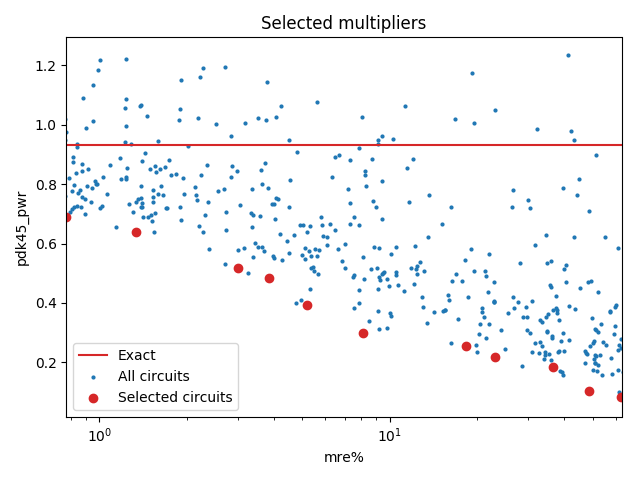

Selected circuits
===================
**Desired bitwidth**: XX
**Optimized for**: XX - YY

Parameters of circuits
----------------------------

| Circuit name | MAE | WCE | EP | Download |
| ----- |  ---- | ---- | --- | ---- | 
| cgp-nn-iccad16.11.cgpnn_mul11_e00_0_00008_csamrca | 0.0 | 0 | 0.0 |  [Verilog](cgp-nn-iccad16.11.cgpnn_mul11_e00_0_00008_csamrca.v) [C](cgp-nn-iccad16.11.cgpnn_mul11_e00_0_00008_csamrca.c) |
| cgp-nn-iccad16.11.cgpnn_mul11_e00_1_00126_csamrca | 778.5 | 4455 | 99.6997594833 |  [Verilog](cgp-nn-iccad16.11.cgpnn_mul11_e00_1_00126_csamrca.v) [C](cgp-nn-iccad16.11.cgpnn_mul11_e00_1_00126_csamrca.c) |
| cgp-nn-iccad16.11.cgpnn_mul11_e00_2_00289_csamrca | 1629.4 | 8342 | 99.7320652008 |  [Verilog](cgp-nn-iccad16.11.cgpnn_mul11_e00_2_00289_csamrca.v) [C](cgp-nn-iccad16.11.cgpnn_mul11_e00_2_00289_csamrca.c) |
| cgp-nn-iccad16.11.cgpnn_mul11_e00_5_00452_csamrca | 3787.0 | 19864 | 99.8664140701 |  [Verilog](cgp-nn-iccad16.11.cgpnn_mul11_e00_5_00452_csamrca.v) [C](cgp-nn-iccad16.11.cgpnn_mul11_e00_5_00452_csamrca.c) |
| cgp-nn-iccad16.11.cgpnn_mul11_e00_5_00416_rcam | 3635.3 | 20860 | 99.8380184174 |  [Verilog](cgp-nn-iccad16.11.cgpnn_mul11_e00_5_00416_rcam.v) [C](cgp-nn-iccad16.11.cgpnn_mul11_e00_5_00416_rcam.c) |
| cgp-nn-iccad16.11.cgpnn_mul11_e01_0_00201_rcam | 8064.3 | 41830 | 99.888086319 |  [Verilog](cgp-nn-iccad16.11.cgpnn_mul11_e01_0_00201_rcam.v) [C](cgp-nn-iccad16.11.cgpnn_mul11_e01_0_00201_rcam.c) |
| cgp-nn-iccad16.11.cgpnn_mul11_e02_0_00166_csamcsa | 14306.1 | 83411 | 99.8944282532 |  [Verilog](cgp-nn-iccad16.11.cgpnn_mul11_e02_0_00166_csamcsa.v) [C](cgp-nn-iccad16.11.cgpnn_mul11_e02_0_00166_csamcsa.c) |
| cgp-nn-iccad16.11.cgpnn_mul11_e05_0_00365_rcam | 44244.4 | 206904 | 99.8977899551 |  [Verilog](cgp-nn-iccad16.11.cgpnn_mul11_e05_0_00365_rcam.v) [C](cgp-nn-iccad16.11.cgpnn_mul11_e05_0_00365_rcam.c) |
| cgp-nn-iccad16.11.cgpnn_mul11_e05_0_00203_rcam | 40880.5 | 197230 | 99.8995065689 |  [Verilog](cgp-nn-iccad16.11.cgpnn_mul11_e05_0_00203_rcam.v) [C](cgp-nn-iccad16.11.cgpnn_mul11_e05_0_00203_rcam.c) |
| cgp-nn-iccad16.11.cgpnn_mul11_e10_0_00006_csamcsa | 91739.0 | 409784 | 99.9004602432 |  [Verilog](cgp-nn-iccad16.11.cgpnn_mul11_e10_0_00006_csamcsa.v) [C](cgp-nn-iccad16.11.cgpnn_mul11_e10_0_00006_csamcsa.c) |
| cgp-nn-iccad16.11.cgpnn_mul11_e15_0_00421_rcam | 151926.6 | 622678 | 99.9012947083 |  [Verilog](cgp-nn-iccad16.11.cgpnn_mul11_e15_0_00421_rcam.v) [C](cgp-nn-iccad16.11.cgpnn_mul11_e15_0_00421_rcam.c) |
| cgp-nn-iccad16.11.cgpnn_mul11_e15_0_00376_wtmrca | 140134.8 | 588559 | 99.9018669128 |  [Verilog](cgp-nn-iccad16.11.cgpnn_mul11_e15_0_00376_wtmrca.v) [C](cgp-nn-iccad16.11.cgpnn_mul11_e15_0_00376_wtmrca.c) |

Parameters
--------------

         