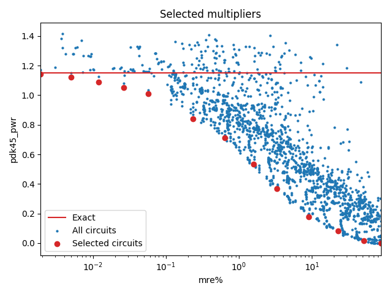

Selected circuits
===================
**Desired bitwidth**: XX
**Optimized for**: XX - YY

Parameters of circuits
----------------------------

| Circuit name | MAE | WCE | Download |
| ----- |  ---- | ---- | --- | ---- | 
| pub-lpaclib.12.kit12_v1_1111 | 0.0 | 0 |  [Verilog](pub-lpaclib.12.kit12_v1_1111.v) [C](pub-lpaclib.12.kit12_v1_1111.c) |
| truncation-bam.12.bam12_00_03 | 4.2 | 17 |  [Verilog](truncation-bam.12.bam12_00_03.v) [C](truncation-bam.12.bam12_00_03.c) |
| truncation-bam.12.bam12_00_04 | 12.2 | 49 |  [Verilog](truncation-bam.12.bam12_00_04.v) [C](truncation-bam.12.bam12_00_04.c) |
| truncation-bam.12.bam12_00_05 | 32.2 | 129 |  [Verilog](truncation-bam.12.bam12_00_05.v) [C](truncation-bam.12.bam12_00_05.c) |
| truncation-bam.12.bam12_00_06 | 80.2 | 321 |  [Verilog](truncation-bam.12.bam12_00_06.v) [C](truncation-bam.12.bam12_00_06.c) |
| truncation-bam.12.bam12_00_07 | 192.2 | 769 |  [Verilog](truncation-bam.12.bam12_00_07.v) [C](truncation-bam.12.bam12_00_07.c) |
| cgp-compare17.12.cmpmul12_so_3in_2out_wc_4194_4_csamcsa | 832.1 | 4190 |  [Verilog](cgp-compare17.12.cmpmul12_so_3in_2out_wc_4194_4_csamcsa.v) [C](cgp-compare17.12.cmpmul12_so_3in_2out_wc_4194_4_csamcsa.c) |
| truncation-tm.12.trun12_tam02a | 6140.2 | 24561 |  [Verilog](truncation-tm.12.trun12_tam02a.v) [C](truncation-tm.12.trun12_tam02a.c) |
| truncation-bam.12.bam12_00_12 | 11264.2 | 45057 |  [Verilog](truncation-bam.12.bam12_00_12.v) [C](truncation-bam.12.bam12_00_12.c) |
| truncation-bam.12.bam12_04_13 | 30720.2 | 122881 |  [Verilog](truncation-bam.12.bam12_04_13.v) [C](truncation-bam.12.bam12_04_13.c) |
| truncation-tm.12.trun12_tam06a | 128000.2 | 512001 |  [Verilog](truncation-tm.12.trun12_tam06a.v) [C](truncation-tm.12.trun12_tam06a.c) |
| truncation-bam.12.bam12_08_17 | 391168.2 | 1564673 |  [Verilog](truncation-bam.12.bam12_08_17.v) [C](truncation-bam.12.bam12_08_17.c) |
| truncation-bam.12.bam12b_10_19 | 1308672.2 | 5234689 |  [Verilog](truncation-bam.12.bam12b_10_19.v) [C](truncation-bam.12.bam12b_10_19.c) |
| truncation-tm.12.trun12_tm11b | 3143680.2 | 12574721 |  [Verilog](truncation-tm.12.trun12_tm11b.v) [C](truncation-tm.12.trun12_tm11b.c) |

Parameters
--------------

         