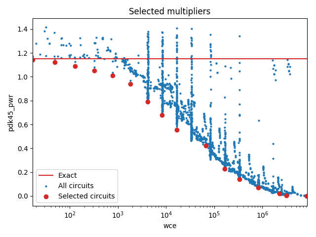

Selected circuits
===================
**Desired bitwidth**: XX
**Optimized for**: XX - YY

Parameters of circuits
----------------------------

| Circuit name | MAE | WCE | EP | Download |
| ----- |  ---- | ---- | --- | ---- | 
| pub-lpaclib.12.kit12_v1_1111 | 0.0 | 0 | 0.0 |  [Verilog](pub-lpaclib.12.kit12_v1_1111.v) [C](pub-lpaclib.12.kit12_v1_1111.c) |
| truncation-bam.12.bam12_00_03 | 4.2 | 17 | 68.75 |  [Verilog](truncation-bam.12.bam12_00_03.v) [C](truncation-bam.12.bam12_00_03.c) |
| truncation-bam.12.bam12_00_04 | 12.2 | 49 | 81.25 |  [Verilog](truncation-bam.12.bam12_00_04.v) [C](truncation-bam.12.bam12_00_04.c) |
| truncation-bam.12.bam12_00_05 | 32.2 | 129 | 89.0625 |  [Verilog](truncation-bam.12.bam12_00_05.v) [C](truncation-bam.12.bam12_00_05.c) |
| truncation-bam.12.bam12_00_06 | 80.2 | 321 | 93.75 |  [Verilog](truncation-bam.12.bam12_00_06.v) [C](truncation-bam.12.bam12_00_06.c) |
| truncation-bam.12.bam12_00_07 | 192.2 | 769 | 96.484375 |  [Verilog](truncation-bam.12.bam12_00_07.v) [C](truncation-bam.12.bam12_00_07.c) |
| truncation-bam.12.bam12_00_08 | 448.2 | 1793 | 98.046875 |  [Verilog](truncation-bam.12.bam12_00_08.v) [C](truncation-bam.12.bam12_00_08.c) |
| cgp-compare17.12.cmpmul12_so_3in_2out_wc_4194_2_csamrca | 1226.7 | 4121 | 99.9641895294 |  [Verilog](cgp-compare17.12.cmpmul12_so_3in_2out_wc_4194_2_csamrca.v) [C](cgp-compare17.12.cmpmul12_so_3in_2out_wc_4194_2_csamrca.c) |
| cgp-compare17.12.cmpmul12_so_3in_2out_wc_8389_1_csamrca | 2519.7 | 8274 | 99.9886155128 |  [Verilog](cgp-compare17.12.cmpmul12_so_3in_2out_wc_8389_1_csamrca.v) [C](cgp-compare17.12.cmpmul12_so_3in_2out_wc_8389_1_csamrca.c) |
| cgp-compare17.12.cmpmul12_so_3in_2out_wc_16777_4_wtmcsa | 4688.5 | 16718 | 99.9914526939 |  [Verilog](cgp-compare17.12.cmpmul12_so_3in_2out_wc_16777_4_wtmcsa.v) [C](cgp-compare17.12.cmpmul12_so_3in_2out_wc_16777_4_wtmcsa.c) |
| cgp-compare17.12.cmpmul12_mo_3in_2out_710 | 16144.8 | 66291 | 99.9973416328 |  [Verilog](cgp-compare17.12.cmpmul12_mo_3in_2out_710.v) [C](cgp-compare17.12.cmpmul12_mo_3in_2out_710.c) |
| cgp-compare17.12.cmpmul12_so_3in_2out_wc_167772_4_csamrca | 37823.5 | 166186 | 99.9992370605 |  [Verilog](cgp-compare17.12.cmpmul12_so_3in_2out_wc_167772_4_csamrca.v) [C](cgp-compare17.12.cmpmul12_so_3in_2out_wc_167772_4_csamrca.c) |
| cgp-compare17.12.cmpmul12_so_2in_1out_wc_335544_3_csamrca | 98202.7 | 335434 | 99.9998569489 |  [Verilog](cgp-compare17.12.cmpmul12_so_2in_1out_wc_335544_3_csamrca.v) [C](cgp-compare17.12.cmpmul12_so_2in_1out_wc_335544_3_csamrca.c) |
| cgp-compare17.12.cmpmul12_so_2in_1out_wc_838861_7_csamcsa | 283966.4 | 819059 | 99.9998688698 |  [Verilog](cgp-compare17.12.cmpmul12_so_2in_1out_wc_838861_7_csamcsa.v) [C](cgp-compare17.12.cmpmul12_so_2in_1out_wc_838861_7_csamcsa.c) |
| cgp-compare17.12.cmpmul12_so_2in_1out_wc_2516582_0_wtmrca | 581115.1 | 2247823 | 99.9999582767 |  [Verilog](cgp-compare17.12.cmpmul12_so_2in_1out_wc_2516582_0_wtmrca.v) [C](cgp-compare17.12.cmpmul12_so_2in_1out_wc_2516582_0_wtmrca.c) |
| cgp-compare17.12.cmpmul12_so_3in_2out_wc_3355443_4_wtmrca | 1193724.0 | 3182468 | 99.9999821186 |  [Verilog](cgp-compare17.12.cmpmul12_so_3in_2out_wc_3355443_4_wtmrca.v) [C](cgp-compare17.12.cmpmul12_so_3in_2out_wc_3355443_4_wtmrca.c) |
| truncation-tm-ones.12.trun12_tm11b_ones | 2264009.13166 | 8380418 | 99.9999880791 |  [Verilog](truncation-tm-ones.12.trun12_tm11b_ones.v) [C](truncation-tm-ones.12.trun12_tm11b_ones.c) |

Parameters
--------------

         