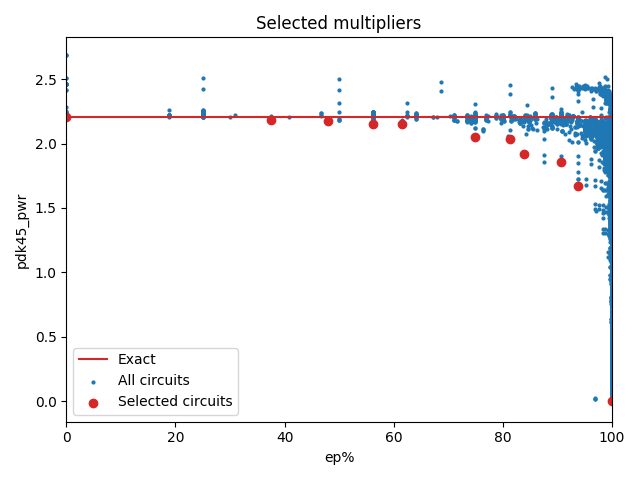

Selected circuits
===================
**Desired bitwidth**: XX
**Optimized for**: XX - YY

Parameters of circuits
----------------------------

| Circuit name | MAE | WCE | EP | Download |
| ----- |  ---- | ---- | --- | ---- | 
| dc-composition.16.m16_m4_composed_wc_pwr_ar_0001 | 0.0 | 0 | 0.0 |  [Verilog](dc-composition.16.m16_m4_composed_wc_pwr_ar_0001.v) [C](dc-composition.16.m16_m4_composed_wc_pwr_ar_0001.c) |
| dc-composition.16.m16_comp_arch_a3_wc_pwr_ar_cgp-approx14ep_mult8_cgp14ep_ep49152_wc1_2_csamrca | 64.2 | 257 | 37.5 |  [Verilog](dc-composition.16.m16_comp_arch_a3_wc_pwr_ar_cgp-approx14ep_mult8_cgp14ep_ep49152_wc1_2_csamrca.v) [C](dc-composition.16.m16_comp_arch_a3_wc_pwr_ar_cgp-approx14ep_mult8_cgp14ep_ep49152_wc1_2_csamrca.c) |
| dc-composition.16.m16_comp_arch_a5_wc_pwr_ar_cgp-approx14ep_mult8_cgp14ep_ep13107_wc1_csamrca | 12373.8 | 66049 | 47.900390625 |  [Verilog](dc-composition.16.m16_comp_arch_a5_wc_pwr_ar_cgp-approx14ep_mult8_cgp14ep_ep13107_wc1_csamrca.v) [C](dc-composition.16.m16_comp_arch_a5_wc_pwr_ar_cgp-approx14ep_mult8_cgp14ep_ep13107_wc1_csamrca.c) |
| dc-composition.16.m16_comp_arch_a5_wc_pwr_ar_cgp-approx14ep_mult8_cgp14ep_ep49152_wc1_2_csamrca | 16480.1 | 66049 | 56.25 |  [Verilog](dc-composition.16.m16_comp_arch_a5_wc_pwr_ar_cgp-approx14ep_mult8_cgp14ep_ep49152_wc1_2_csamrca.v) [C](dc-composition.16.m16_comp_arch_a5_wc_pwr_ar_cgp-approx14ep_mult8_cgp14ep_ep49152_wc1_2_csamrca.c) |
| pub-lpaclib.16.kit16_lit_1100 | 232103.125 | 3713650 | 61.5157186985 |  [Verilog](pub-lpaclib.16.kit16_lit_1100.v) [C](pub-lpaclib.16.kit16_lit_1100.c) |
| truncation-bam.16.bam16_02_02 | 49151.2 | 196605 | 74.9988555908 |  [Verilog](truncation-bam.16.bam16_02_02.v) [C](truncation-bam.16.bam16_02_02.c) |
| truncation-bam.16.bam16_02_03 | 49152.2 | 196609 | 81.2488555908 |  [Verilog](truncation-bam.16.bam16_02_03.v) [C](truncation-bam.16.bam16_02_03.c) |
| pub-bsdlc.16.wallace_compr(2) | 1041749.4 | 16667990 | 83.8478833437 |  [Verilog](pub-bsdlc.16.wallace_compr(2).v) [C](pub-bsdlc.16.wallace_compr(2).c) |
| truncation-bam.16.bam16_03_04 | 114688.2 | 458753 | 90.623664856 |  [Verilog](truncation-bam.16.bam16_03_04.v) [C](truncation-bam.16.bam16_03_04.c) |
| truncation-bam.16.bam16_04_04 | 245756.2 | 983025 | 93.7485694885 |  [Verilog](truncation-bam.16.bam16_04_04.v) [C](truncation-bam.16.bam16_04_04.c) |
| truncation-tm.16.trun16_tam15b | 805273600.3 | 3221094401 | 99.9969482422 |  [Verilog](truncation-tm.16.trun16_tam15b.v) [C](truncation-tm.16.trun16_tam15b.c) |

Parameters
--------------

         