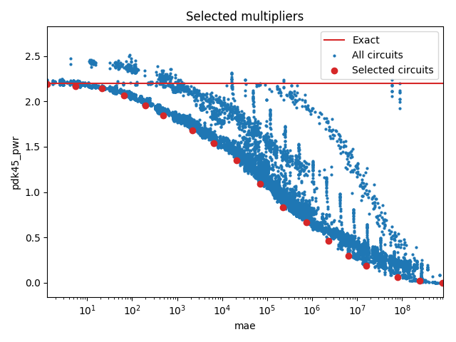

Selected circuits
===================
**Desired bitwidth**: XX
**Optimized for**: XX - YY

Parameters of circuits
----------------------------

| Circuit name | MAE | WCE | Download |
| ----- |  ---- | ---- | --- | ---- | 
| dc-composition.16.m16_m4_composed_wc_pwr_ar_0001 | 0.0 | 0 |  [Verilog](dc-composition.16.m16_m4_composed_wc_pwr_ar_0001.v) [C](dc-composition.16.m16_m4_composed_wc_pwr_ar_0001.c) |
| dc-composition.16.m16_m4_composed_wc_pwr_ar_0047 | 1.3 | 4 |  [Verilog](dc-composition.16.m16_m4_composed_wc_pwr_ar_0047.v) [C](dc-composition.16.m16_m4_composed_wc_pwr_ar_0047.c) |
| dc-composition.16.m16_m3_composed_wc_pwr_ar_0151 | 5.6 | 21 |  [Verilog](dc-composition.16.m16_m3_composed_wc_pwr_ar_0151.v) [C](dc-composition.16.m16_m3_composed_wc_pwr_ar_0151.c) |
| dc-composition.16.m16_m4_composed_filt.wc_pwr_ar_0069 | 21.0 | 63 |  [Verilog](dc-composition.16.m16_m4_composed_filt.wc_pwr_ar_0069.v) [C](dc-composition.16.m16_m4_composed_filt.wc_pwr_ar_0069.c) |
| dc-composition.16.m16_m3_composed_wc_pwr_ar_0333 | 66.3 | 256 |  [Verilog](dc-composition.16.m16_m3_composed_wc_pwr_ar_0333.v) [C](dc-composition.16.m16_m3_composed_wc_pwr_ar_0333.c) |
| dc-composition.16.m16_m4_composed_filt.wc_pwr_ar_0205 | 194.7 | 907 |  [Verilog](dc-composition.16.m16_m4_composed_filt.wc_pwr_ar_0205.v) [C](dc-composition.16.m16_m4_composed_filt.wc_pwr_ar_0205.c) |
| dc-composition.16.m16_m4_composed_wc_pwr_ar_0688 | 485.6 | 2189 |  [Verilog](dc-composition.16.m16_m4_composed_wc_pwr_ar_0688.v) [C](dc-composition.16.m16_m4_composed_wc_pwr_ar_0688.c) |
| dc-composition.16.m16_m4_composed_wc_pwr_ar_1489 | 2155.1 | 10288 |  [Verilog](dc-composition.16.m16_m4_composed_wc_pwr_ar_1489.v) [C](dc-composition.16.m16_m4_composed_wc_pwr_ar_1489.c) |
| dc-composition.16.m16_m4_composed_filt.wc_pwr_ar_0679 | 6571.9 | 31672 |  [Verilog](dc-composition.16.m16_m4_composed_filt.wc_pwr_ar_0679.v) [C](dc-composition.16.m16_m4_composed_filt.wc_pwr_ar_0679.c) |
| dc-composition.16.m16_m4_composed_wc_pwr_ar_2169 | 21171.7 | 117733 |  [Verilog](dc-composition.16.m16_m4_composed_wc_pwr_ar_2169.v) [C](dc-composition.16.m16_m4_composed_wc_pwr_ar_2169.c) |
| dc-composition.16.m16_m4_composed_wc_pwr_ar_3068 | 70399.7 | 420380 |  [Verilog](dc-composition.16.m16_m4_composed_wc_pwr_ar_3068.v) [C](dc-composition.16.m16_m4_composed_wc_pwr_ar_3068.c) |
| dc-composition.16.m16_m3_composed_filt.wc_pwr_ar_0841 | 224066.7 | 1357781 |  [Verilog](dc-composition.16.m16_m3_composed_filt.wc_pwr_ar_0841.v) [C](dc-composition.16.m16_m3_composed_filt.wc_pwr_ar_0841.c) |
| dc-composition.16.m16_m3_composed_wc_pwr_ar_3244 | 742479.9 | 4287525 |  [Verilog](dc-composition.16.m16_m3_composed_wc_pwr_ar_3244.v) [C](dc-composition.16.m16_m3_composed_wc_pwr_ar_3244.c) |
| dc-composition.16.m16_m4_composed_wc_pwr_ar_5762 | 2324288.4 | 12325434 |  [Verilog](dc-composition.16.m16_m4_composed_wc_pwr_ar_5762.v) [C](dc-composition.16.m16_m4_composed_wc_pwr_ar_5762.c) |
| dc-composition.16.m16_m3_composed_wc_pwr_ar_3745 | 6315746.8 | 29534962 |  [Verilog](dc-composition.16.m16_m3_composed_wc_pwr_ar_3745.v) [C](dc-composition.16.m16_m3_composed_wc_pwr_ar_3745.c) |
| cgp-formal.16.cgp-verif2-m16-1.5-circ26 | 15820935.7431 | 64174310 |  [Verilog](cgp-formal.16.cgp-verif2-m16-1.5-circ26.v) [C](cgp-formal.16.cgp-verif2-m16-1.5-circ26.c) |
| dc-composition.16.m16_m3_composed_wc_pwr_ar_4333 | 78403520.4 | 333332504 |  [Verilog](dc-composition.16.m16_m3_composed_wc_pwr_ar_4333.v) [C](dc-composition.16.m16_m3_composed_wc_pwr_ar_4333.c) |
| cgp-iccad17.16.mult16_20/run3.00009 | 244808489.0 | 850653589 |  [Verilog](cgp-iccad17.16.mult16_20_run3.00009.v) [C](cgp-iccad17.16.mult16_20_run3.00009.c) |
| truncation-tm.16.trun16_tam15b | 805273600.3 | 3221094401 |  [Verilog](truncation-tm.16.trun16_tam15b.v) [C](truncation-tm.16.trun16_tam15b.c) |

Parameters
--------------

         