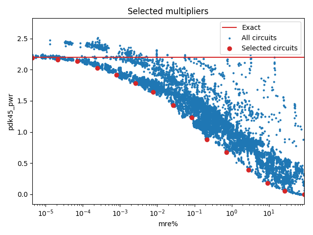

Selected circuits
===================
**Desired bitwidth**: XX
**Optimized for**: XX - YY

Parameters of circuits
----------------------------

| Circuit name | MAE | WCE | Download |
| ----- |  ---- | ---- | --- | ---- | 
| dc-composition.16.m16_m4_composed_wc_pwr_ar_0001 | 0.0 | 0 |  [Verilog](dc-composition.16.m16_m4_composed_wc_pwr_ar_0001.v) [C](dc-composition.16.m16_m4_composed_wc_pwr_ar_0001.c) |
| dc-composition.16.m16_m4_composed_wc_pwr_ar_0047 | 1.3 | 4 |  [Verilog](dc-composition.16.m16_m4_composed_wc_pwr_ar_0047.v) [C](dc-composition.16.m16_m4_composed_wc_pwr_ar_0047.c) |
| dc-composition.16.m16_m3_composed_filt.wc_pwr_ar_0041 | 6.9 | 26 |  [Verilog](dc-composition.16.m16_m3_composed_filt.wc_pwr_ar_0041.v) [C](dc-composition.16.m16_m3_composed_filt.wc_pwr_ar_0041.c) |
| dc-composition.16.m16_m4_composed_filt.wc_pwr_ar_0073 | 24.5 | 79 |  [Verilog](dc-composition.16.m16_m4_composed_filt.wc_pwr_ar_0073.v) [C](dc-composition.16.m16_m4_composed_filt.wc_pwr_ar_0073.c) |
| dc-composition.16.m16_m4_composed_filt.wc_pwr_ar_0145 | 91.9 | 356 |  [Verilog](dc-composition.16.m16_m4_composed_filt.wc_pwr_ar_0145.v) [C](dc-composition.16.m16_m4_composed_filt.wc_pwr_ar_0145.c) |
| dc-composition.16.m16_m4_composed_wc_pwr_ar_0558 | 336.5 | 1335 |  [Verilog](dc-composition.16.m16_m4_composed_wc_pwr_ar_0558.v) [C](dc-composition.16.m16_m4_composed_wc_pwr_ar_0558.c) |
| dc-composition.16.m16_m4_composed_wc_pwr_ar_1102 | 1227.2 | 5569 |  [Verilog](dc-composition.16.m16_m4_composed_wc_pwr_ar_1102.v) [C](dc-composition.16.m16_m4_composed_wc_pwr_ar_1102.c) |
| dc-composition.16.m16_m3_composed_wc_pwr_ar_1174 | 3231.3 | 18591 |  [Verilog](dc-composition.16.m16_m3_composed_wc_pwr_ar_1174.v) [C](dc-composition.16.m16_m3_composed_wc_pwr_ar_1174.c) |
| dc-composition.16.m16_m4_composed_filt.wc_pwr_ar_0821 | 16741.2 | 108496 |  [Verilog](dc-composition.16.m16_m4_composed_filt.wc_pwr_ar_0821.v) [C](dc-composition.16.m16_m4_composed_filt.wc_pwr_ar_0821.c) |
| dc-composition.16.m16_m3_composed_wc_pwr_ar_1726 | 54059.3 | 266045 |  [Verilog](dc-composition.16.m16_m3_composed_wc_pwr_ar_1726.v) [C](dc-composition.16.m16_m3_composed_wc_pwr_ar_1726.c) |
| dc-composition.16.m16_m3_composed_wc_pwr_ar_2364 | 205399.0 | 1183474 |  [Verilog](dc-composition.16.m16_m3_composed_wc_pwr_ar_2364.v) [C](dc-composition.16.m16_m3_composed_wc_pwr_ar_2364.c) |
| dc-composition.16.m16_m3_composed_wc_pwr_ar_3232 | 793124.2 | 4120196 |  [Verilog](dc-composition.16.m16_m3_composed_wc_pwr_ar_3232.v) [C](dc-composition.16.m16_m3_composed_wc_pwr_ar_3232.c) |
| truncation-tm.16.trun16_tam08a | 8339456.3 | 33357825 |  [Verilog](truncation-tm.16.trun16_tam08a.v) [C](truncation-tm.16.trun16_tam08a.c) |
| truncation-tm.16.trun16_tam10a | 33259520.3 | 133038081 |  [Verilog](truncation-tm.16.trun16_tam10a.v) [C](truncation-tm.16.trun16_tam10a.c) |
| truncation-tm.16.trun16_tam12a | 129990656.2 | 519962625 |  [Verilog](truncation-tm.16.trun16_tam12a.v) [C](truncation-tm.16.trun16_tam12a.c) |
| truncation-tm.16.trun16_tam15b | 805273600.3 | 3221094401 |  [Verilog](truncation-tm.16.trun16_tam15b.v) [C](truncation-tm.16.trun16_tam15b.c) |

Parameters
--------------

         