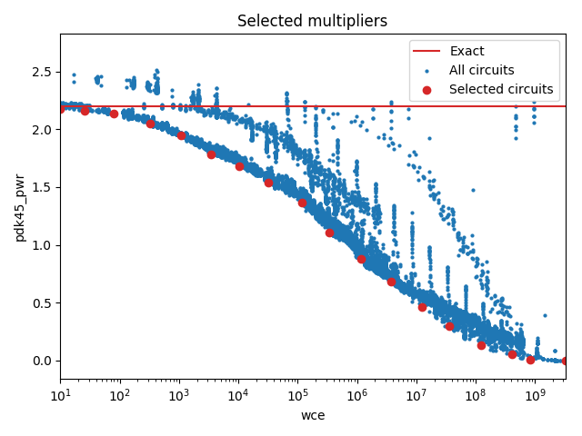

Selected circuits
===================
**Desired bitwidth**: XX
**Optimized for**: XX - YY

Parameters of circuits
----------------------------

| Circuit name | MAE | WCE | EP | Download |
| ----- |  ---- | ---- | --- | ---- | 
| dc-composition.16.m16_m4_composed_wc_pwr_ar_0001 | 0.0 | 0 | 0.0 |  [Verilog](dc-composition.16.m16_m4_composed_wc_pwr_ar_0001.v) [C](dc-composition.16.m16_m4_composed_wc_pwr_ar_0001.c) |
| dc-composition.16.m16_m4_composed_wc_pwr_ar_0100 | 4.9 | 10 | 90.625 |  [Verilog](dc-composition.16.m16_m4_composed_wc_pwr_ar_0100.v) [C](dc-composition.16.m16_m4_composed_wc_pwr_ar_0100.c) |
| dc-composition.16.m16_m3_composed_filt.wc_pwr_ar_0041 | 6.9 | 26 | 83.10546875 |  [Verilog](dc-composition.16.m16_m3_composed_filt.wc_pwr_ar_0041.v) [C](dc-composition.16.m16_m3_composed_filt.wc_pwr_ar_0041.c) |
| dc-composition.16.m16_m4_composed_filt.wc_pwr_ar_0073 | 24.5 | 79 | 98.1231689453 |  [Verilog](dc-composition.16.m16_m4_composed_filt.wc_pwr_ar_0073.v) [C](dc-composition.16.m16_m4_composed_filt.wc_pwr_ar_0073.c) |
| dc-composition.16.m16_m3_composed_wc_pwr_ar_0368 | 108.1 | 325 | 99.6215820312 |  [Verilog](dc-composition.16.m16_m3_composed_wc_pwr_ar_0368.v) [C](dc-composition.16.m16_m3_composed_wc_pwr_ar_0368.c) |
| dc-composition.16.m16_m4_composed_wc_pwr_ar_0535 | 411.3 | 1085 | 99.9374389648 |  [Verilog](dc-composition.16.m16_m4_composed_wc_pwr_ar_0535.v) [C](dc-composition.16.m16_m4_composed_wc_pwr_ar_0535.c) |
| dc-composition.16.m16_m4_composed_filt.wc_pwr_ar_0313 | 871.3 | 3462 | 99.9641418457 |  [Verilog](dc-composition.16.m16_m4_composed_filt.wc_pwr_ar_0313.v) [C](dc-composition.16.m16_m4_composed_filt.wc_pwr_ar_0313.c) |
| dc-composition.16.m16_m4_composed_wc_pwr_ar_1489 | 2155.1 | 10288 | 99.9562859535 |  [Verilog](dc-composition.16.m16_m4_composed_wc_pwr_ar_1489.v) [C](dc-composition.16.m16_m4_composed_wc_pwr_ar_1489.c) |
| dc-composition.16.m16_m4_composed_filt.wc_pwr_ar_0679 | 6571.9 | 31672 | 99.9977774918 |  [Verilog](dc-composition.16.m16_m4_composed_filt.wc_pwr_ar_0679.v) [C](dc-composition.16.m16_m4_composed_filt.wc_pwr_ar_0679.c) |
| dc-composition.16.m16_m4_composed_wc_pwr_ar_2152 | 25617.9 | 117432 | 99.9982252717 |  [Verilog](dc-composition.16.m16_m4_composed_wc_pwr_ar_2152.v) [C](dc-composition.16.m16_m4_composed_wc_pwr_ar_2152.c) |
| dc-composition.16.m16_m3_composed_wc_pwr_ar_1845 | 76788.0 | 334438 | 99.9997887295 |  [Verilog](dc-composition.16.m16_m3_composed_wc_pwr_ar_1845.v) [C](dc-composition.16.m16_m3_composed_wc_pwr_ar_1845.c) |
| dc-composition.16.m16_m3_composed_wc_pwr_ar_2364 | 205399.0 | 1183474 | 99.9999347143 |  [Verilog](dc-composition.16.m16_m3_composed_wc_pwr_ar_2364.v) [C](dc-composition.16.m16_m3_composed_wc_pwr_ar_2364.c) |
| dc-composition.16.m16_m3_composed_wc_pwr_ar_3167 | 725789.6 | 3771136 | 99.9997983221 |  [Verilog](dc-composition.16.m16_m3_composed_wc_pwr_ar_3167.v) [C](dc-composition.16.m16_m3_composed_wc_pwr_ar_3167.c) |
| dc-composition.16.m16_m4_composed_wc_pwr_ar_5762 | 2324288.4 | 12325434 | 99.999979604 |  [Verilog](dc-composition.16.m16_m4_composed_wc_pwr_ar_5762.v) [C](dc-composition.16.m16_m4_composed_wc_pwr_ar_5762.c) |
| dc-composition.16.m16_m3_composed_wc_pwr_ar_3767 | 7942655.4 | 35331314 | 99.9999908032 |  [Verilog](dc-composition.16.m16_m3_composed_wc_pwr_ar_3767.v) [C](dc-composition.16.m16_m3_composed_wc_pwr_ar_3767.c) |
| dc-composition.16.m16_m3_composed_wc_pwr_ar_4087 | 30393031.3 | 124773500 | 99.9996130122 |  [Verilog](dc-composition.16.m16_m3_composed_wc_pwr_ar_4087.v) [C](dc-composition.16.m16_m3_composed_wc_pwr_ar_4087.c) |
| cgp-iccad17.16.mult16_10/run3.00014 | 104402352.8 | 401661904 | 100.0 |  [Verilog](cgp-iccad17.16.mult16_10_run3.00014.v) [C](cgp-iccad17.16.mult16_10_run3.00014.c) |
| cgp-iccad17.16.mult16_20/run3.00014 | 327095701.9 | 839996024 | 100.0 |  [Verilog](cgp-iccad17.16.mult16_20_run3.00014.v) [C](cgp-iccad17.16.mult16_20_run3.00014.c) |
| truncation-tm.16.trun16_tam15b | 805273600.3 | 3221094401 | 99.9969482422 |  [Verilog](truncation-tm.16.trun16_tam15b.v) [C](truncation-tm.16.trun16_tam15b.c) |

Parameters
--------------

         