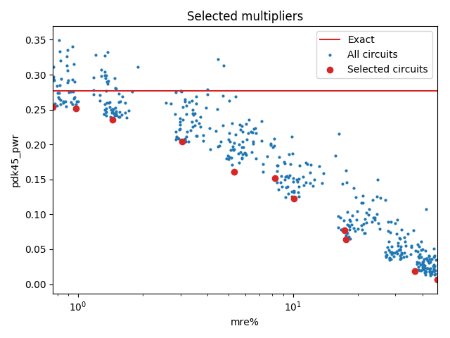

Selected circuits
===================
**Desired bitwidth**: XX
**Optimized for**: XX - YY

Parameters of circuits
----------------------------

| Circuit name | MAE | WCE | EP | Download |
| ----- |  ---- | ---- | --- | ---- | 
| cgp-nn-iccad16.07.cgpnn_mul7_e00_0_00002_csamrca | 0.0 | 0 | 0.0 |  [Verilog](cgp-nn-iccad16.07.cgpnn_mul7_e00_0_00002_csamrca.v) [C](cgp-nn-iccad16.07.cgpnn_mul7_e00_0_00002_csamrca.c) |
| cgp-nn-iccad16.07.cgpnn_mul7_e00_1_00324_csamcsa | 4.5 | 15 | 79.541015625 |  [Verilog](cgp-nn-iccad16.07.cgpnn_mul7_e00_1_00324_csamcsa.v) [C](cgp-nn-iccad16.07.cgpnn_mul7_e00_1_00324_csamcsa.c) |
| cgp-nn-iccad16.07.cgpnn_mul7_e00_1_00882_csamrca | 4.9 | 15 | 82.6110839844 |  [Verilog](cgp-nn-iccad16.07.cgpnn_mul7_e00_1_00882_csamrca.v) [C](cgp-nn-iccad16.07.cgpnn_mul7_e00_1_00882_csamrca.c) |
| cgp-nn-iccad16.07.cgpnn_mul7_e00_2_00559_csamrca | 8.4 | 31 | 87.3474121094 |  [Verilog](cgp-nn-iccad16.07.cgpnn_mul7_e00_2_00559_csamrca.v) [C](cgp-nn-iccad16.07.cgpnn_mul7_e00_2_00559_csamrca.c) |
| cgp-nn-iccad16.07.cgpnn_mul7_e00_5_00236_csamrca | 21.1 | 80 | 92.8771972656 |  [Verilog](cgp-nn-iccad16.07.cgpnn_mul7_e00_5_00236_csamrca.v) [C](cgp-nn-iccad16.07.cgpnn_mul7_e00_5_00236_csamrca.c) |
| cgp-nn-iccad16.07.cgpnn_mul7_e01_0_00579_rcam | 39.8 | 162 | 95.3979492188 |  [Verilog](cgp-nn-iccad16.07.cgpnn_mul7_e01_0_00579_rcam.v) [C](cgp-nn-iccad16.07.cgpnn_mul7_e01_0_00579_rcam.c) |
| cgp-nn-iccad16.07.cgpnn_mul7_e02_0_00265_wtmrca | 73.6 | 314 | 97.3083496094 |  [Verilog](cgp-nn-iccad16.07.cgpnn_mul7_e02_0_00265_wtmrca.v) [C](cgp-nn-iccad16.07.cgpnn_mul7_e02_0_00265_wtmrca.c) |
| cgp-nn-iccad16.07.cgpnn_mul7_e02_0_00544_csamcsa | 75.1 | 317 | 97.5280761719 |  [Verilog](cgp-nn-iccad16.07.cgpnn_mul7_e02_0_00544_csamcsa.v) [C](cgp-nn-iccad16.07.cgpnn_mul7_e02_0_00544_csamcsa.c) |
| cgp-nn-iccad16.07.cgpnn_mul7_e05_0_00779_csamrca | 177.4 | 796 | 98.2421875 |  [Verilog](cgp-nn-iccad16.07.cgpnn_mul7_e05_0_00779_csamrca.v) [C](cgp-nn-iccad16.07.cgpnn_mul7_e05_0_00779_csamrca.c) |
| cgp-nn-iccad16.07.cgpnn_mul7_e05_0_00347_csamrca | 185.6 | 812 | 98.2299804688 |  [Verilog](cgp-nn-iccad16.07.cgpnn_mul7_e05_0_00347_csamrca.v) [C](cgp-nn-iccad16.07.cgpnn_mul7_e05_0_00347_csamrca.c) |
| cgp-nn-iccad16.07.cgpnn_mul7_e15_0_00808_wtmrca | 595.3 | 2366 | 98.4069824219 |  [Verilog](cgp-nn-iccad16.07.cgpnn_mul7_e15_0_00808_wtmrca.v) [C](cgp-nn-iccad16.07.cgpnn_mul7_e15_0_00808_wtmrca.c) |
| cgp-nn-iccad16.07.cgpnn_mul7_e20_0_00656_csamcsa | 834.5 | 3121 | 98.4130859375 |  [Verilog](cgp-nn-iccad16.07.cgpnn_mul7_e20_0_00656_csamcsa.v) [C](cgp-nn-iccad16.07.cgpnn_mul7_e20_0_00656_csamcsa.c) |

Parameters
--------------

         