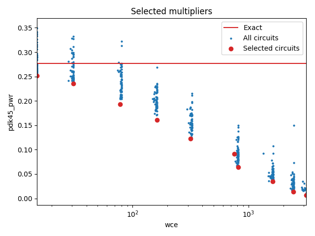

Selected circuits
===================
**Desired bitwidth**: XX
**Optimized for**: XX - YY

Parameters of circuits
----------------------------

| Circuit name | MAE | WCE | Download |
| ----- |  ---- | ---- | --- | ---- | 
| cgp-nn-iccad16.07.cgpnn_mul7_e00_0_00002_csamrca | 0.0 | 0 |  [Verilog](cgp-nn-iccad16.07.cgpnn_mul7_e00_0_00002_csamrca.v) [C](cgp-nn-iccad16.07.cgpnn_mul7_e00_0_00002_csamrca.c) |
| cgp-nn-iccad16.07.cgpnn_mul7_e00_1_00882_csamrca | 4.9 | 15 |  [Verilog](cgp-nn-iccad16.07.cgpnn_mul7_e00_1_00882_csamrca.v) [C](cgp-nn-iccad16.07.cgpnn_mul7_e00_1_00882_csamrca.c) |
| cgp-nn-iccad16.07.cgpnn_mul7_e00_2_00559_csamrca | 8.4 | 31 |  [Verilog](cgp-nn-iccad16.07.cgpnn_mul7_e00_2_00559_csamrca.v) [C](cgp-nn-iccad16.07.cgpnn_mul7_e00_2_00559_csamrca.c) |
| cgp-nn-iccad16.07.cgpnn_mul7_e00_5_00110_csamcsa | 22.9 | 78 |  [Verilog](cgp-nn-iccad16.07.cgpnn_mul7_e00_5_00110_csamcsa.v) [C](cgp-nn-iccad16.07.cgpnn_mul7_e00_5_00110_csamcsa.c) |
| cgp-nn-iccad16.07.cgpnn_mul7_e01_0_00579_rcam | 39.8 | 162 |  [Verilog](cgp-nn-iccad16.07.cgpnn_mul7_e01_0_00579_rcam.v) [C](cgp-nn-iccad16.07.cgpnn_mul7_e01_0_00579_rcam.c) |
| cgp-nn-iccad16.07.cgpnn_mul7_e02_0_00544_csamcsa | 75.1 | 317 |  [Verilog](cgp-nn-iccad16.07.cgpnn_mul7_e02_0_00544_csamcsa.v) [C](cgp-nn-iccad16.07.cgpnn_mul7_e02_0_00544_csamcsa.c) |
| cgp-nn-iccad16.07.cgpnn_mul7_e05_0_00248_wtmcsa | 179.2 | 753 |  [Verilog](cgp-nn-iccad16.07.cgpnn_mul7_e05_0_00248_wtmcsa.v) [C](cgp-nn-iccad16.07.cgpnn_mul7_e05_0_00248_wtmcsa.c) |
| cgp-nn-iccad16.07.cgpnn_mul7_e05_0_00347_csamrca | 185.6 | 812 |  [Verilog](cgp-nn-iccad16.07.cgpnn_mul7_e05_0_00347_csamrca.v) [C](cgp-nn-iccad16.07.cgpnn_mul7_e05_0_00347_csamrca.c) |
| cgp-nn-iccad16.07.cgpnn_mul7_e10_0_00366_rcam | 372.5 | 1617 |  [Verilog](cgp-nn-iccad16.07.cgpnn_mul7_e10_0_00366_rcam.v) [C](cgp-nn-iccad16.07.cgpnn_mul7_e10_0_00366_rcam.c) |
| cgp-nn-iccad16.07.cgpnn_mul7_e15_0_00367_rcam | 646.2 | 2433 |  [Verilog](cgp-nn-iccad16.07.cgpnn_mul7_e15_0_00367_rcam.v) [C](cgp-nn-iccad16.07.cgpnn_mul7_e15_0_00367_rcam.c) |
| cgp-nn-iccad16.07.cgpnn_mul7_e20_0_00656_csamcsa | 834.5 | 3121 |  [Verilog](cgp-nn-iccad16.07.cgpnn_mul7_e20_0_00656_csamcsa.v) [C](cgp-nn-iccad16.07.cgpnn_mul7_e20_0_00656_csamcsa.c) |

Parameters
--------------

         