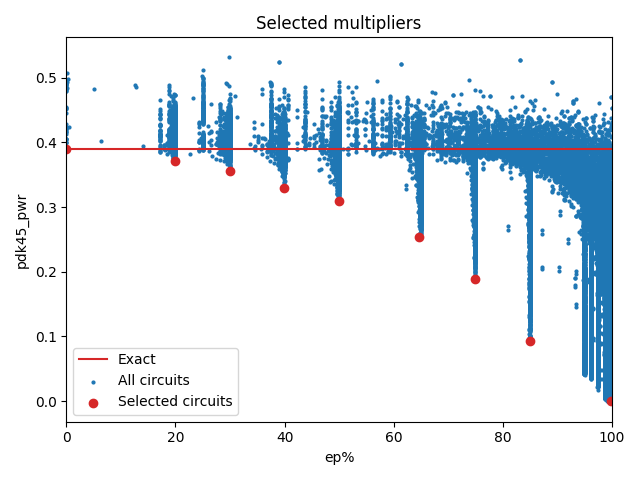

Selected circuits
===================
**Desired bitwidth**: XX
**Optimized for**: XX - YY

Parameters of circuits
----------------------------

| Circuit name | MAE | WCE | EP | Download |
| ----- |  ---- | ---- | --- | ---- | 
| cgp-evoapproxlib.08.mul8_CarrySaveArrayMultiplier_Using_RippleCarryAdder | 0.0 | 0 | 0.0 |  [Verilog](cgp-evoapproxlib.08.mul8_CarrySaveArrayMultiplier_Using_RippleCarryAdder.v) [C](cgp-evoapproxlib.08.mul8_CarrySaveArrayMultiplier_Using_RippleCarryAdder.c) |
| cgp-approx14ep.08.mult8_cgp14ep_ep13107_wc10176_csamrca | 731.4 | 10176 | 19.82421875 |  [Verilog](cgp-approx14ep.08.mult8_cgp14ep_ep13107_wc10176_csamrca.v) [C](cgp-approx14ep.08.mult8_cgp14ep_ep13107_wc10176_csamrca.c) |
| cgp-approx14ep.08.mult8_cgp14ep_ep19660_wc748_csamrca | 37.0 | 748 | 29.931640625 |  [Verilog](cgp-approx14ep.08.mult8_cgp14ep_ep19660_wc748_csamrca.v) [C](cgp-approx14ep.08.mult8_cgp14ep_ep19660_wc748_csamrca.c) |
| cgp-approx14ep.08.mult8_cgp14ep_ep26214_wc1558_csamcsa | 87.3 | 1558 | 39.9291992188 |  [Verilog](cgp-approx14ep.08.mult8_cgp14ep_ep26214_wc1558_csamcsa.v) [C](cgp-approx14ep.08.mult8_cgp14ep_ep26214_wc1558_csamcsa.c) |
| cgp-approx14ep.08.mult8_cgp14ep_ep32768_wc3436_csamrca | 234.0 | 3436 | 49.9267578125 |  [Verilog](cgp-approx14ep.08.mult8_cgp14ep_ep32768_wc3436_csamrca.v) [C](cgp-approx14ep.08.mult8_cgp14ep_ep32768_wc3436_csamrca.c) |
| cgp-approx14ep.08.mult8_cgp14ep_ep42598_wc1826_rcam | 165.8 | 1826 | 64.7338867188 |  [Verilog](cgp-approx14ep.08.mult8_cgp14ep_ep42598_wc1826_rcam.v) [C](cgp-approx14ep.08.mult8_cgp14ep_ep42598_wc1826_rcam.c) |
| cgp-approx14ep.08.mult8_cgp14ep_ep49152_wc9124_rcam | 1011.3 | 9124 | 74.9130249023 |  [Verilog](cgp-approx14ep.08.mult8_cgp14ep_ep49152_wc9124_rcam.v) [C](cgp-approx14ep.08.mult8_cgp14ep_ep49152_wc9124_rcam.c) |
| cgp-approx14ep.08.mult8_cgp14ep_ep55705_wc16384_wtmrca | 2718.4 | 16384 | 84.928894043 |  [Verilog](cgp-approx14ep.08.mult8_cgp14ep_ep55705_wc16384_wtmrca.v) [C](cgp-approx14ep.08.mult8_cgp14ep_ep55705_wc16384_wtmrca.c) |
| cgp-approx14.08.mult8_cgp14_wc33411_wtmrca | 10765.3 | 33411 | 99.9206542969 |  [Verilog](cgp-approx14.08.mult8_cgp14_wc33411_wtmrca.v) [C](cgp-approx14.08.mult8_cgp14_wc33411_wtmrca.c) |

Parameters
--------------

         
