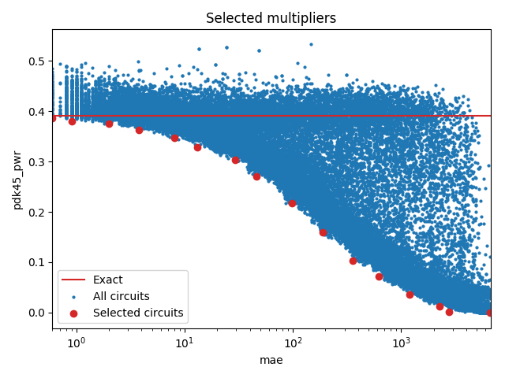

Selected circuits
===================
**Desired bitwidth**: XX
**Optimized for**: XX - YY

Parameters of circuits
----------------------------

| Circuit name | MAE | WCE | Download |
| ----- |  ---- | ---- | --- | ---- | 
| cgp-evoapproxlib.08.mul8_CarrySaveArrayMultiplier_Using_RippleCarryAdder | 0.0 | 0 |  [Verilog](cgp-evoapproxlib.08.mul8_CarrySaveArrayMultiplier_Using_RippleCarryAdder.v) [C](cgp-evoapproxlib.08.mul8_CarrySaveArrayMultiplier_Using_RippleCarryAdder.c) |
| cgp-approx14ep.08.mult8_cgp14ep_ep13107_wc6_csamrca | 0.6 | 6 |  [Verilog](cgp-approx14ep.08.mult8_cgp14ep_ep13107_wc6_csamrca.v) [C](cgp-approx14ep.08.mult8_cgp14ep_ep13107_wc6_csamrca.c) |
| cgp-approx14ep.08.mult8_cgp14ep_ep13107_wc10_2_csamrca | 0.9 | 10 |  [Verilog](cgp-approx14ep.08.mult8_cgp14ep_ep13107_wc10_2_csamrca.v) [C](cgp-approx14ep.08.mult8_cgp14ep_ep13107_wc10_2_csamrca.c) |
| cgp-approx14ep.08.mult8_cgp14ep_ep19660_wc16_csamrca | 2.0 | 16 |  [Verilog](cgp-approx14ep.08.mult8_cgp14ep_ep19660_wc16_csamrca.v) [C](cgp-approx14ep.08.mult8_cgp14ep_ep19660_wc16_csamrca.c) |
| cgp-approx14ep.08.mult8_cgp14ep_ep32768_wc27_csamrca | 3.8 | 27 |  [Verilog](cgp-approx14ep.08.mult8_cgp14ep_ep32768_wc27_csamrca.v) [C](cgp-approx14ep.08.mult8_cgp14ep_ep32768_wc27_csamrca.c) |
| cgp-approx14ep.08.mult8_cgp14ep_ep32768_wc54_csamrca | 8.1 | 54 |  [Verilog](cgp-approx14ep.08.mult8_cgp14ep_ep32768_wc54_csamrca.v) [C](cgp-approx14ep.08.mult8_cgp14ep_ep32768_wc54_csamrca.c) |
| cgp-approx14ep.08.mult8_cgp14ep_ep49152_wc66_csamrca | 13.0 | 66 |  [Verilog](cgp-approx14ep.08.mult8_cgp14ep_ep49152_wc66_csamrca.v) [C](cgp-approx14ep.08.mult8_cgp14ep_ep49152_wc66_csamrca.c) |
| cgp-approx14ep.08.mult8_cgp14ep_ep55705_wc125_csamrca | 29.4 | 125 |  [Verilog](cgp-approx14ep.08.mult8_cgp14ep_ep55705_wc125_csamrca.v) [C](cgp-approx14ep.08.mult8_cgp14ep_ep55705_wc125_csamrca.c) |
| cgp-approx14zr.08.mult8_cgp14zr_wc195_rcam | 46.4 | 195 |  [Verilog](cgp-approx14zr.08.mult8_cgp14zr_wc195_rcam.v) [C](cgp-approx14zr.08.mult8_cgp14zr_wc195_rcam.c) |
| cgp-approx14zr.08.mult8_cgp14zr_wc423_rcam | 98.3 | 423 |  [Verilog](cgp-approx14zr.08.mult8_cgp14zr_wc423_rcam.v) [C](cgp-approx14zr.08.mult8_cgp14zr_wc423_rcam.c) |
| cgp-approx14ep.08.mult8_cgp14ep_ep63897_wc761_csamrca | 187.6 | 761 |  [Verilog](cgp-approx14ep.08.mult8_cgp14ep_ep63897_wc761_csamrca.v) [C](cgp-approx14ep.08.mult8_cgp14ep_ep63897_wc761_csamrca.c) |
| cgp-approx14.08.mult8_cgp14_wc1584_rcam | 359.8 | 1584 |  [Verilog](cgp-approx14.08.mult8_cgp14_wc1584_rcam.v) [C](cgp-approx14.08.mult8_cgp14_wc1584_rcam.c) |
| cgp-approx14.08.mult8_cgp14_wc2656_rcam | 622.3 | 2656 |  [Verilog](cgp-approx14.08.mult8_cgp14_wc2656_rcam.v) [C](cgp-approx14.08.mult8_cgp14_wc2656_rcam.c) |
| cgp-approx14.08.mult8_cgp14_wc5016_rcam | 1201.6 | 5016 |  [Verilog](cgp-approx14.08.mult8_cgp14_wc5016_rcam.v) [C](cgp-approx14.08.mult8_cgp14_wc5016_rcam.c) |
| cgp-compare17.08.cmpmul8_so_3in_2out_wc_9753_17_rcam | 2255.1 | 8820 |  [Verilog](cgp-compare17.08.cmpmul8_so_3in_2out_wc_9753_17_rcam.v) [C](cgp-compare17.08.cmpmul8_so_3in_2out_wc_9753_17_rcam.c) |
| cgp-compare17.08.cmpmul8_so_3in_2out_wc_9753_18_wtmcsa | 2783.6 | 9425 |  [Verilog](cgp-compare17.08.cmpmul8_so_3in_2out_wc_9753_18_wtmcsa.v) [C](cgp-compare17.08.cmpmul8_so_3in_2out_wc_9753_18_wtmcsa.c) |
| cgp-approx14.08.mult8_cgp14_wc34416_wtmcla | 6694.8 | 34416 |  [Verilog](cgp-approx14.08.mult8_cgp14_wc34416_wtmcla.v) [C](cgp-approx14.08.mult8_cgp14_wc34416_wtmcla.c) |

Parameters
--------------

         