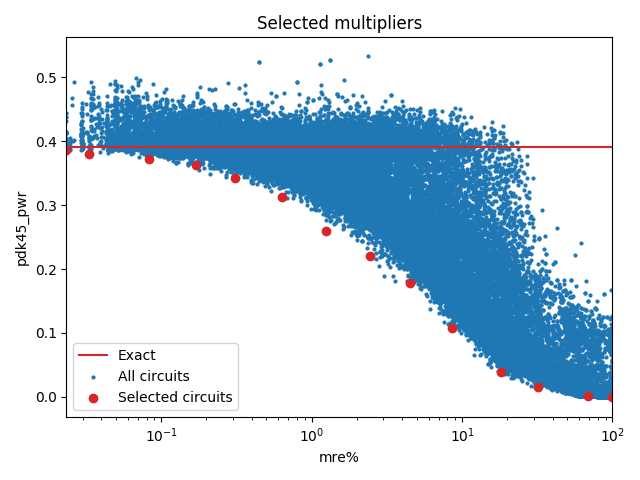

Selected circuits
===================
**Desired bitwidth**: XX
**Optimized for**: XX - YY

Parameters of circuits
----------------------------

| Circuit name | MAE | WCE | EP | Download |
| ----- |  ---- | ---- | --- | ---- | 
| cgp-evoapproxlib.08.mul8_CarrySaveArrayMultiplier_Using_RippleCarryAdder | 0.0 | 0 | 0.0 |  [Verilog](cgp-evoapproxlib.08.mul8_CarrySaveArrayMultiplier_Using_RippleCarryAdder.v) [C](cgp-evoapproxlib.08.mul8_CarrySaveArrayMultiplier_Using_RippleCarryAdder.c) |
| cgp-approx14ep.08.mult8_cgp14ep_ep13107_wc6_csamrca | 0.6 | 6 | 17.1875 |  [Verilog](cgp-approx14ep.08.mult8_cgp14ep_ep13107_wc6_csamrca.v) [C](cgp-approx14ep.08.mult8_cgp14ep_ep13107_wc6_csamrca.c) |
| cgp-approx14ep.08.mult8_cgp14ep_ep13107_wc10_2_csamrca | 0.9 | 10 | 19.53125 |  [Verilog](cgp-approx14ep.08.mult8_cgp14ep_ep13107_wc10_2_csamrca.v) [C](cgp-approx14ep.08.mult8_cgp14ep_ep13107_wc10_2_csamrca.c) |
| cgp-approx14ep.08.mult8_cgp14ep_ep19660_wc26_3_csamrca | 2.6 | 26 | 29.296875 |  [Verilog](cgp-approx14ep.08.mult8_cgp14ep_ep19660_wc26_3_csamrca.v) [C](cgp-approx14ep.08.mult8_cgp14ep_ep19660_wc26_3_csamrca.c) |
| cgp-approx14ep.08.mult8_cgp14ep_ep26214_wc50_2_csamrca | 6.5 | 50 | 39.94140625 |  [Verilog](cgp-approx14ep.08.mult8_cgp14ep_ep26214_wc50_2_csamrca.v) [C](cgp-approx14ep.08.mult8_cgp14ep_ep26214_wc50_2_csamrca.c) |
| cgp-approx14ep.08.mult8_cgp14ep_ep32768_wc82_2_csamrca | 11.0 | 82 | 49.0234375 |  [Verilog](cgp-approx14ep.08.mult8_cgp14ep_ep32768_wc82_2_csamrca.v) [C](cgp-approx14ep.08.mult8_cgp14ep_ep32768_wc82_2_csamrca.c) |
| cgp-approx14ep.08.mult8_cgp14ep_ep49152_wc122_csamrca | 21.2 | 122 | 74.2919921875 |  [Verilog](cgp-approx14ep.08.mult8_cgp14ep_ep49152_wc122_csamrca.v) [C](cgp-approx14ep.08.mult8_cgp14ep_ep49152_wc122_csamrca.c) |
| cgp-approx14ep.08.mult8_cgp14ep_ep42598_wc444_rcam | 71.8 | 444 | 64.8803710938 |  [Verilog](cgp-approx14ep.08.mult8_cgp14ep_ep42598_wc444_rcam.v) [C](cgp-approx14ep.08.mult8_cgp14ep_ep42598_wc444_rcam.c) |
| cgp-approx14ep.08.mult8_cgp14ep_ep55705_wc952_rcam | 133.9 | 952 | 84.9868774414 |  [Verilog](cgp-approx14ep.08.mult8_cgp14ep_ep55705_wc952_rcam.v) [C](cgp-approx14ep.08.mult8_cgp14ep_ep55705_wc952_rcam.c) |
| cgp-approx14ep.08.mult8_cgp14ep_ep62259_wc782_csamcsa | 157.0 | 782 | 94.9768066406 |  [Verilog](cgp-approx14ep.08.mult8_cgp14ep_ep62259_wc782_csamcsa.v) [C](cgp-approx14ep.08.mult8_cgp14ep_ep62259_wc782_csamcsa.c) |
| cgp-approx14ep.08.mult8_cgp14ep_ep63897_wc2214_csamrca | 393.1 | 2214 | 97.4807739258 |  [Verilog](cgp-approx14ep.08.mult8_cgp14ep_ep63897_wc2214_csamrca.v) [C](cgp-approx14ep.08.mult8_cgp14ep_ep63897_wc2214_csamrca.c) |
| cgp-approx14ep.08.mult8_cgp14ep_ep63078_wc16002_rcam | 2468.9 | 16002 | 96.2493896484 |  [Verilog](cgp-approx14ep.08.mult8_cgp14ep_ep63078_wc16002_rcam.v) [C](cgp-approx14ep.08.mult8_cgp14ep_ep63078_wc16002_rcam.c) |
| cgp-approx14ep.08.mult8_cgp14ep_ep64716_wc32289_wtmrca | 3828.2 | 32289 | 98.7487792969 |  [Verilog](cgp-approx14ep.08.mult8_cgp14ep_ep64716_wc32289_wtmrca.v) [C](cgp-approx14ep.08.mult8_cgp14ep_ep64716_wc32289_wtmrca.c) |
| cgp-approx14zr.08.mult8_cgp14zr_wc24257_rcam | 6332.4 | 24257 | 99.2202758789 |  [Verilog](cgp-approx14zr.08.mult8_cgp14zr_wc24257_rcam.v) [C](cgp-approx14zr.08.mult8_cgp14zr_wc24257_rcam.c) |
| cgp-approx14ep.08.mult8_cgp14ep_ep65536_wc65025_rcam | 16256.2 | 65025 | 99.2202758789 |  [Verilog](cgp-approx14ep.08.mult8_cgp14ep_ep65536_wc65025_rcam.v) [C](cgp-approx14ep.08.mult8_cgp14ep_ep65536_wc65025_rcam.c) |

Parameters
--------------

         