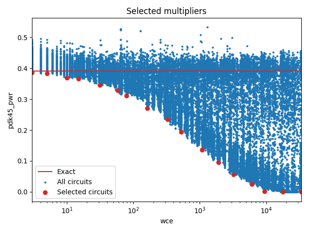

Selected circuits
===================
**Desired bitwidth**: XX
**Optimized for**: XX - YY

Parameters of circuits
----------------------------

| Circuit name | MAE | WCE | Download |
| ----- |  ---- | ---- | --- | ---- | 
| cgp-evoapproxlib.08.mul8_CarrySaveArrayMultiplier_Using_RippleCarryAdder | 0.0 | 0 |  [Verilog](cgp-evoapproxlib.08.mul8_CarrySaveArrayMultiplier_Using_RippleCarryAdder.v) [C](cgp-evoapproxlib.08.mul8_CarrySaveArrayMultiplier_Using_RippleCarryAdder.c) |
| cgp-approx14.08.mult8_cgp14_wc3_csamrca | 1.0 | 3 |  [Verilog](cgp-approx14.08.mult8_cgp14_wc3_csamrca.v) [C](cgp-approx14.08.mult8_cgp14_wc3_csamrca.c) |
| cgp-approx14ep.08.mult8_cgp14ep_ep55705_wc5_5_csamrca | 1.7 | 5 |  [Verilog](cgp-approx14ep.08.mult8_cgp14ep_ep55705_wc5_5_csamrca.v) [C](cgp-approx14ep.08.mult8_cgp14ep_ep55705_wc5_5_csamrca.c) |
| dz4m2.08.mult8_res17_dz4m_ADP_10_4_csam_rca | 4.7 | 10 |  [Verilog](dz4m2.08.mult8_res17_dz4m_ADP_10_4_csam_rca.v) [C](dz4m2.08.mult8_res17_dz4m_ADP_10_4_csam_rca.c) |
| dz4m2.08.mult8_res17_dz4m_ADP_15_5_csam_rca | 5.7 | 15 |  [Verilog](dz4m2.08.mult8_res17_dz4m_ADP_15_5_csam_rca.v) [C](dz4m2.08.mult8_res17_dz4m_ADP_15_5_csam_rca.c) |
| cgp-approx14.08.mult8_cgp14_wc31_2_csamrca | 10.5 | 31 |  [Verilog](cgp-approx14.08.mult8_cgp14_wc31_2_csamrca.v) [C](cgp-approx14.08.mult8_cgp14_wc31_2_csamrca.c) |
| cgp-compare17.08.cmpmul8_so_3in_2out_wc_65_15_csamrca | 17.4 | 58 |  [Verilog](cgp-compare17.08.cmpmul8_so_3in_2out_wc_65_15_csamrca.v) [C](cgp-compare17.08.cmpmul8_so_3in_2out_wc_65_15_csamrca.c) |
| cgp-approx14.08.mult8_cgp14_wc79_csamrca | 24.5 | 79 |  [Verilog](cgp-approx14.08.mult8_cgp14_wc79_csamrca.v) [C](cgp-approx14.08.mult8_cgp14_wc79_csamrca.c) |
| dz4m2.08.mult8_res17_dz4m_ADP_161_1_csam_rca | 55.4 | 161 |  [Verilog](dz4m2.08.mult8_res17_dz4m_ADP_161_1_csam_rca.v) [C](dz4m2.08.mult8_res17_dz4m_ADP_161_1_csam_rca.c) |
| cgp-compare17.08.cmpmul8_so_2in_1out_wc_325_17_rcam | 108.1 | 325 |  [Verilog](cgp-compare17.08.cmpmul8_so_2in_1out_wc_325_17_rcam.v) [C](cgp-compare17.08.cmpmul8_so_2in_1out_wc_325_17_rcam.c) |
| cgp-approx14.08.mult8_cgp14_wc521_csamrca | 212.0 | 521 |  [Verilog](cgp-approx14.08.mult8_cgp14_wc521_csamrca.v) [C](cgp-approx14.08.mult8_cgp14_wc521_csamrca.c) |
| dz4m2.08.mult8_res17_dz4m_ADP_1085_1_csam_rca | 411.3 | 1085 |  [Verilog](dz4m2.08.mult8_res17_dz4m_ADP_1085_1_csam_rca.v) [C](dz4m2.08.mult8_res17_dz4m_ADP_1085_1_csam_rca.c) |
| cgp-approx14zr.08.mult8_cgp14zr_wc1925_rcam | 441.6 | 1925 |  [Verilog](cgp-approx14zr.08.mult8_cgp14zr_wc1925_rcam.v) [C](cgp-approx14zr.08.mult8_cgp14zr_wc1925_rcam.c) |
| cgp-compare17.08.cmpmul8_so_2in_1out_wc_3251_8_csamrca | 1092.3 | 3224 |  [Verilog](cgp-compare17.08.cmpmul8_so_2in_1out_wc_3251_8_csamrca.v) [C](cgp-compare17.08.cmpmul8_so_2in_1out_wc_3251_8_csamrca.c) |
| cgp-approx14.08.mult8_cgp14_wc6072_csamrca | 1654.5 | 6072 |  [Verilog](cgp-approx14.08.mult8_cgp14_wc6072_csamrca.v) [C](cgp-approx14.08.mult8_cgp14_wc6072_csamrca.c) |
| cgp-compare17.08.cmpmul8_so_3in_2out_wc_9753_18_wtmcsa | 2783.6 | 9425 |  [Verilog](cgp-compare17.08.cmpmul8_so_3in_2out_wc_9753_18_wtmcsa.v) [C](cgp-compare17.08.cmpmul8_so_3in_2out_wc_9753_18_wtmcsa.c) |
| cgp-approx14.08.mult8_cgp14_wc17860_wtmrca | 5723.6 | 17860 |  [Verilog](cgp-approx14.08.mult8_cgp14_wc17860_wtmrca.v) [C](cgp-approx14.08.mult8_cgp14_wc17860_wtmrca.c) |
| cgp-approx14.08.mult8_cgp14_wc33411_wtmrca | 10765.3 | 33411 |  [Verilog](cgp-approx14.08.mult8_cgp14_wc33411_wtmrca.v) [C](cgp-approx14.08.mult8_cgp14_wc33411_wtmrca.c) |

Parameters
--------------

         