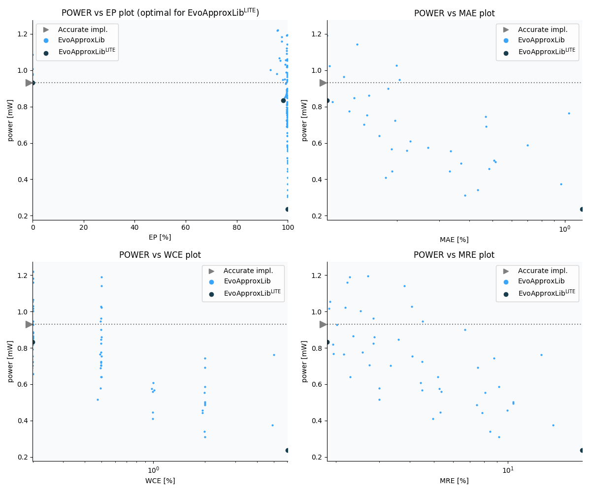

Selected circuits
===================
 - **Circuit**: 11-bit unsigned multiplier
 - **Selection criteria**: pareto optimal sub-set wrt. pwr and ep parameters
 - **References**: 
  - V. Mrazek, S. S. Sarwar, L. Sekanina, Z. Vasicek and K. Roy, "Design of power-efficient approximate multipliers for approximate artificial neural networks," 2016 IEEE/ACM International Conference on Computer-Aided Design (ICCAD), Austin, TX, 2016, pp. 1-7. doi: [10.1145/2966986.2967021](https://dx.doi.org/10.1145/2966986.2967021)

Parameters of selected circuits
----------------------------

| Circuit name | MAE | WCE | EP | MRE | MSE | Download |
| --- |  --- | --- | --- | --- | --- | --- | 
| mul11u_pwr_0_930_ep_00 | 0.00% | 0% | 0.00% | 0% | 0.00 |  [[Verilog generic](mul11u_pwr_0_930_ep_00_gen.v)] [[Verilog PDK45](mul11u_pwr_0_930_ep_00_pdk45.v)]  [[C](mul11u_pwr_0_930_ep_00.c)] |
| mul11u_pwr_0_834_ep_98 | 0.10% | 0.2% | 98.28% | 1.8% | 28977591.05 |  [[Verilog generic](mul11u_pwr_0_834_ep_98_gen.v)] [[Verilog PDK45](mul11u_pwr_0_834_ep_98_pdk45.v)]  [[C](mul11u_pwr_0_834_ep_98.c)] |
| mul11u_pwr_0_236_ep_99 | 1.18% | 6.% | 99.90% | 20% | 3729088972.49 |  [[Verilog generic](mul11u_pwr_0_236_ep_99_gen.v)] [[Verilog PDK45](mul11u_pwr_0_236_ep_99_pdk45.v)]  [[C](mul11u_pwr_0_236_ep_99.c)] |
    
Parameters
--------------

             